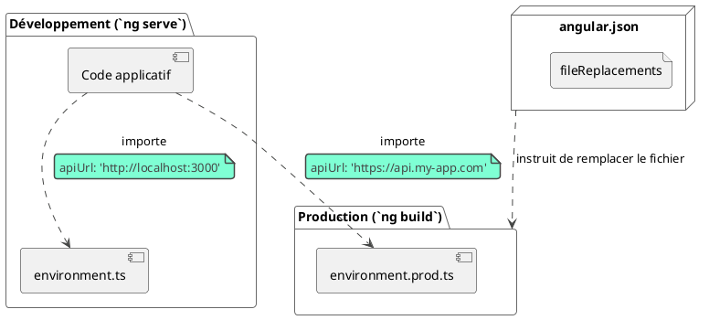

# Module 0 : Pour aller plus loin - Vers un Code Professionnel

### Objectifs pédagogiques

À la fin de cette partie, vous aurez ajouté des cordes essentielles à votre arc de développeur professionnel :

* **Utiliser** la fonction `inject()` pour une injection de dépendances plus flexible et moderne.
* **Gérer** les configurations spécifiques à chaque environnement (développement, production) avec les fichiers
  d'environnement.
* **Tirer parti** des fonctionnalités de TypeScript (Interfaces, Enums, `readonly`) pour écrire un code plus sûr, plus
  lisible et plus maintenable.
* **Comprendre** la philosophie derrière ces pratiques : écrire du code non seulement qui fonctionne, mais qui est aussi
  robuste et prêt pour le travail en équipe.

### Introduction

Si la partie "L'essentiel" nous a permis de vérifier que le châssis, le moteur et les roues de notre voiture étaient
bien en place, cette partie "Pour aller plus loin" s'intéresse aux finitions qui font toute la différence. Nous allons
installer le tableau de bord, les ceintures de sécurité et le GPS.

Ce ne sont pas des gadgets. Ce sont des outils et des habitudes de travail qui transforment un code fonctionnel en une
application professionnelle. Ils garantissent la sécurité (typage), la fiabilité (gestion des configurations) et
l'ergonomie (lisibilité du code). Adopter ces pratiques dès maintenant est l'un des investissements les plus rentables
que vous puissiez faire dans votre carrière de développeur.

### L'injection de dépendances moderne avec `inject()`

Vous connaissez déjà l'injection via le `constructor`. C'est le mécanisme historique et il fonctionne parfaitement.
Cependant, depuis l'avènement des composants Standalone et des approches plus fonctionnelles, une nouvelle API a fait
son apparition : la fonction `inject()`.

Elle permet d'obtenir une dépendance directement dans le corps de la classe, sans passer par le constructeur.

**Avant (avec le constructeur) :**

```typescript
import {Component} from '@angular/core';
import {UserService} from './user.service';

@Component({...})
export class UserComponent {
    // Déclaration de la propriété
    private userService: UserService;

    // Injection et assignation dans le constructeur
    constructor(userService: UserService) {
        this.userService = userService;
    }
}
```

Ou sa version courte :

```typescript
import {Component} from '@angular/core';
import {UserService} from './user.service';

@Component({...})
export class UserComponent {
    // Injection et déclaration en une seule ligne
    constructor(private userService: UserService) {
    }
}
```

**Maintenant (avec `inject()`) :**

```typescript
import {Component, inject} from '@angular/core';
import {UserService} from './user.service';

@Component({...})
export class UserComponent {
    // Injection directe dans la propriété de la classe
    private userService = inject(UserService);
}
```

<warning>
**Quand utiliser `inject()` ?**
La fonction `inject()` doit être appelée dans un **contexte d'injection**, c'est-à-dire lors de l'initialisation d'une propriété de classe, dans le constructeur, ou dans les "factory" des providers. Vous ne pouvez pas l'appeler plus tard dans une méthode comme `ngOnInit()` ou un gestionnaire de clic.
</warning>

L'avantage principal est une syntaxe plus concise et une plus grande flexibilité pour des cas d'usage avancés (comme les
`Route Guards` fonctionnels) que nous verrons plus tard. Pour l'instant, voyez-la comme la manière moderne et élégante
de réaliser l'injection de dépendances.

### Gérer les Configurations avec les Fichiers d'Environnement

Imaginez : votre API de développement tourne sur `http://localhost:3000`. L'API de production, elle, est sur
`https://api.monsupersite.com`. Allez-vous changer l'URL manuellement dans votre `DataService` avant chaque
déploiement ? Certainement pas ! C'est une recette pour l'erreur humaine.

Angular CLI nous offre une solution élégante : les fichiers d'environnement.

Dans le dossier `src/environments/`, vous trouverez deux fichiers :

* `environment.ts` : Pour le développement.
* `environment.prod.ts` : Pour la production (ou tout autre environnement que vous configurez).

**`src/environments/environment.ts`**

```typescript
export const environment = {
    production: false,
    apiUrl: 'http://localhost:3000/api'
};
```

**`src/environments/environment.prod.ts`**

```typescript
export const environment = {
    production: true,
    apiUrl: 'https://api.monsupersite.com/api'
};
```

Ensuite, dans votre service, il vous suffit d'importer l'objet `environment` :

```typescript
import {Injectable, inject} from '@angular/core';
import {HttpClient} from '@angular/common/http';
import {environment} from '../../environments/environment';

@Injectable({providedIn: 'root'})
export class ProductService {
    private http = inject(HttpClient);
    private apiUrl = environment.apiUrl; // Utilisation de la variable

    getProducts() {
        return this.http.get(`${this.apiUrl}/products`);
    }
}
```

**Comment ça marche ?**
La magie opère au moment du build. Dans le fichier `angular.json`, une configuration spécifie que lorsque vous lancez
`ng build` (qui par défaut est en mode production), Angular remplacera l'import de `environment.ts` par celui de
`environment.prod.ts`.



### Renforcer votre Code avec TypeScript

TypeScript est bien plus qu'un simple "JavaScript avec des types". C'est un outil puissant pour construire des
applications robustes. Voici trois fonctionnalités que vous devriez utiliser systématiquement.

<tabs>
<tab title="Interfaces et Types">

Ne laissez jamais une structure de données complexe être de type `any`. Définir une `interface` ou un `type` pour vos modèles de données offre des avantages considérables :

* **Autocomplétion** dans votre éditeur de code.
* **Détection d'erreurs à la compilation** (ex: vous avez écrit `produit.titel` au lieu de `produit.title`).
* **Code auto-documenté** : une `interface` décrit la forme exacte de l'objet attendu.

```typescript
// AVANT : Risqué et peu clair
function processProduct(product: any): void {
    console.log(product.name.toUpperCase()); // Et si name n'existe pas ?
}

// APRÈS : Sûr et explicite
export interface Product {
    id: number;
    name: string;
    price: number;
    description?: string; // La propriété est optionnelle
}

function processProduct(product: Product): void {
    console.log(product.name.toUpperCase()); // Garanti d'exister !
}
```

</tab>
<tab title="Enums">

Quand vous avez une propriété qui ne peut prendre qu'un nombre limité de valeurs textuelles (un statut, une catégorie...), utilisez un `enum` au lieu de simples chaînes de caractères ("magic strings").

* **Évite les fautes de frappe** : `Status.PUBLISHED` est plus sûr que `"published"`.
* **Centralise les valeurs possibles** : Si vous devez ajouter un statut, vous ne le modifiez qu'à un seul endroit.
* **Améliore la lisibilité** du code.

```typescript
// AVANT : Fragile
function publish(status: string) {
    if (status === 'PUBLISHED') { /* ... */
    } // faute de frappe possible
}

publish('PUBLIHSED'); // Oups ! Pas d'erreur...

// APRÈS : Robuste
export enum ArticleStatus {
    DRAFT = 'DRAFT',
    PUBLISHED = 'PUBLISHED',
    ARCHIVED = 'ARCHIVED',
}

function publish(status: ArticleStatus) {
    if (status === ArticleStatus.PUBLISHED) { /* ... */
    }
}

// Erreur détectée par TypeScript !
// publish(ArticleStatus.PUBLIHSED); 
```

</tab>
<tab title="Immutabilité avec `readonly`">

Le mot-clé `readonly` vous permet de déclarer une propriété qui ne peut être assignée qu'au moment de sa déclaration ou dans le constructeur. Une fois assignée, elle ne peut plus être modifiée.

C'est une première étape douce vers le concept d'**immutabilité**, qui est crucial pour les optimisations de
performance (`OnPush`) et la gestion d'état (NgRx) que nous verrons plus tard.

```typescript
export interface User {
    readonly id: number; // L'ID ne doit jamais changer
    name: string;
}

const user: User = {id: 1, name: 'John Doe'};

user.name = 'Jane Doe'; // OK

// Erreur TypeScript : Impossible d'assigner à 'id' car 
// c'est une propriété en lecture seule.
// user.id = 2; 
```

</tab>
</tabs>

### Exercice 0.2 : Refactoring vers un code professionnel

**Objectif :** Reprendre un code simple et appliquer les trois concepts que nous venons de voir.

**Scénario de départ :**
Vous avez un service et un composant qui affichent des "notifications". Le code fonctionne, mais il n'est pas robuste.

`notification.service.ts` (départ)

```typescript
import {Injectable} from '@angular/core';
import {of} from 'rxjs';

@Injectable({providedIn: 'root'})
export class NotificationService {
    getNotifications() {
        // L'URL est en dur !
        console.log('Fetching from /api/notifications');
        return of([
            {id: 101, text: 'Maintenance prévue', type: 'info'},
            {id: 102, text: 'Votre rapport est prêt', type: 'success'}
        ]);
    }
}
```

`notification-list.component.ts` (départ)

```typescript
import {Component, OnInit} from '@angular/core';
import {NotificationService} from '../notification.service';
import {CommonModule} from '@angular/common';

@Component({
    selector: 'app-notification-list',
    standalone: true,
    imports: [CommonModule],
    template: `
    <ul>
      <li *ngFor="let n of notifications">
        {{ n.text }} (Type: {{ n.type }})
      </li>
    </ul>
  `
})
export class NotificationListComponent implements OnInit {
    notifications: any[] = [];

    constructor(private notificationService: NotificationService) {
    }

    ngOnInit() {
        this.notificationService.getNotifications()
            .subscribe(data => this.notifications = data);
    }
}
```

**Votre mission :**

1. **Créez un fichier `notification.model.ts`** :
    * Définissez un `enum` `NotificationType` avec les valeurs `INFO`, `SUCCESS`, `WARNING`, `ERROR`.
    * Définissez une `interface` `Notification` avec les propriétés `id` (nombre, en lecture seule), `text` (chaîne) et
      `type` (utilisant l'enum `NotificationType`).
2. **Modifiez les fichiers d'environnement** pour y inclure une `apiUrl`.
3. **Refactorez `NotificationService`** :
    * Il doit utiliser l'URL de l'environnement (même si nous la simulons pour l'instant).
    * La méthode `getNotifications()` doit retourner un `Observable<Notification[]>`.
4. **Refactorez `NotificationListComponent`** :
    * Utilisez la fonction `inject()` pour obtenir le service.
    * Le tableau `notifications` doit être typé correctement avec `Notification[]`.

#### Correction exercice 0.2 {collapsible='true'}

<procedure>
<p>Voici le code refactorisé, appliquant toutes les bonnes pratiques demandées.</p>

**1. Fichiers d'environnement**

`src/environments/environment.ts`

```typescript
export const environment = {
    production: false,
    apiUrl: 'http://localhost:4200/api'
};
```

`src/environments/environment.prod.ts`

```typescript
export const environment = {
    production: true,
    apiUrl: 'https://prod.server.com/api'
};
```

**2. Le nouveau modèle de données**

`src/app/notification.model.ts`

```typescript
// Définit les types de notifications possibles de manière sûre.
export enum NotificationType {
    INFO = 'info',
    SUCCESS = 'success',
    WARNING = 'warning',
    ERROR = 'error',
}

// Décrit la structure d'une notification.
export interface Notification {
    readonly id: number; // L'ID ne pourra pas être modifié.
    text: string;
    type: NotificationType;
}
```

**3. Le service refactorisé**

`src/app/notification.service.ts`

```typescript
import {Injectable, inject} from '@angular/core';
import {Observable, of} from 'rxjs';
import {environment} from '../environments/environment';
import {Notification, NotificationType} from './notification.model';

@Injectable({
    providedIn: 'root'
})
export class NotificationService {
    private apiUrl = environment.apiUrl;

    // La méthode est maintenant typée et retourne un Observable du bon type.
    getNotifications(): Observable<Notification[]> {
        console.log(`Fetching from ${this.apiUrl}/notifications`);

        // Les données simulées respectent maintenant notre modèle.
        const mockNotifications: Notification[] = [
            {
                id: 101,
                text: 'Maintenance prévue à 2h du matin.',
                type: NotificationType.INFO
            },
            {
                id: 102,
                text: 'Votre rapport a été généré avec succès.',
                type: NotificationType.SUCCESS
            }
        ];
        return of(mockNotifications);
    }
}
```

**4. Le composant refactorisé**

`src/app/notification-list/notification-list.component.ts`

```typescript
import {Component, OnInit, inject} from '@angular/core';
import {CommonModule} from '@angular/common';
import {Observable} from 'rxjs';
import {NotificationService} from '../notification.service';
import {Notification} from '../notification.model';

@Component({
    selector: 'app-notification-list',
    standalone: true,
    imports: [CommonModule],
    template: `
    <h3>Notifications</h3>
    <ul>
      <!-- On utilise le pipe async pour une gestion plus propre -->
      <li *ngFor="let n of notifications$ | async">
        {{ n.text }} (Type: {{ n.type }})
      </li>
    </ul>
  `
})
export class NotificationListComponent implements OnInit {
    // Injection de dépendances moderne.
    private notificationService = inject(NotificationService);

    // La propriété est un Observable, ce qui est une bonne pratique.
    // Elle est correctement typée.
    notifications$!: Observable<Notification[]>;

    ngOnInit() {
        this.notifications$ = this.notificationService.getNotifications();
    }
}
```

</procedure>

### Auto-évaluation

1. **Laquelle de ces affirmations concernant la fonction `inject()` est FAUSSE ?**
   a. Elle doit être appelée dans un contexte d'injection (ex: initialisation de propriété).
   b. Elle peut remplacer complètement l'injection par constructeur.
   c. Elle peut être appelée à n'importe quel moment dans le cycle de vie d'un composant, y compris dans une méthode
   déclenchée par un clic.
   d. Elle offre une syntaxe plus concise.

2. **Expliquez en deux phrases le mécanisme qui permet à une application Angular d'utiliser une URL d'API différente en
   développement et en production.**

3. **Quel est le principal bénéfice de l'utilisation d'une `interface` TypeScript pour modéliser les données reçues
   d'une API ?**
   a. Cela accélère les appels HTTP.
   b. Cela garantit la sécurité des données sur le serveur.
   c. Cela fournit une vérification de type à la compilation et améliore l'aide au développement (autocomplétion).
   d. Cela compresse automatiquement les données JSON.

4. **Vous travaillez sur une entité `Order` (commande) et vous voulez vous assurer que sa propriété `creationDate` ne
   soit jamais modifiée après son assignation initiale. Quel mot-clé TypeScript utiliseriez-vous sur cette propriété
   dans l'interface `Order` ?**

5. **Quel fichier de configuration d'un projet Angular CLI est responsable de la gestion du remplacement des fichiers d'
   environnement ?**
   a. `package.json`
   b. `tsconfig.json`
   c. `angular.json`
   d. `ng.conf`

### Conclusion

Félicitations ! Vous venez de faire un grand pas en avant. En maîtrisant l'injection via `inject()`, la gestion des
environnements et un typage rigoureux avec TypeScript, vous avez adopté les réflexes d'un développeur soucieux de la
qualité. Ce sont ces détails qui, mis bout à bout, font la différence entre une application qui fonctionne "pour
l'instant" et une application robuste, prête à évoluer et à être maintenue par une équipe.

Ces bases solides vont nous être indispensables pour la suite. Maintenant que nous savons comment structurer notre code
de manière propre et professionnelle, nous sommes prêts à nous attaquer à un sujet puissant et central dans l'écosystème
Angular : la programmation réactive. Dans le prochain module, nous plongerons au cœur de **RxJS** pour apprendre à
maîtriser les flux de données comme jamais auparavant.