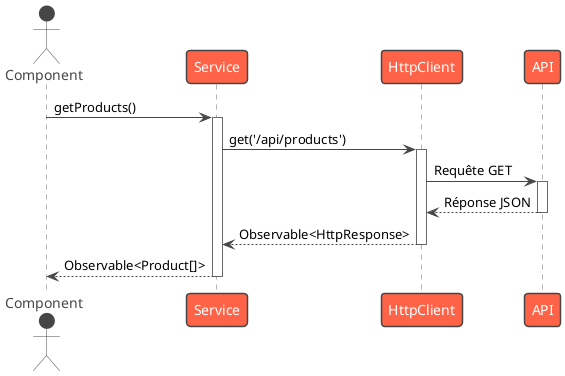

# Module 0 : L'essentiel - Introduction et Rappels Clés

### Objectifs pédagogiques

À la fin de ce module, vous serez capable de :

* **Comprendre** les enjeux et les défis liés au développement d'applications Angular à grande échelle.
* **Identifier** les compétences qui distinguent un développeur avancé d'un développeur compétent.
* **Valider** votre maîtrise des concepts fondamentaux d'Angular : Composants Standalone, Services, Injection de
  Dépendances et Formulaires Réactifs.
* **Susciter** votre curiosité pour les sujets avancés qui seront abordés tout au long de ce cours.

### Introduction

Félicitations ! Vous avez déjà parcouru une partie importante du chemin. Vous savez créer des composants, interagir avec
des API et construire des formulaires. Vous avez probablement déjà livré vos premières applications Angular et ressenti
la satisfaction de voir votre code prendre vie.

Mais que se passe-t-il quand l'application grandit ? Quand les fonctionnalités s'ajoutent les unes aux autres ? Quand
plusieurs développeurs doivent collaborer sur la même base de code ? C'est là que de nouveaux défis apparaissent : la
performance, la maintenabilité du code, et la capacité de l'application à évoluer sans s'effondrer sous son propre
poids.

Ce cours a été conçu pour vous faire passer ce cap. Nous n'allons pas seulement apprendre de nouvelles fonctionnalités
d'Angular, nous allons apprendre à **penser comme des architectes d'applications**. Nous allons découvrir les patrons de
conception, les stratégies et les outils qui vous permettront de construire des applications robustes, performantes et
agréables à maintenir.

Prêts à passer au niveau supérieur ? C'est parti !

### De Développeur à Architecte d'Application

Imaginez un petit projet qui démarre vite. Au début, tout est simple. Mais au fil des mois, les demandes évoluent,
l'équipe s'agrandit, et ce qui était un code simple et clair commence à ressembler à un labyrinthe. Ajouter une nouvelle
fonctionnalité devient une épreuve, et corriger un bug en crée deux autres. C'est une situation que tout développeur a
connue.

Pour éviter cela, un développeur avancé se pose constamment trois questions :

1. **Performance :** Mon application est-elle rapide ? Le temps de chargement initial est-il optimal ? Les interactions
   sont-elles fluides ? Un utilisateur patient est un mythe. La performance perçue est un facteur clé de succès.

2. **Maintenabilité :** Si un nouveau développeur rejoint le projet, combien de temps lui faudra-t-il pour être
   productif ? Est-il facile de trouver où modifier le code pour une fonctionnalité donnée ? Un code maintenable est un
   code qui peut vivre et évoluer sur le long terme.

3. **Scalabilité :** L'architecture de mon application peut-elle supporter l'ajout de nombreuses fonctionnalités
   complexes ? L'équipe peut-elle travailler en parallèle sur différentes parties de l'application sans se gêner ?

Ce sont précisément ces défis que nous allons apprendre à relever ensemble, en explorant des sujets comme la gestion
d'état, les stratégies d'optimisation et les tests avancés.

### Validation des Acquis : Les Piliers d'Angular

Avant de plonger dans les profondeurs, assurons-nous que nous partageons tous le même vocabulaire et les mêmes bases
solides. Voici un rappel "à 30 000 pieds" des quatre piliers sur lesquels nous allons construire notre expertise.

<tabs>
<tab title="Composants Standalone">
Depuis Angular 14, les composants Standalone sont la nouvelle norme. Ils simplifient l'architecture en supprimant la nécessité des `NgModules`. Un composant se déclare lui-même et gère ses propres dépendances. C'est la brique de base de nos applications modernes.

```typescript
import {Component} from '@angular/core';
import {CommonModule} from '@angular/common';
import {RouterOutlet} from '@angular/router';

@Component({
    selector: 'app-root',
    standalone: true, // Ce composant est autonome
    imports: [CommonModule, RouterOutlet], // Il importe ce dont il a besoin
    template: `<h1>Bienvenue !</h1>`
})
export class AppComponent {
    title = 'my-advanced-app';
}
```

</tab>
<tab title="Services et Injection de Dépendances (DI)">
Le cœur de la logique métier ne doit pas résider dans les composants. Les **Services** sont des classes TypeScript dédiées à une tâche précise (appeler une API, gérer l'authentification, etc.). Grâce à l'**Injection de Dépendances**, Angular peut automatiquement "fournir" une instance d'un service à n'importe quel composant qui en fait la demande dans son constructeur.

L'injecteur racine (`providedIn: 'root'`) crée un singleton du service, une seule instance partagée pour toute
l'application.

```typescript
// user.service.ts
import {Injectable} from '@angular/core';

@Injectable({
    providedIn: 'root' // Disponible dans toute l'application
})
export class UserService {
    getUsers() {
        // Logique pour récupérer les utilisateurs
        return [{id: 1, name: 'Alice'}];
    }
}
```

```typescript
// user-list.component.ts
import {Component, OnInit} from '@angular/core';
import {UserService} from './user.service';

@Component({
    selector: 'app-user-list',
    // ...
})
export class UserListComponent implements OnInit {
    // Angular va injecter l'instance unique de UserService ici
    constructor(private userService: UserService) {
    }

    ngOnInit() {
        const users = this.userService.getUsers();
        console.log(users);
    }
}
```

@startuml
skinparam linetype ortho
!theme vibrant

class UserListComponent {

+ constructor(userService: UserService)
  }

class UserService {

+ getUsers(): User[]
  }

UserListComponent ..> UserService : "dépend de"
@enduml

</tab>
<tab title="RxJS et Asynchronisme">
Dans le monde du web, tout est asynchrone : les appels HTTP, les interactions utilisateur, etc. RxJS est une bibliothèque qui permet de gérer ces flux de données asynchrones (les **Observables**) de manière élégante et puissante. Au lieu d'attendre une réponse, on "s'abonne" à un flux et on réagit aux données au fur et à mesure qu'elles arrivent.

`HttpClient` d'Angular retourne des Observables, ce qui en fait un partenaire naturel de RxJS.

```typescript
// data.service.ts
import {Injectable} from '@angular/core';
import {HttpClient} from '@angular/common/http';
import {Observable} from 'rxjs';
import {map} from 'rxjs/operators';

@Injectable({providedIn: 'root'})
export class DataService {

    constructor(private http: HttpClient) {
    }

    getProducts(): Observable<Product[]> {
        return this.http.get<{ data: Product[] }>('/api/products').pipe(
            map(response => response.data) // Transforme le flux de données
        );
    }
}
```



</tab>
<tab title="Formulaires Réactifs">
Pour gérer les formulaires complexes avec des logiques de validation riches, les Formulaires Réactifs sont l'outil de choix. Le modèle du formulaire (`FormGroup`, `FormControl`) est défini et géré dans la classe du composant, ce qui le rend facile à tester et à manipuler. La synchronisation avec le template HTML se fait via des directives comme `[formGroup]` et `formControlName`.

```typescript
// profile-editor.component.ts
import {Component, OnInit} from '@angular/core';
import {FormBuilder, FormGroup, Validators} from '@angular/forms';

@Component({
    selector: 'app-profile-editor',
    // ...
})
export class ProfileEditorComponent implements OnInit {
    profileForm: FormGroup;

    constructor(private fb: FormBuilder) {
    }

    ngOnInit() {
        this.profileForm = this.fb.group({
            // Crée un contrôle de formulaire avec une valeur initiale
            // et des validateurs
            firstName: ['', Validators.required],
            lastName: ['', [Validators.required, Validators.minLength(2)]],
        });
    }

    onSubmit() {
        console.log(this.profileForm.value);
    }
}
```

</tab>
</tabs>

### Exercice 0.1 : Consolidation des acquis

Mettons ces quatre piliers en action dans un petit exercice de synthèse.

**Objectif :** Créer un composant simple qui récupère une liste de "tâches" (todos) via un service et permet d'en
ajouter une nouvelle via un formulaire réactif.

**Instructions :**

1. **Créez un service `TodoService`** qui a une méthode `getTodos()` retournant un `Observable` d'un tableau de tâches (
   vous pouvez simuler avec `of([{ id: 1, title: 'Apprendre Angular' }])`) et une méthode `addTodo(todo)` qui ajoute une
   tâche à la liste.
2. **Créez un composant Standalone `TodoListComponent`**.
3. **Injectez `TodoService`** dans le composant.
4. Dans `ngOnInit`, appelez `getTodos()` pour initialiser la liste des tâches.
5. **Créez un formulaire réactif** avec un seul champ `title` qui doit être non vide (`Validators.required`).
6. Quand le formulaire est soumis et valide, **appelez la méthode `addTodo()`** du service, puis réinitialisez le
   formulaire.
7. **Affichez la liste des tâches** dans le template et le formulaire d'ajout.

#### Correction exercice 0.1 {collapsible='true'}

<procedure>
<p>Voici une solution possible pour cet exercice. Concentrez-vous sur la manière dont les différents concepts s'articulent.</p>

**1. Le Service `TodoService`**

Ce service utilise un `BehaviorSubject` pour simuler une source de données réactive. C'est un avant-goût de ce que nous
verrons dans le module sur la gestion d'état !

```typescript
// src/app/todo.service.ts
import {Injectable} from '@angular/core';
import {BehaviorSubject, Observable, of} from 'rxjs';
import {map} from 'rxjs/operators';

export interface Todo {
    id: number;
    title: string;
    completed: boolean;
}

@Injectable({
    providedIn: 'root'
})
export class TodoService {

    // Un BehaviorSubject maintient la valeur actuelle et la diffuse
    // aux nouveaux abonnés.
    private todos$ = new BehaviorSubject<Todo[]>([
        {id: 1, title: 'Maîtriser les bases d-Angular', completed: true},
        {id: 2, title: 'Apprendre RxJS', completed: false},
    ]);

    // Expose l'Observable public pour que les composants s'y abonnent
    getTodos(): Observable<Todo[]> {
        return this.todos$.asObservable();
    }

    // Méthode pour ajouter une nouvelle tâche
    addTodo(title: string): void {
        // Récupère la liste actuelle
        const currentTodos = this.todos$.getValue();
        const newTodo: Todo = {
            // Calcule un nouvel ID simple
            id: Math.max(...currentTodos.map(t => t.id)) + 1,
            title: title,
            completed: false
        };

        // Met à jour le BehaviorSubject avec la nouvelle liste
        this.todos$.next([...currentTodos, newTodo]);
    }
}
```

**2. Le Composant `TodoListComponent`**

Ce composant est Standalone et importe tout ce dont il a besoin. Il orchestre la vue, le formulaire et le service.

```typescript
// src/app/todo-list/todo-list.component.ts
import {Component, OnInit, inject} from '@angular/core';
import {CommonModule} from '@angular/common';
import {FormBuilder, FormGroup, ReactiveFormsModule, Validators}
    from '@angular/forms';
import {Observable} from 'rxjs';
import {Todo, TodoService} from '../todo.service';

@Component({
    selector: 'app-todo-list',
    standalone: true,
    imports: [
        CommonModule,
        ReactiveFormsModule // Indispensable pour les formulaires réactifs
    ],
    template: `
    <h2>Ma Liste de Tâches</h2>
    
    <!-- On utilise le pipe 'async' pour s'abonner automatiquement -->
    <ul>
      <li *ngFor="let todo of todos$ | async">
        {{ todo.title }}
      </li>
    </ul>

    <h3>Ajouter une tâche</h3>
    <form [formGroup]="todoForm" (ngSubmit)="onSubmit()">
      <input 
        type="text" 
        formControlName="title" 
        placeholder="Nouvelle tâche...">
      
      <button type="submit" [disabled]="todoForm.invalid">
        Ajouter
      </button>
    </form>
  `,
    styleUrls: ['./todo-list.component.css']
})
export class TodoListComponent implements OnInit {
    // Injection de dépendances moderne avec inject()
    private todoService = inject(TodoService);
    private fb = inject(FormBuilder);

    // L'Observable qui sera consommé par le template
    todos$!: Observable<Todo[]>;
    todoForm!: FormGroup;

    ngOnInit(): void {
        this.todos$ = this.todoService.getTodos();

        this.todoForm = this.fb.group({
            title: ['', Validators.required]
        });
    }

    onSubmit(): void {
        if (this.todoForm.invalid) {
            return;
        }

        const title = this.todoForm.get('title')?.value;
        this.todoService.addTodo(title);

        // Réinitialise le formulaire pour la prochaine saisie
        this.todoForm.reset();
    }
}
```

</procedure>

### Auto-évaluation

Prenez un moment pour répondre à ces questions. L'objectif n'est pas d'avoir tout juste, mais de mesurer votre niveau de
confiance sur ces sujets de base. Les corrections sont à la toute fin du support de cours.

1. **Quel est le principal avantage des composants Standalone par rapport aux `NgModule` ?**<br/>
   a. Ils sont plus performants à l'exécution.<br/>
   b. Ils simplifient la gestion des dépendances et réduisent le code standard (boilerplate).<br/>
   c. Ils permettent d'utiliser TypeScript 5.0.<br/>
   d. Ils sont obligatoires pour utiliser les Formulaires Réactifs.<br/>

2. **Expliquez avec vos propres mots le rôle du décorateur `@Injectable({ providedIn: 'root' })` sur une classe de
   service.**

3. **Dans un contexte de recherche auto-complétée où chaque nouvelle frappe au clavier doit annuler la requête HTTP
   précédente, quel opérateur RxJS est le plus approprié ?**<br/>
   a. `mergeMap`<br/>
   b. `concatMap`<br/>
   c. `switchMap`<br/>
   d. `exhaustMap`<br/>

4. **Pourquoi les Formulaires Réactifs sont-ils généralement considérés comme plus "scalables" (adaptés à la croissance)
   que les Formulaires pilotés par le template (Template-Driven) ?**

5. **À quoi sert le `async` pipe dans un template Angular ?**<br/>
   a. Il convertit une `Promise` en `Observable`.<br/>
   b. Il s'abonne à un `Observable` ou une `Promise` et retourne la dernière valeur émise, gérant automatiquement la
   désinscription.<br/>
   c. Il rend les appels `HttpClient` synchrones.<br/>
   d. Il met en pause le rendu du composant jusqu'à ce que les données arrivent.<br/>

### Conclusion

Dans ce module d'introduction, nous avons posé le décor. Nous avons défini notre objectif : devenir des développeurs
Angular capables de construire des applications complexes, performantes et maintenables. Nous avons également solidifié
nos connaissances sur les quatre piliers qui rendent Angular si puissant. Vous avez même eu un aperçu de la
programmation réactive avec le `BehaviorSubject` dans la correction de l'exercice.

Maintenant que les fondations sont solides, nous sommes prêts à plonger dans le cœur de la programmation réactive avec
notre premier module avancé : **la maîtrise de RxJS**. C'est là que nous transformerons les flux de données en alliés
pour résoudre des problèmes complexes.

Accrochez-vous, le voyage ne fait que commencer 