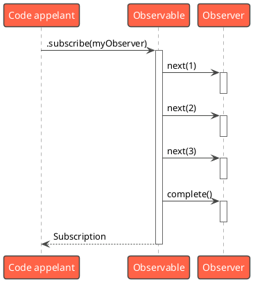
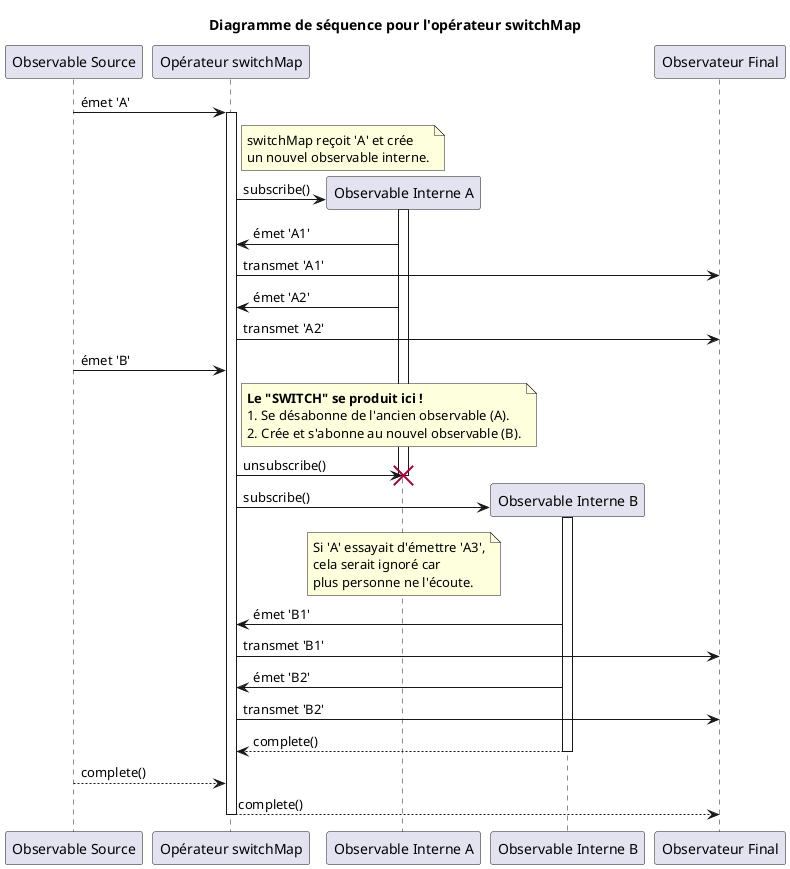
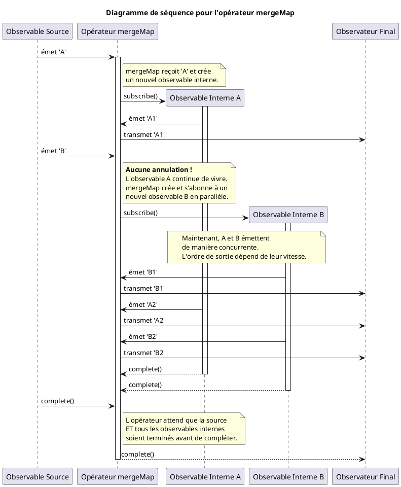
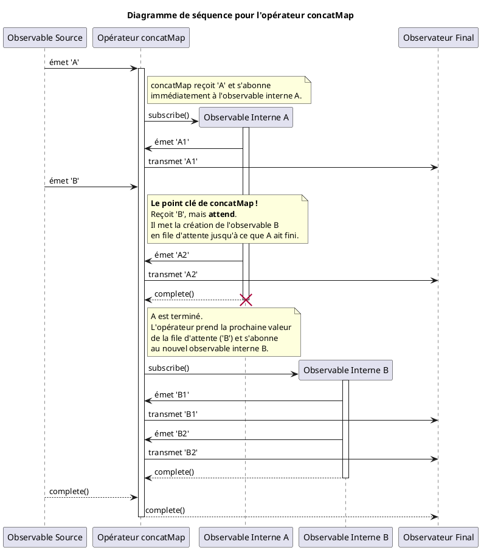
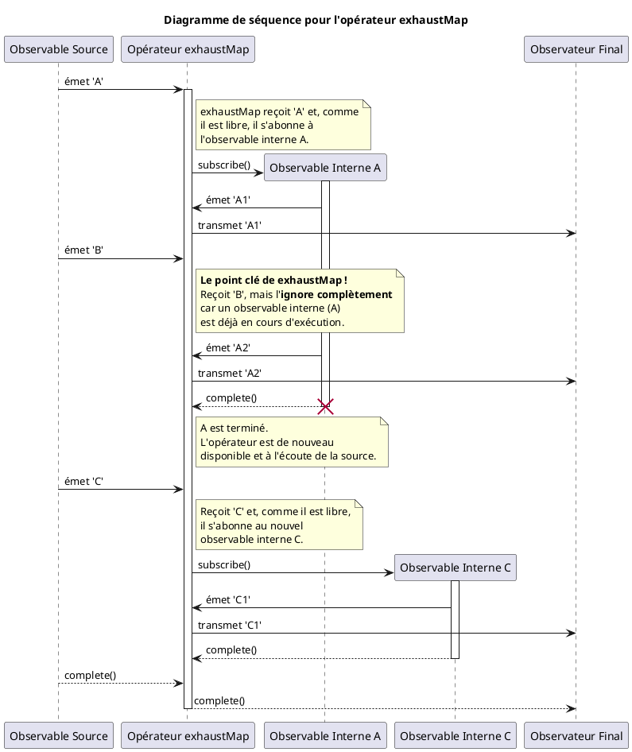

# Module 1 : L'essentiel - Maîtrise de RxJS, le cœur réactif d'Angular

### Objectifs pédagogiques

À la fin de ce module, vous serez capable de :

* **Distinguer** clairement les concepts fondamentaux de RxJS : `Observable`, `Observer` et `Subscription`.
* **Choisir** le bon type de `Subject` (`Subject` vs `BehaviorSubject`) pour des cas d'usage précis, notamment pour
  faire le pont entre le monde impératif et le monde réactif.
* **Maîtriser** le quatuor essentiel des opérateurs de transformation de flux : `switchMap`, `mergeMap`, `concatMap` et
  `exhaustMap`.
* **Appliquer** ces concepts pour résoudre des problèmes concrets et courants, comme la recherche auto-complétée.

### Introduction

Vous avez déjà utilisé RxJS, peut-être sans même y penser en profondeur. Chaque fois que vous avez utilisé `HttpClient`,
vous avez manipulé un `Observable`. Mais vous n'avez fait qu'effleurer la surface de ce qui est sans doute la
bibliothèque la plus puissante de l'écosystème Angular.

Imaginez que vous commandez une pizza. L'approche classique (avec les `Promise`) serait d'attendre passivement devant
votre porte jusqu'à ce que le livreur arrive. Vous ne savez rien de ce qui se passe entre temps.
La programmation réactive avec RxJS, c'est comme avoir une application de suivi : vous recevez une série de
notifications. "Commande reçue", "Préparation en cours", "Livreur en route", "Pizza livrée". Vous ne recevez pas une
seule information à la fin, mais un **flux d'événements dans le temps**.

RxJS vous donne les outils pour créer, combiner, filtrer et transformer ces flux de données. Maîtriser RxJS, c'est
passer d'un développeur qui subit l'asynchronisme à un architecte qui l'orchestre avec précision. C'est la compétence
qui débloquera votre capacité à gérer des scénarios complexes avec un code étonnamment simple et lisible.

### Les Piliers de RxJS

Pour bien construire, il faut des fondations solides. En RxJS, elles reposent sur trois piliers.

1. **L'Observable** : C'est le producteur de données, le flux. Imaginez-le comme un journal. Il publie des
   informations (les valeurs) au fil du temps. Il peut aussi signaler quand il a fini de publier (`complete`) ou si une
   erreur est survenue (`error`).
2. **L'Observer** : C'est le consommateur. C'est un objet avec trois méthodes (`next`, `error`, `complete`) qui sait
   comment réagir aux informations publiées par l'Observable. C'est votre lecteur du journal.
3. **La Subscription** : C'est le lien entre l'Observable et l'Observer. Quand vous faites `.subscribe()`, vous créez
   cet abonnement. C'est ce qui déclenche la production des valeurs. Surtout, cet abonnement possède une méthode
   `unsubscribe()` pour se désabonner et éviter les fuites de mémoire.

```typescript
import {Observable} from 'rxjs';

// 1. Création de l'Observable (le journal)
const myObservable$ = new Observable(subscriber => {
    console.log('L-Observable commence à produire...');
    subscriber.next(1); // Publie la valeur 1
    subscriber.next(2); // Publie la valeur 2
    // subscriber.error('Une erreur est survenue !'); // Pourrait publier une erreur
    subscriber.next(3); // Publie la valeur 3
    subscriber.complete(); // Annonce la fin de la publication
    // Ce code ne sera jamais exécuté car le flux est terminé
    subscriber.next(4);
});

// 2. Création de l'Observer (le lecteur)
const myObserver = {
    next: (value: number) => console.log(`Valeur reçue : ${value}`),
    error: (err: string) => console.error(`Erreur : ${err}`),
    complete: () => console.log('Le flux est terminé.')
};

// 3. Création de la Subscription (l'abonnement)
console.log('Avant l-abonnement');
const subscription = myObservable$.subscribe(myObserver);
console.log('Après l-abonnement');

// Plus tard, pour arrêter d'écouter
// subscription.unsubscribe();
```



### Les `Subjects` : Le Pont entre Deux Mondes

Un `Observable` standard est "froid" : il ne commence à produire ses valeurs que lorsqu'on s'y abonne, et chaque abonné
reçoit sa propre séquence de valeurs (comme si chacun recevait sa propre copie du journal).

Un **`Subject`** est différent. Il est "chaud". C'est un type spécial d'Observable qui permet de "pousser" des valeurs à
plusieurs Observers en même temps (multicast). Il agit comme un canal de communication. Il est à la fois un
`Observable` (on peut s'y abonner) et un `Observer` (on peut lui passer des valeurs avec `.next()`).

C'est le pont parfait entre le code impératif (ex: un clic sur un bouton) et le monde réactif de RxJS.

<tabs>
<tab title="Subject">

Un `Subject` de base. Il n'a pas de mémoire. Si vous vous abonnez après qu'une valeur a été émise, vous ne la recevrez pas. Vous ne recevrez que les valeurs émises *après* votre abonnement.

```typescript
import {Subject} from 'rxjs';

const mySubject = new Subject<string>();

// Le premier abonné arrive
mySubject.subscribe(value => console.log(`Abonné 1: ${value}`));

mySubject.next('Hello'); // Émet une valeur
mySubject.next('World'); // Émet une autre valeur

// Le deuxième abonné arrive en retard
mySubject.subscribe(value => console.log(`Abonné 2: ${value}`));

mySubject.next('!'); // Seuls les deux abonnés reçoivent cette valeur

// Output:
// Abonné 1: Hello
// Abonné 1: World
// Abonné 1: !
// Abonné 2: !
```

</tab>
<tab title="BehaviorSubject">

Le `BehaviorSubject` est l'un des outils les plus utiles de votre arsenal. Il a deux super-pouvoirs :
1.  Il doit être créé avec une **valeur initiale**.
2.  Il garde en mémoire la **dernière valeur émise** et la fournit immédiatement à tout nouvel abonné.

C'est l'outil parfait pour représenter des "états" qui évoluent dans le temps (ex: l'utilisateur connecté, la valeur
d'un panier, etc.).

```typescript
import {BehaviorSubject} from 'rxjs';

// Créé avec une valeur initiale
const myBhvSubject = new BehaviorSubject<string>('Valeur initiale');

myBhvSubject.subscribe(value => console.log(`Abonné 1: ${value}`));

myBhvSubject.next('Nouvelle valeur');

// Le deuxième abonné arrive et reçoit immédiatement la dernière valeur
myBhvSubject.subscribe(value => console.log(`Abonné 2: ${value}`));

// Output:
// Abonné 1: Valeur initiale
// Abonné 1: Nouvelle valeur
// Abonné 2: Nouvelle valeur
```

</tab>
</tabs>

### Les Opérateurs de Transformation de Flux

Le vrai pouvoir de RxJS vient des opérateurs. Imaginez-les comme une chaîne de montage pour vos flux de données.

Un cas très courant est celui où une valeur d'un premier `Observable` (ex: un terme de recherche) déclenche la création
d'un autre `Observable` (ex: un appel HTTP). C'est ce qu'on appelle un "Higher-Order Observable". Pour gérer cela, nous
avons un quatuor d'opérateurs essentiels. La clé est de comprendre comment chacun gère la "concurrence" entre ces
Observables internes.

<tabs>
<tab title="switchMap">

**Le Scénario :** La recherche auto-complétée. L'utilisateur tape "a", puis "ap", puis "app". Vous ne voulez que le résultat de la dernière recherche ("app").

**La Stratégie `switchMap` :** Dès qu'une nouvelle valeur arrive du flux source, il se **désabonne de l'Observable
précédent** et ne s'abonne qu'au nouveau. C'est l'opérateur de choix pour les actions de type "annuler-et-remplacer".



</tab>
<tab title="mergeMap (flatMap)">

**Le Scénario :** L'utilisateur clique sur plusieurs boutons qui déclenchent des actions longues mais indépendantes (ex: téléverser plusieurs fichiers).

**La Stratégie `mergeMap` :** Il s'abonne à tous les Observables internes **en parallèle** et émet leurs valeurs dès
qu'elles arrivent, sans se soucier de l'ordre. Idéal pour la parallélisation.



</tab>
<tab title="concatMap">

**Le Scénario :** Vous devez sauvegarder un formulaire, et seulement si la sauvegarde réussit, mettre à jour les logs. Les actions doivent se faire **en séquence**.

**La Stratégie `concatMap` :** Il attend que l'Observable interne actuel se termine (`complete`) avant de s'abonner au
suivant. Il garantit **le respect de l'ordre**.



</tab>
<tab title="exhaustMap">

**Le Scénario :** Un bouton de soumission de formulaire. L'utilisateur double-clique frénétiquement. Vous ne voulez prendre en compte que le premier clic et **ignorer tous les autres** tant que la première requête n'est pas terminée.

**La Stratégie `exhaustMap` :** Il s'abonne au premier Observable interne et ignore toutes les nouvelles valeurs de la
source tant que cet Observable n'est pas terminé. Parfait pour éviter les actions multiples non désirées.



</tab>
</tabs>

#### Tableau Récapitulatif : `switchMap` vs `mergeMap` vs `concatMap` vs `exhaustMap`

| Opérateur        | Comportement principal                                                                 | Concurrence                                                               | Ordre de sortie                                                                | Analogie                                                      |
|:-----------------|:---------------------------------------------------------------------------------------|:--------------------------------------------------------------------------|:-------------------------------------------------------------------------------|:--------------------------------------------------------------|
| `**switchMap**`  | **ANNULE** l'observable précédent.                                                     | 1 seul observable interne actif.                                          | Uniquement les valeurs du *dernier* observable.                                | Changer de chaîne de télévision.                              |
| `**mergeMap**`   | Exécute tout **EN PARALLÈLE**.                                                         | Plusieurs observables actifs simultanément.                               | L'ordre dépend de la vitesse de chaque observable.                             | Regarder plusieurs écrans en même temps.                      |
| `**concatMap**`  | Exécute tout **EN SÉQUENCE**.                                                          | 1 seul observable interne actif (les autres attendent).                   | Garanti, identique à l'ordre de la source.                                     | Une file d'attente à un guichet unique.                       |
| `**exhaustMap**` | **IGNORE** les nouvelles valeurs de la source tant que l'observable interne est actif. | 1 seul observable interne actif (les nouvelles tentatives sont rejetées). | Garanti pour les observables *traités*, mais des valeurs sources sont perdues. | Un bouton "Soumettre" qui se désactive pendant le chargement. |

### Exercice 1.1 : La recherche auto-complétée

C'est l'exercice classique pour maîtriser `switchMap`. Nous allons construire un champ de recherche qui appelle un (
faux) service de recherche, en optimisant les appels.

**Objectif :** Créer un composant avec un champ de recherche. Chaque fois que l'utilisateur tape du texte, nous
voulons :

1. Attendre une pause de 300ms pour ne pas lancer de recherche à chaque frappe (`debounceTime`).
2. Ne pas lancer de recherche si le texte n'a pas changé (ex: `a` -> `a` en appuyant sur Shift) (
   `distinctUntilChanged`).
3. Lancer un appel à un service de recherche. Si une nouvelle recherche est lancée, annuler la précédente (`switchMap`).

**Instructions :**

1. **Créez un service `SearchService`** avec une méthode `search(term: string): Observable<string[]>`. Cette méthode
   simulera un appel HTTP avec un délai, en utilisant `of([...]).pipe(delay(500))`. Elle retournera des résultats qui
   contiennent le terme de recherche.
2. **Dans votre composant**, créez un `FormControl` pour le champ de recherche.
3. Abonnez-vous à l'Observable `valueChanges` de ce `FormControl`.
4. **Pipez** cet `Observable` à travers les opérateurs `debounceTime(300)`, `distinctUntilChanged()`, et `switchMap()`
   qui appellera votre `SearchService`.
5. Affichez les résultats dans votre template.

#### Correction exercice 1.1 {collapsible='true'}

<procedure>
<p>Voici une implémentation complète de la recherche auto-complétée.</p>

**1. Le service `SearchService`**

Ce service simule une API qui prend du temps à répondre.

```typescript
// src/app/search.service.ts
import {Injectable} from '@angular/core';
import {Observable, of} from 'rxjs';
import {delay} from 'rxjs/operators';

@Injectable({
    providedIn: 'root'
})
export class SearchService {

    private allItems = [
        'Angular', 'React', 'Vue', 'Svelte',
        'RxJS', 'NgRx', 'Node.js', 'TypeScript'
    ];

    search(term: string): Observable<string[]> {
        console.log(`Recherche du terme: "${term}"`);

        // Si le terme est vide, on retourne un tableau vide
        if (!term.trim()) {
            return of([]);
        }

        // Filtre les items et simule une latence réseau
        const results = this.allItems.filter(item =>
            item.toLowerCase().includes(term.toLowerCase())
        );

        // 'of' crée un Observable qui émet les résultats,
        // 'delay' simule un appel réseau de 500ms
        return of(results).pipe(delay(500));
    }
}
```

**2. Le composant de recherche**

Le composant orchestre la logique RxJS.

```typescript
// src/app/search/search.component.ts
import {Component, OnInit, inject} from '@angular/core';
import {CommonModule} from '@angular/common';
import {FormControl, ReactiveFormsModule} from '@angular/forms';
import {Observable, of} from 'rxjs';
import {
    debounceTime,
    distinctUntilChanged,
    switchMap,
    tap
} from 'rxjs/operators';

import {SearchService} from '../search.service';

@Component({
    selector: 'app-search',
    standalone: true,
    imports: [CommonModule, ReactiveFormsModule],
    template: `
    <h2>Recherche Intelligente avec RxJS</h2>
    <input 
      type="text" 
      [formControl]="searchControl" 
      placeholder="Tapez pour rechercher...">

    <div *ngIf="isLoading" class="loader">Chargement...</div>

    <ul *ngIf="results$ | async as results">
      <li *ngIf="results.length === 0 && searchControl.value">
        Aucun résultat
      </li>
      <li *ngFor="let result of results">{{ result }}</li>
    </ul>
  `
})
export class SearchComponent implements OnInit {
    private searchService = inject(SearchService);

    searchControl = new FormControl('');
    results$!: Observable<string[]>;
    isLoading = false;

    ngOnInit(): void {
        this.results$ = this.searchControl.valueChanges.pipe(
            // Attend 300ms après la dernière frappe
            debounceTime(300),

            // Affiche le terme dans la console (pour le débogage)
            tap(term => console.log(`Terme déboggué: ${term}`)),

            // Ne continue que si la valeur a réellement changé
            distinctUntilChanged(),

            // Affiche/cache un loader
            tap(() => this.isLoading = true),

            // Annule la recherche précédente et lance la nouvelle
            switchMap(term => this.searchService.search(term || '')),

            // Cache le loader une fois les résultats reçus
            tap(() => this.isLoading = false)
        );
    }
}
```

</procedure>

### Auto-évaluation

1. **Vous utilisez un `BehaviorSubject` pour stocker l'utilisateur actuellement connecté. Un nouveau composant s'abonne
   à ce `BehaviorSubject`. Que reçoit-il immédiatement ?**
   a. Rien, il doit attendre la prochaine connexion/déconnexion.
   b. La valeur initiale avec laquelle le `BehaviorSubject` a été créé.
   c. La toute dernière valeur de l'utilisateur qui a été émise (ou la valeur initiale si aucune n'a été émise).
   d. Un message d'erreur, car on ne peut s'abonner qu'une seule fois.

2. **Expliquez avec vos propres mots la différence fondamentale de comportement entre `switchMap` et `mergeMap`.**

3. **Vous devez implémenter une séquence d'appels API : 1. `createOrder()` 2. `processPayment()`
   3. `sendConfirmationEmail()`. Chaque étape ne doit commencer que si la précédente a réussi. Quel opérateur de
   transformation de flux est le plus adapté ?**
   a. `switchMap`
   b. `mergeMap`
   c. `exhaustMap`
   d. `concatMap`

4. **À quoi sert l'objet retourné par un appel à `.subscribe()` ? Pourquoi est-il crucial de ne pas le "perdre", en
   particulier dans les composants Angular ?**

5. **Quelle est la principale différence entre un `Observable` créé avec `new Observable(...)` et un `Subject` ?**
   a. Un `Subject` ne peut émettre que des nombres, un `Observable` peut émettre n'importe quoi.
   b. Un `Subject` est "chaud" et multicast (partage ses valeurs), tandis qu'un `Observable` standard est "froid" et
   unicast (chaque abonné a sa propre exécution).
   c. Seuls les `Observables` peuvent être utilisés avec `HttpClient`.
   d. Les `Subjects` n'ont pas de méthode `complete()`.

### Conclusion

Vous venez de faire un grand pas dans la maîtrise d'Angular. Nous avons décortiqué les briques de base de RxJS, compris
l'utilité des `Subjects` comme pont entre deux mondes, et surtout, nous avons appris à choisir le bon outil parmi le
quatuor `switchMap`, `mergeMap`, `concatMap`, `exhaustMap` pour orchestrer des opérations asynchrones complexes.

Ce n'est qu'un début. La programmation réactive est un changement de paradigme. Entraînez-vous à "penser en flux". La
prochaine fois que vous ferez face à un problème asynchrone, demandez-vous : "Comment puis-je le modéliser avec des
`Observables` et des opérateurs ?"

Dans la partie "Pour aller plus loin", nous allons ajouter des outils essentiels à notre panoplie : comment gérer les
erreurs avec élégance, et comment combiner plusieurs flux de données pour créer des vues encore plus riches et
synchronisées.