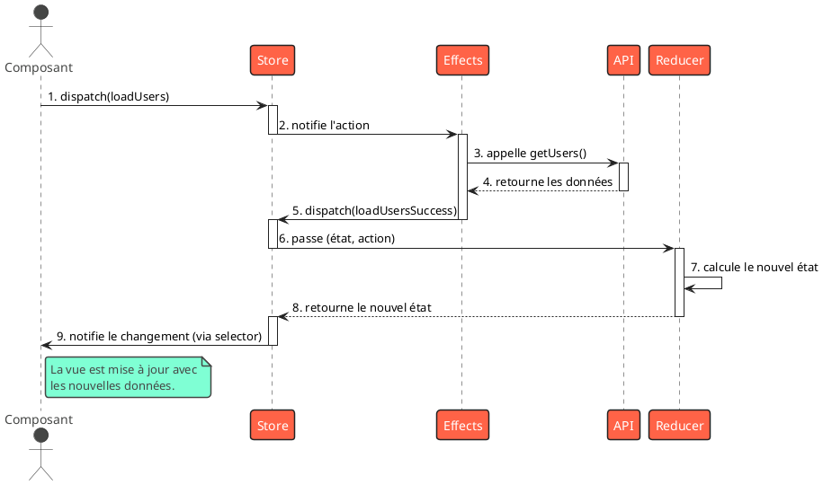

# Module 2 : Pour aller plus loin - Introduction à NgRx (L'approche Redux)

### Objectifs pédagogiques

À la fin de cette partie, vous serez capable de :

* **Comprendre** la philosophie derrière NgRx : état unique, immuable et flux de données unidirectionnel.
* **Distinguer** le rôle de chaque acteur principal de NgRx : `Store`, `Actions`, `Reducers`, `Effects`, et `Selectors`.
* **Mettre en œuvre** un cycle complet de gestion d'état avec NgRx : de l'action de l'utilisateur à la mise à jour de la
  vue.
* **Refactoriser** une fonctionnalité existante pour utiliser NgRx.

### Introduction

Le service "stateful" que nous avons construit est un outil fantastique. C'est votre couteau suisse : polyvalent, simple
et efficace pour de nombreuses situations. Mais que se passe-t-il lorsque vous ne construisez plus une cabane, mais un
gratte-ciel ? Quand plusieurs équipes d'artisans doivent travailler en même temps, chacune sur un étage différent, tout
en s'assurant que la plomberie et l'électricité restent cohérentes dans tout le bâtiment ?

C'est là que le couteau suisse montre ses limites. Vous avez besoin d'un plan d'architecte détaillé, d'un cahier des
charges strict et de processus clairs. **NgRx est ce plan d'architecte.**

Inspiré par la bibliothèque Redux de l'écosystème React, NgRx apporte un cadre très structuré pour la gestion d'état. Sa
courbe d'apprentissage est plus raide, et il demande plus de code au départ ("boilerplate"). Alors pourquoi l'utiliser ?
Pour trois raisons fondamentales qui deviennent cruciales dans les grandes applications :

1. **Prévisibilité :** Les changements d'état deviennent extrêmement prévisibles, car ils doivent suivre un chemin
   strict et unique.
2. **Maintenabilité :** Le code est découpé en petites unités logiques (actions, reducers, effects), ce qui le rend plus
   facile à comprendre, à tester et à faire évoluer.
3. **Outillage (Tooling) :** NgRx s'accompagne d'outils de développement exceptionnels (comme le Redux DevTools) qui
   vous permettent de voyager dans le temps, d'inspecter chaque changement d'état et de déboguer votre application comme
   jamais auparavant.

Préparez-vous à changer de perspective. Nous n'allons plus simplement "modifier" l'état, nous allons "décrire" les
événements qui mènent à de nouveaux états.

### La Philosophie de NgRx

Tout repose sur trois principes, inspirés de Redux :

1. **Source de vérité unique :** L'état de toute votre application est stocké dans un seul objet, à l'intérieur d'un
   unique **Store**.
2. **L'état est en lecture seule (immuable) :** La seule façon de modifier l'état est d'émettre une **Action**, un objet
   décrivant ce qui s'est passé. On ne modifie jamais l'état existant, on en crée toujours un nouveau.
3. **Les changements sont effectués avec des fonctions pures :** Pour spécifier comment l'état est transformé par les
   actions, vous écrivez des **Reducers**. Un reducer est une fonction pure qui prend l'état précédent et une action, et
   retourne l'état suivant.

### Les Acteurs de NgRx

Pour comprendre le flux NgRx, il faut connaître sa troupe d'acteurs. Chacun a un rôle bien précis.

<tabs>
<tab title="Le Store">

C'est le cœur de NgRx. Un service injectable qui contient l'état global de l'application. On interagit avec lui de deux manières :

*   `store.dispatch(action)` : pour envoyer une instruction de changement.
*   `store.select(selector)` : pour lire une partie de l'état.

</tab>
<tab title="Les Actions">

Les Actions sont le point de départ de toute modification. 
Ce sont des **messages**, des descriptions d'événements. Elles disent *ce qui s'est passé*, pas *comment* l'état doit changer.

```typescript
// src/app/users/users.actions.ts
import {createAction, props} from '@ngrx/store';
import {User} from '../models/user.model';

// Décrit l'événement "L'utilisateur veut charger la liste"
export const loadUsers = createAction(
    '[Users Page] Load Users'
);

// Décrit l'événement "La liste a été chargée avec succès"
// et transporte la charge utile (payload)
export const loadUsersSuccess = createAction(
    '[Users API] Load Users Success',
    props<{ users: User[] }>()
);

// Décrit l'événement "Le chargement a échoué"
export const loadUsersFailure = createAction(
    '[Users API] Load Users Failure',
    props<{ error: any }>()
);
```

</tab>
<tab title="Les Reducers">

Le Reducer est le comptable. Il écoute toutes les actions qui passent. Quand il en reconnaît une, il prend l'état actuel, l'action, et **calcule le nouvel état**. C'est une **fonction pure** : pour les mêmes entrées, elle produit toujours la même sortie, sans aucun effet de bord (pas d'appel API ici !).

L'**immutabilité** est la règle d'or : on ne mute jamais `state`, on utilise le spread operator (`...`) pour créer une
nouvelle copie.

```typescript
// src/app/users/users.reducer.ts
import {createReducer, on} from '@ngrx/store';
import {loadUsers, loadUsersSuccess, loadUsersFailure}
    from './users.actions';

export interface UsersState {
    users: User[];
    isLoading: boolean;
    error: any;
}

export const initialState: UsersState = {
    users: [],
    isLoading: false,
    error: null
};

export const usersReducer = createReducer(
    initialState,
    // Quand l'action `loadUsers` est dispatchée...
    on(loadUsers, (state) => ({
        ...state, // ...on retourne un nouvel état
        isLoading: true
    })),

    // Quand l'action `loadUsersSuccess` arrive...
    on(loadUsersSuccess, (state, {users}) => ({
        ...state,
        users: users, // ...on met à jour les utilisateurs
        isLoading: false
    })),

    // Quand l'action `loadUsersFailure` arrive...
    on(loadUsersFailure, (state, {error}) => ({
        ...state,
        error: error,
        isLoading: false
    }))
);
```

</tab>
<tab title="Les Effects">

Mais alors, où fait-on les appels API ? Dans les **Effects** !
Un Effect est une classe qui écoute les actions, mais au lieu de modifier l'état, elle effectue des **effets de bord** (tâches asynchrones). Typiquement, un Effect va :

1. Écouter une action (ex: `loadUsers`).
2. Appeler un service (ex: `HttpClient`).
3. En cas de succès ou d'échec, dispatcher une **nouvelle action** (ex: `loadUsersSuccess` ou `loadUsersFailure`).

```typescript
// src/app/users/users.effects.ts
import {Injectable, inject} from '@angular/core';
import {Actions, createEffect, ofType} from '@ngrx/effects';
import {catchError, map, mergeMap} from 'rxjs/operators';
import {of} from 'rxjs';
import {UserService} from '../services/user.service';
import * as UsersActions from './users.actions';

@Injectable()
export class UsersEffects {
    private actions$ = inject(Actions);
    private userService = inject(UserService);

    loadUsers$ = createEffect(() =>
        this.actions$.pipe(
            // Écoute seulement les actions de type `loadUsers`
            ofType(UsersActions.loadUsers),
            // Appelle le service
            mergeMap(() => this.userService.getUsers().pipe(
                // Si ça réussit, dispatche l'action de succès
                map(users => UsersActions.loadUsersSuccess({users})),
                // Si ça échoue, dispatche l'action d'échec
                catchError(error => of(UsersActions.loadUsersFailure({error})))
            ))
        )
    );
}
```

</tab>
<tab title="Les Selectors">

Les Selectors sont des fonctions pures qui permettent de **lire des morceaux de l'état**. Ils sont optimisés : NgRx met en cache le résultat (`memoization`). Si l'état n'a pas changé, le selector retourne la dernière valeur calculée sans refaire le travail. C'est excellent pour la performance.

```typescript
// src/app/users/users.selectors.ts
import {createFeatureSelector, createSelector} from '@ngrx/store';
import {UsersState} from './users.reducer';

// Sélectionne la "tranche" de l'état qui concerne les utilisateurs
export const selectUsersState =
    createFeatureSelector<UsersState>('users');

// Sélectionne la liste des utilisateurs à partir de la tranche
export const selectAllUsers = createSelector(
    selectUsersState,
    (state) => state.users
);

// Sélectionne l'état de chargement
export const selectUsersIsLoading = createSelector(
    selectUsersState,
    (state) => state.isLoading
);
```

</tab>
</tabs>

### Le Flux de Données Unidirectionnel

Voici le cycle de vie complet, qui est le cœur de NgRx :



### Atelier Pratique : Refactoriser la Liste d'Utilisateurs avec NgRx

**Objectif :** Prendre une application simple qui charge des utilisateurs via un service, et la refactoriser pour
utiliser NgRx.

**Instructions :**

1. **Installez NgRx :** `ng add @ngrx/store @ngrx/effects @ngrx/store-devtools`
2. **Créez un dossier `store`** dans `src/app`. À l'intérieur, créez un dossier `users`.
3. **Définissez vos Actions** dans `users.actions.ts` : `loadUsers`, `loadUsersSuccess`, `loadUsersFailure`.
4. **Définissez votre State et votre Reducer** dans `users.reducer.ts`.
5. **Créez votre Effect** dans `users.effects.ts` pour gérer l'appel API.
6. **Créez vos Selectors** dans `users.selectors.ts`.
7. **Configurez le Store** dans votre `app.config.ts` (pour une application Standalone) en important les providers.
8. **Modifiez votre `UserListComponent`** :
    * Injectez le `Store`.
    * Dans `ngOnInit`, dispatchez l'action `loadUsers`.
    * Utilisez les selectors pour récupérer les données (`users$ = this.store.select(...)`) et les consommer dans le
      template avec le pipe `async`.

#### Correction exercice 2.2 {collapsible='true'}

<procedure>
<p>Voici l'implémentation complète du refactoring vers NgRx.</p>

**Prérequis : Un service `UserService` qui fait l'appel API.**

```typescript
// src/app/services/user.service.ts
import {Injectable, inject} from '@angular/core';
import {HttpClient} from '@angular/common/http';
import {Observable} from 'rxjs';
import {User} from '../models/user.model'; // Assurez-vous d'avoir ce modèle

@Injectable({providedIn: 'root'})
export class UserService {
    private http = inject(HttpClient);

    getUsers(): Observable<User[]> {
        return this.http.get<User[]>('https://jsonplaceholder.typicode.com/users');
    }
}
```

```typescript

// src/app/models/user.model.ts

export interface User {
  id: number;
  name: string;
  username: string;
  email: string;
}
```

**1. Les fichiers NgRx (dans `src/app/store/users/`)**

**Les actions**

```typescript
// src/app/store/users/user.actions.ts

import { createActionGroup, emptyProps, props } from '@ngrx/store';
import { User } from '../../models/user.model';

export const UsersActions = createActionGroup({
  // Source de l'action, utile pour le debugging avec les DevTools
  source: 'Users API',
  // Liste des événements
  events: {
    // Action déclenchée par le composant pour démarrer le chargement
    'LoadUsers': emptyProps(),

    // Action déclenchée par l'effect en cas de succès de l'appel API
    // Elle transporte la liste des utilisateurs en payload
    'LoadUsersSuccess': props<{ users: User[] }>(),

    // Action déclenchée par l'effect en cas d'échec de l'appel API
    // Elle transporte l'erreur en payload
    'LoadUsersFailure': props<{ error: any }>(),
  },
});
```

**Les reducers**

```typescript
// src/app/store/users/user.reducers.ts

import { createReducer, on } from '@ngrx/store';
import { User } from '../../models/user.model';
import { UsersActions } from './users.actions';

// 1. Définir la forme de la "tranche" d'état pour les utilisateurs
export interface UsersState {
  users: User[];
  isLoading: boolean;
  error: any | null;
}

// 2. Définir l'état initial
export const initialState: UsersState = {
  users: [],
  isLoading: false,
  error: null,
};

// 3. Créer le reducer
export const usersReducer = createReducer(
  initialState,

  // Quand l'action 'Load Users' est dispatchée, on passe en mode chargement
  on(UsersActions.loadUsers, (state) => ({
    ...state,
    isLoading: true,
    error: null, // On nettoie les erreurs précédentes
  })),

  // Quand l'action 'Load Users Success' arrive, on met à jour les utilisateurs et on arrête le chargement
  on(UsersActions.loadUsersSuccess, (state, { users }) => ({
    ...state,
    users: users,
    isLoading: false,
  })),

  // Quand l'action 'Load Users Failure' arrive, on stocke l'erreur et on arrête le chargement
  on(UsersActions.loadUsersFailure, (state, { error }) => ({
    ...state,
    error: error,
    isLoading: false,
  }))
);
```

**Les effects**

```typescript
// src/app/store/users/user.effects.ts

import { Injectable, inject } from '@angular/core';
import { Actions, createEffect, ofType } from '@ngrx/effects';
import { catchError, map, switchMap } from 'rxjs/operators';
import { of } from 'rxjs';

import { UserService } from '../../services/user.service';
import { UsersActions } from './users.actions';

@Injectable()
export class UsersEffects {
  private actions$ = inject(Actions);
  private userService = inject(UserService);

  // L'effect principal pour charger les utilisateurs
  loadUsers$ = createEffect(() =>
    this.actions$.pipe(
      // 1. Écoute uniquement l'action 'Load Users'
      ofType(UsersActions.loadUsers),

      // 2. Pour chaque action 'Load Users', annule les requêtes précédentes et lance une nouvelle
      switchMap(() =>
        // 3. Appelle le service pour récupérer les données
        this.userService.getUsers().pipe(
          // 4. En cas de succès, dispatche l'action 'Load Users Success' avec les données
          map((users) => UsersActions.loadUsersSuccess({ users })),

          // 5. En cas d'erreur, dispatche l'action 'Load Users Failure' avec l'erreur
          catchError((error) => of(UsersActions.loadUsersFailure({ error })))
        )
      )
    )
  );
}
```

**Les selectors**

```typescript
// src/app/store/users/user.selectors.ts

import { createFeatureSelector, createSelector } from '@ngrx/store';
import { UsersState } from './users.reducer';

// 1. Crée un "feature selector" pour récupérer la tranche d'état 'users'
// La chaîne 'users' doit correspondre à la clé définie dans app.config.ts
export const selectUsersFeatureState = createFeatureSelector<UsersState>('users');

// 2. Crée un selector pour obtenir la liste des utilisateurs depuis la tranche d'état
export const selectAllUsers = createSelector(
        selectUsersFeatureState,
        (state: UsersState) => state.users
);

// 3. Crée un selector pour obtenir l'état de chargement
export const selectUsersIsLoading = createSelector(
        selectUsersFeatureState,
        (state: UsersState) => state.isLoading
);

// 4. (Optionnel mais recommandé) Crée un selector pour l'erreur
export const selectUsersError = createSelector(
        selectUsersFeatureState,
        (state: UsersState) => state.error
);

```

* `users.actions.ts` : (Identique à l'exemple ci-dessus)
* `users.reducer.ts` : (Identique à l'exemple ci-dessus)
* `users.effects.ts` : (Identique à l'exemple ci-dessus)
* `users.selectors.ts` : (Identique à l'exemple ci-dessus)

**2. Configuration dans `app.config.ts`**

```typescript
// src/app/app.config.ts
import {
   ApplicationConfig,
   isDevMode,
   provideBrowserGlobalErrorListeners,
   provideZoneChangeDetection
} from '@angular/core';
import { provideRouter } from '@angular/router';
import { routes } from './app.routes';

import {provideHttpClient} from '@angular/common/http';
import {usersReducer} from './store/users/users.reducer';
import {provideStore} from '@ngrx/store';
import {provideEffects} from '@ngrx/effects';
import {UsersEffects} from './store/users/users.effects';
import { provideStoreDevtools } from '@ngrx/store-devtools';

export const appConfig: ApplicationConfig = {
   providers: [
      provideBrowserGlobalErrorListeners(),
      provideZoneChangeDetection({ eventCoalescing: true }),
      provideRouter(routes),

      provideHttpClient(),
      // Enregistre le store global
      provideStore({users: usersReducer}),
      // Enregistre les effects
      provideEffects([UsersEffects]),
      // Active les DevTools seulement en mode développement
      provideStoreDevtools({
         maxAge: 25,
         logOnly: !isDevMode(),
      }),
   ]
};

```

**3. Le composant**

```typescript
// src/app/components/user-list/user-list.component.ts

import {Component, OnInit, inject} from '@angular/core';
import {CommonModule} from '@angular/common';
import {Store} from '@ngrx/store';

import { UsersActions } from '../../store/users/users.actions';
import {selectAllUsers, selectUsersIsLoading}
   from '../../store/users/users.selectors';

@Component({
   selector: 'app-user-list',
   imports: [CommonModule],
   standalone: true,
   templateUrl: './user-list.html',
   styleUrl: './user-list.css'
})
export class UserListComponent implements OnInit {
   private store = inject(Store);

   // On sélectionne les données du store via les selectors
   users$ = this.store.select(selectAllUsers);
   isLoading$ = this.store.select(selectUsersIsLoading);

   ngOnInit(): void {
      // On dispatche l'action pour déclencher le chargement
      this.store.dispatch(UsersActions.loadUsers());
   }
}

```

</procedure>

### Auto-évaluation

1. **Lequel de ces principes n'appartient PAS à la philosophie de NgRx/Redux ?**
   a. L'état est en lecture seule.
   b. Les composants peuvent modifier directement l'état pour plus de simplicité.
   c. Il y a une source de vérité unique (le Store).
   d. Les changements d'état sont faits par des fonctions pures (Reducers).

2. **Expliquez le rôle d'un `Effect` et pourquoi il ne modifie jamais directement l'état.**

3. **Quel est le rôle principal d'un `Reducer` ?**
   a. Gérer les appels API et autres effets de bord.
   b. Calculer un nouvel état en réponse à une action.
   c. Sélectionner des données du store pour les composants.
   d. Dispatcher des actions.

4. **Pourquoi les `Selectors` sont-ils considérés comme performants ?**

5. **Dans le flux de données NgRx, quelle est la première chose qu'un composant fait pour initier un changement d'état (
   comme le chargement de données) ?**
   a. Il appelle une méthode sur un `Reducer`.
   b. Il s'abonne à un `Effect`.
   c. Il dispatche une `Action` au `Store`.
   d. Il modifie directement une variable dans le `Store`.

### Conclusion

Vous venez de faire vos premiers pas dans le monde structuré de NgRx. Nous avons vu que malgré un code initial plus
important, cette approche apporte une clarté et une prévisibilité sans égales pour les applications complexes. Vous avez
appris à séparer les préoccupations : les **Actions** décrivent les événements, les **Reducers** calculent l'état, les *
*Effects** gèrent les effets de bord, et les **Selectors** lisent les données.

NgRx est un outil puissant, et le maîtriser demande de la pratique. Ne soyez pas découragé par le nombre de fichiers ;
voyez-le comme un plan bien organisé. Dans les prochains modules, nous verrons comment cette gestion d'état centralisée
interagit avec des patrons de conception de composants pour créer des architectures encore plus propres et performantes.
Vous verrez comment le patron "Container/Presentational" s'accorde parfaitement avec la philosophie de NgRx.