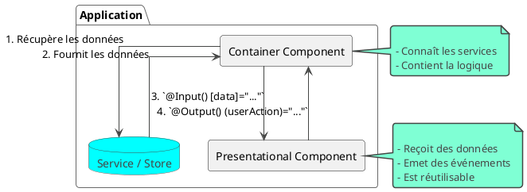

# Module 3 : L'essentiel - Bâtir des Composants Sains et Performants

### Objectifs pédagogiques

À la fin de ce module, vous serez capable de :

* **Distinguer et appliquer** le patron de conception "Container/Presentational" pour mieux organiser votre code.
* **Maîtriser** la stratégie de détection de changement `OnPush` pour optimiser radicalement les performances de vos
  composants.
* **Comprendre** et **mettre en œuvre** le principe d'immutabilité, prérequis indispensable pour `OnPush`.
* **Optimiser** le rendu des listes dynamiques avec la fonction `trackBy` pour une expérience utilisateur plus fluide.

### Introduction

Vous savez maintenant comment gérer l'état de votre application de manière centralisée. C'est une immense avancée. Mais
comment les composants doivent-ils consommer et afficher cet état ?

Imaginez un composant `UserProfileComponent`. Il doit récupérer les données de l'utilisateur, afficher son nom et sa
photo, contenir un formulaire pour modifier son profil, appeler le service pour sauvegarder les changements, et afficher
des messages de succès ou d'erreur. Ce composant est un "homme à tout faire". Il devient rapidement un monolithe de
plusieurs centaines de lignes, difficile à lire, quasi impossible à réutiliser et un véritable cauchemar à tester.

Dans ce module, nous allons apprendre à déconstruire ces monolithes. Nous allons découvrir des patrons de conception qui
séparent les responsabilités : la logique d'un côté, l'affichage de l'autre. C'est le secret pour écrire des composants
plus petits, plus ciblés, plus réutilisables et, surtout, beaucoup plus performants. Nous allons transformer nos
composants en une équipe d'experts spécialisés plutôt qu'en un seul employé surmené.

### Le Patron "Container/Presentational" (ou "Smart/Dumb Components")

C'est l'un des patrons de conception les plus importants pour une architecture Angular saine. L'idée est de diviser vos
composants en deux catégories distinctes.

<tabs>
<tab title="Container / Smart Component">

**Le Cerveau / Le Manager**

Ce composant connaît le "monde extérieur". Ses responsabilités sont :

* **Se connecter aux sources de données :** Injecter des services, se connecter au Store NgRx.
* **Gérer la logique métier :** Déclencher des actions, appeler des méthodes de service.
* **Passer les données** aux composants de présentation via des `@Input()`.
* **Écouter les événements** remontés par les composants de présentation via `@Output()`.

Il ne se préoccupe pas de savoir si un bouton est bleu ou si un titre est en `<h2>`. Il gère le *quoi* et le *pourquoi*.

</tab>
<tab title="Presentational / Dumb Component">
**Les Mains / L'Employé Spécialisé**

Ce composant est "stupide" et isolé du reste de l'application. Il ne sait pas d'où viennent les données. Ses
responsabilités sont :

* **Recevoir des données** via des `@Input()`.
* **Afficher ces données** dans un template.
* **Émettre des événements** via des `@Output()` lorsque l'utilisateur interagit avec lui (clic, saisie...).
* **Être auto-suffisant et réutilisable :** Vous pourriez le déplacer dans n'importe quelle autre application, lui
  donner les bons `@Input()`, et il fonctionnerait.

Il se concentre exclusivement sur le *comment* les choses sont affichées.

</tab>
</tabs>

**Le flux de données est simple :**



### Optimisation des Performances : Change Detection `OnPush`

Par défaut, Angular est très prudent. Dès qu'un événement se produit dans votre application (un clic, un appel HTTP
terminé, un `setTimeout`), il vérifie **tous** les composants, du haut vers le bas, pour voir si quelque chose a changé
et s'il faut mettre à jour le DOM. C'est la stratégie `Default`. C'est sûr, mais potentiellement lent dans une grande
application.

La stratégie **`OnPush`** change la donne. Un composant `OnPush` ne sera vérifié que si l'une de ces conditions est
remplie :

1. **Une référence de ses `@Input()` a changé.**
2. Un événement (comme un `click`) a été déclenché **depuis le composant lui-même ou l'un de ses enfants**.
3. On demande manuellement une vérification (via `ChangeDetectorRef.markForCheck()`).

<warning>
**La Règle d'Or de l'Immutabilité**

Le point 1 est crucial. Si vous passez un objet à un composant `OnPush` et que vous modifiez une de ses propriétés sans
changer l'objet lui-même, **Angular ne verra pas le changement !** La référence de l'objet est la même.

Pour déclencher la détection de changement, vous devez **créer un nouvel objet ou un nouvel tableau**. C'est le principe
de l'immutabilité, et c'est pourquoi les `Reducers` NgRx utilisent toujours le spread operator (`...`).

```typescript
// DANS LE CONTAINER

// MAUVAIS : Ne déclenchera pas OnPush sur le composant enfant
this.user.name = 'Nouveau Nom';

// BON : Crée un nouvel objet, change la référence, déclenche OnPush
this.user = {...this.user, name: 'Nouveau Nom'}; 
```

</warning>

Les composants de présentation ("Dumb") sont les candidats parfaits pour passer en `OnPush`, car ils ne dépendent que de
leurs `@Input()`.

#### Exemple

**1. Le Composant Enfant : user-profile.component.ts**

Ce composant va simplement recevoir un utilisateur et l'afficher. On active OnPush.

```typescript
// src/app/user-profile/user-profile.component.ts

import { Component, Input, ChangeDetectionStrategy, OnChanges, SimpleChanges } from '@angular/core';

@Component({
  selector: 'app-user-profile',
  template: `
    <div class="profile-card">
      <h3>{{ user.name }}</h3>
      <p>ID: {{ user.id }}</p>
      <!-- On ajoute un log pour voir quand le composant est vérifié -->
      {{ check() }}
    </div>
  `,
  styles: [`.profile-card { border: 1px solid steelblue; padding: 10px; margin: 10px; border-radius: 5px; }`],
  // LA LIGNE MAGIQUE !
  changeDetection: ChangeDetectionStrategy.OnPush
})
export class UserProfileComponent {
  @Input() user: { id: number; name: string };

  check(): void {
    console.log(`UserProfileComponent vérifié pour : ${this.user.name}`);
  }
}
```

**2. Le Composant Parent : app.component.ts**

Ce composant va gérer les données et les passer au composant enfant.

```typescript
// src/app/app.component.ts

import { Component } from '@angular/core';

@Component({
  selector: 'app-root',
  template: `
    <h1>Exemple OnPush</h1>
    
    <button (click)="changeUserNameWithoutChangingReference()">
      Modifier le nom (Mauvaise façon - Mutation)
    </button>
    
    <button (click)="changeUserNameWithNewReference()">
      Modifier le nom (Bonne façon - Immuabilité)
    </button>

    <button (click)="addUser()">
      Ajouter un utilisateur
    </button>
    
    <hr>
    
    <app-user-profile 
      *ngFor="let user of users; trackBy: trackById" 
      [user]="user">
    </app-user-profile>
  `
})
export class AppComponent {
  users = [
    { id: 1, name: 'Alice' },
    { id: 2, name: 'Bob' }
  ];

  // Nécessaire avec *ngFor pour l'optimisation
  trackById(index: number, user: { id: number; name: string }): number {
    return user.id;
  }

  /**
   * MAUVAISE FAÇON avec OnPush :
   * On modifie directement une propriété de l'objet dans le tableau.
   * La référence du tableau "users" ne change pas.
   * La référence de l'objet "user" pour Alice ne change pas.
   * Le composant enfant ne sera PAS mis à jour.
   */
  changeUserNameWithoutChangingReference(): void {
    console.log("Tentative de modification par mutation...");
    this.users[0].name = 'Alice (modifié)';
  }

  /**
   * BONNE FAÇON avec OnPush :
   * On crée un NOUVEAU tableau en utilisant .map().
   * Pour l'utilisateur que l'on veut changer, on crée un NOUVEL objet avec le spread operator (...).
   * La référence du tableau et de l'objet modifié changent.
   * Le composant enfant SERA mis à jour.
   */
  changeUserNameWithNewReference(): void {
    console.log("Modification avec une nouvelle référence (immuabilité)...");
    this.users = this.users.map(user => {
      if (user.id === 1) {
        return { ...user, name: 'Alice (Immuable)' }; // Nouvel objet !
      }
      return user;
    });
  }
  
  /**
   * Ici, on crée un nouveau tableau en ajoutant un utilisateur.
   * La référence du tableau change, donc la vue est mise à jour.
   */
  addUser(): void {
    const newUser = { id: this.users.length + 1, name: 'Charlie' };
    this.users = [...this.users, newUser]; // Nouveau tableau !
  }
}
```

##### Testons le résultat
1. Lancez l'application. Vous verrez "Alice" et "Bob". Dans la console, vous verrez :
   - UserProfileComponent vérifié pour : Alice
   - UserProfileComponent vérifié pour : Bob

2. Cliquez sur "Modifier le nom (Mauvaise façon - Mutation)".
   - Résultat UI : Rien ne change ! Le nom "Alice" reste affiché.
   - Résultat console : Le console.log de la méthode s'affiche, mais PAS ceux du check() du composant enfant.
   - Pourquoi ? On a modifié une propriété de l'objet, mais la référence de l'objet (this.users[0]) passée à l'input @Input() user n'a pas changé. OnPush ignore donc le changement.

3. Cliquez sur "Ajouter un utilisateur".
   - Résultat UI : "Charlie" apparaît.
   - Résultat console : UserProfileComponent vérifié pour : Charlie s'affiche.
   - Pourquoi ? On a créé un tout nouveau tableau (this.users = [...]). Angular détecte que la référence de l'input
     users a changé pour le *ngFor, donc il met à jour la liste.

4. Cliquez sur "Modifier le nom (Bonne façon - Immuabilité)".
   - Résultat UI : Le nom d'Alice devient "Alice (Immuable)".
   - Résultat console : UserProfileComponent vérifié pour : Alice (Immuable) s'affiche.
   - Pourquoi ? On a créé un nouveau tableau (.map() renvoie un nouveau tableau) et un nouvel objet ({ ...user })
     pour Alice. La référence de l'input @Input() user du premier UserProfileComponent a changé, ce qui déclenche la détection de changement.

##### Conclusion du test
La stratégie OnPush est un outil puissant pour optimiser votre application. Elle vous force à adopter de bonnes pratiques comme l'immuabilité (ne pas modifier les objets/tableaux existants, mais en créer de nouveaux). Cela rend le flux de données de votre application plus prévisible et plus performant.


### Optimisation des Listes : `trackBy`

Lorsque vous utilisez `@for` (ou l'ancien `*ngFor`) pour afficher une liste et que cette liste change, Angular doit
déterminer comment mettre à jour le DOM. Par défaut, il n'a aucun moyen de savoir si les éléments ont simplement été
réorganisés ou si ce sont de tout nouveaux éléments. Pour être sûr, il peut être amené à détruire tous les nœuds DOM de
la liste et à les recréer.

C'est lent, et cela peut avoir des effets de bord indésirables (perte du focus, réinitialisation d'animations CSS...).

La fonction `trackBy` est la solution. Vous fournissez une fonction qui donne à Angular un **identifiant unique et
stable** pour chaque élément de la liste. Ainsi, Angular peut suivre chaque élément individuellement.

```typescript
// Dans le composant
@Component({
    // ...
    template: `
    <!-- On fournit la fonction trackBy à la directive -->
    <div *ngFor="let item of items; trackBy: trackById">
      {{ item.name }}
    </div>

    <!-- Nouvelle syntaxe avec @for -->
    @for (item of items; track item.id) {
      <div>{{ item.name }}</div>
    }
  `
})
export class MyListComponent {
    items = [{id: 1, name: 'A'}, {id: 2, name: 'B'}];

    // La fonction reçoit l'index et l'item
    // Elle doit retourner une valeur unique et stable (string ou number)
    trackById(index: number, item: { id: number; name: string }): number {
        return item.id;
    }
}
```

Maintenant, si vous mélangez la liste, Angular ne fera que réorganiser les éléments dans le DOM au lieu de tout détruire
et recréer.

### Exercice 3.1 : Création d'une "Product List" optimisée

**Objectif :** Mettre en pratique les trois concepts vus dans ce module.

**Instructions :**

1. **Créez un `ProductCardComponent` (Presentational) :**
    * Il doit avoir un `@Input() product` pour recevoir les données d'un produit (`{id, name, price}`).
    * Il doit avoir un `@Output() addToCart` qui émet l'ID du produit quand on clique sur un bouton "Ajouter".
    * **Passez ce composant en stratégie `OnPush`**.
2. **Créez un `ProductListComponent` (Container) :**
    * Il doit simuler la récupération d'une liste de produits dans `ngOnInit` (un simple tableau d'objets).
    * Il doit afficher une liste de `ProductCardComponent` en utilisant `@for`.
    * **Utilisez `trackBy` (ou `@for...track`)** pour optimiser le rendu de la liste.
    * Il doit avoir une méthode `onAddToCart(productId: number)` qui affiche un `console.log`.
    * Ajoutez un bouton "Mettre à jour le premier produit" qui modifie le prix du premier produit de la liste **de
      manière immuable** pour que le changement soit visible dans le `ProductCardComponent` `OnPush`.

#### Correction exercice 3.1 {collapsible='true'}

<procedure>
<p>Voici une solution complète qui combine les trois patrons.</p>

**1. `product-card.component.ts` (Le composant de présentation)**

```typescript
// src/app/product-card/product-card.component.ts
import {
    Component, Input, Output, EventEmitter,
    ChangeDetectionStrategy
} from '@angular/core';
import {CommonModule} from '@angular/common';

export interface Product {
    id: number;
    name: string;
    price: number;
}

@Component({
    selector: 'app-product-card',
    standalone: true,
    imports: [CommonModule],
    template: `
    <div class="card" *ngIf="product">
      <h4>{{ product.name }}</h4>
      <p>{{ product.price | currency }}</p>
      <button (click)="onAddToCart()">Ajouter au panier</button>
    </div>
  `,
    styles: [`.card { border: 1px solid grey; padding: 1rem; margin: 0.5rem; }`],
    // LA LIGNE MAGIQUE POUR LA PERFORMANCE !
    changeDetection: ChangeDetectionStrategy.OnPush
})
export class ProductCardComponent {
    // Ce composant ne connaît que ses inputs et outputs.
    @Input() product!: Product;
    @Output() addToCart = new EventEmitter<number>();

    onAddToCart(): void {
        this.addToCart.emit(this.product.id);
    }
}
```

**2. `product-list.component.ts` (Le composant conteneur)**

```typescript
// src/app/product-list/product-list.component.ts
import {Component, OnInit} from '@angular/core';
import {CommonModule} from '@angular/common';
import {ProductCardComponent, Product}
    from '../product-card/product-card.component';

@Component({
    selector: 'app-product-list',
    standalone: true,
    imports: [CommonModule, ProductCardComponent],
    template: `
    <h2>Nos Produits</h2>
    <button (click)="updateFirstProduct()">Mettre à jour le prix du 1er</button>
    
    <div class="list-container">
      <!-- Nouvelle syntaxe avec @for et track -->
      @for (product of products; track product.id) {
        <app-product-card 
          [product]="product"
          (addToCart)="onAddToCart($event)">
        </app-product-card>
      }
    </div>
  `
})
export class ProductListComponent implements OnInit {
    products: Product[] = [];

    ngOnInit(): void {
        // Simule une récupération de données
        this.products = [
            {id: 101, name: 'Super Casque Audio', price: 150},
            {id: 102, name: 'Clavier Mécanique', price: 95},
            {id: 103, name: 'Souris Gamer', price: 60}
        ];
    }

    onAddToCart(productId: number): void {
        console.log(`Le produit avec l'ID ${productId} a été ajouté au panier.`);
    }

    updateFirstProduct(): void {
        if (this.products.length === 0) return;

        // Approche immuable : on crée un NOUVEAU tableau
        this.products = this.products.map((p, index) => {
            // Si c'est le premier produit, on retourne un NOUVEL objet
            if (index === 0) {
                return {...p, price: p.price + 10};
            }
            // Sinon, on retourne l'objet original
            return p;
        });

        console.log('Liste des produits mise à jour.', this.products);
    }
}
```

</procedure>

### Auto-évaluation

1. **Laquelle de ces responsabilités N'APPARTIENT PAS à un composant de présentation ("Dumb Component") ?**
   a. Recevoir des données via `@Input()`.
   b. Injecter un service pour récupérer des données.
   c. Émettre des événements via `@Output()`.
   d. Afficher des données dans un template.

2. **Expliquez avec vos propres mots pourquoi l'immutabilité est une condition nécessaire pour faire fonctionner
   correctement un composant qui utilise la stratégie de détection de changement `OnPush`.**

3. **Quel est le principal bénéfice de l'utilisation de `trackBy` (ou `@for...track`) dans une liste ?**
   a. Cela accélère le chargement initial des données de la liste.
   b. Cela empêche Angular de détruire et recréer inutilement des éléments du DOM lorsque la liste est mise à jour.
   c. Cela sécurise les données affichées dans la liste.
   d. Cela applique automatiquement la stratégie `OnPush` à chaque élément.

4. **Dans le patron Container/Presentational, comment un composant "Container" est-il informé d'une action de l'
   utilisateur qui a eu lieu dans un composant "Presentational" (par exemple, un clic sur un bouton) ?**

5. **Vous avez un composant `OnPush`. Lequel de ces événements NE déclenchera PAS sa détection de changement ?**
   a. L'utilisateur clique sur un bouton à l'intérieur du template du composant.
   b. Un de ses `@Input()` reçoit un nouveau tableau.
   c. Son composant parent modifie une propriété d'un objet qui a été passé en `@Input()` au composant `OnPush`.
   d. `ChangeDetectorRef.markForCheck()` est appelé.

### Conclusion

Félicitations ! Vous venez d'acquérir des compétences fondamentales en architecture de composants. En séparant la
logique (Container) de l'affichage (Presentational), vous rendez votre code plus propre, plus testable et plus
réutilisable. En appliquant la stratégie `OnPush` et l'immutabilité, vous prenez le contrôle de la détection de
changement pour des performances optimales. Enfin, avec `trackBy`, vous vous assurez que même les listes les plus
longues et dynamiques restent fluides.

Ces optimisations se situent au niveau des composants (micro-optimisations). Dans la partie "Pour aller plus loin", nous
allons changer d'échelle et nous intéresser à une optimisation au niveau de l'application entière : le **Lazy Loading**,
ou chargement paresseux. C'est la technique qui va radicalement réduire le temps de chargement initial de votre
application.