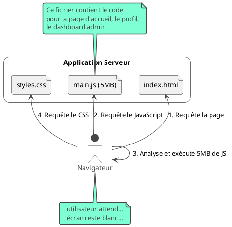
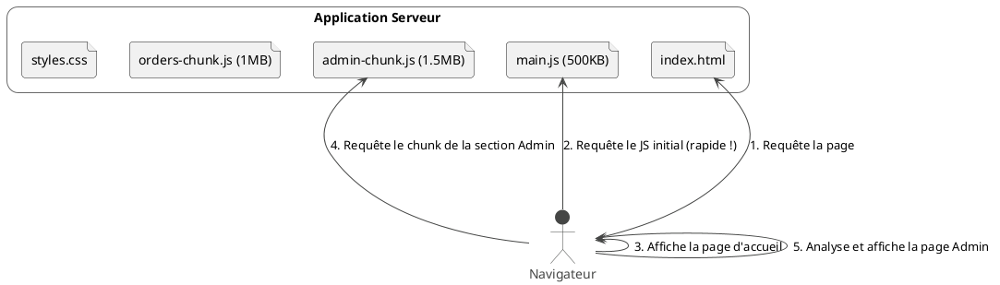

# Module 3 : Pour aller plus loin - Architecturer pour la Vitesse : Le Lazy Loading des Routes

### Objectifs pédagogiques

À la fin de cette partie, vous serez capable de :

* **Comprendre** l'impact du "bundling" sur le temps de chargement initial d'une application.
* **Analyser** le contenu de votre application pour identifier les sections candidates au chargement paresseux.
* **Configurer** le routeur Angular avec `loadChildren` pour implémenter le chargement paresseux de sections entières.
* **Vérifier** l'efficacité du lazy loading en utilisant les outils de développement de votre navigateur.

### Introduction

Dans la partie "L'essentiel", nous avons agi comme des artisans perfectionnistes, optimisant chaque pièce de notre
application (nos composants) pour qu'elle soit plus efficace. C'est excellent, mais nous avons un problème plus grand.

Imaginez que votre application est une immense bibliothèque. Pour l'instant, quand un visiteur arrive, vous lui donnez
l'intégralité des livres de la bibliothèque d'un seul coup. Des milliers de pages, même s'il ne veut lire que la
première page du premier livre ! C'est lourd, lent, et la plupart de ce travail initial est inutile.

C'est exactement ce qui se passe quand on ne fait pas de **Lazy Loading**. Au moment du "build", Angular regroupe tout
votre code dans un gros fichier JavaScript (un "bundle"). L'utilisateur doit télécharger et analyser ce fichier entier
avant de pouvoir voir quoi que ce soit. Pour une application qui grandit, ce fichier peut devenir énorme, et le temps de
chargement initial explose.

Le chargement paresseux, ou "Lazy Loading", est la solution. C'est la stratégie qui consiste à ne donner au visiteur que
le hall d'entrée de la bibliothèque. Ensuite, s'il décide d'aller dans la section "Science-Fiction", on ne lui amène que
les livres de cette section, et seulement à ce moment-là. C'est l'une des techniques d'optimisation les plus impactantes
que vous puissiez apprendre.

### Le Problème : Le Monolithe de Démarrage

Quand vous construisez votre application pour la production (`ng build`), le processus de "bundling" crée des fichiers
optimisés. Le plus important est souvent `main.js`. Sans lazy loading, ce fichier contient le code de **toute** votre
application.



### La Solution : Le Chargement Paresseux (Lazy Loading)

Le Lazy Loading est une stratégie de **division du code (code splitting)**. Au lieu d'un seul gros `main.js`, le build
va créer plusieurs petits "morceaux" (chunks).

* Un `main.js` plus petit, qui contient le strict nécessaire pour démarrer.
* Des fichiers séparés pour chaque section "paresseuse" de votre application (ex: `admin-routes.js`,
  `orders-routes.js`).

Le routeur Angular agit alors comme un chef d'orchestre intelligent. Il ne demande le téléchargement d'un "chunk" que
lorsque l'utilisateur navigue vers une route qui en a besoin.



### Mise en Œuvre avec le Routeur Angular

Le lazy loading se configure au niveau du routeur. La clé est la propriété `loadChildren`.

<tabs>
<tab title="Avant : Chargement Hâtif (Eager Loading)">
Ici, tous les composants sont importés statiquement en haut du fichier. Ils seront donc tous inclus dans le bundle principal.

```typescript
// src/app/app.routes.ts (Eager)
import {Routes} from '@angular/router';
import {HomeComponent} from './home/home.component';
import {AdminDashboardComponent} from './admin/admin-dashboard.component';
import {AdminUserListComponent} from './admin/admin-user-list.component';

export const routes: Routes = [
    {path: '', component: HomeComponent},

    // La section Admin est chargée immédiatement
    {path: 'admin/dashboard', component: AdminDashboardComponent},
    {path: 'admin/users', component: AdminUserListComponent},

    // ... autres routes
];
```

</tab>

<tab title="Après : Chargement Paresseux (Lazy Loading)">
On ne charge plus les composants, mais on indique au routeur **où trouver les routes** de la section à charger paresseusement.

**Étape 1 : Créer un fichier de routes pour la section**

```typescript
// src/app/admin/admin.routes.ts
import {Routes} from '@angular/router';
import {AdminDashboardComponent} from './admin-dashboard.component';
import {AdminUserListComponent} from './admin-user-list.component';

// On exporte un tableau de routes pour cette section
export const ADMIN_ROUTES: Routes = [
    {path: 'dashboard', component: AdminDashboardComponent},
    {path: 'users', component: AdminUserListComponent},
    {path: '', redirectTo: 'dashboard', pathMatch: 'full'}
];
```

**Étape 2 : Mettre à jour le fichier de routes principal**

```typescript
// src/app/app.routes.ts (Lazy)
import {Routes} from '@angular/router';
import {HomeComponent} from './home/home.component';

export const routes: Routes = [
    {path: '', component: HomeComponent},

    // Quand l'utilisateur navigue vers une URL qui commence par 'admin'...
    {
        path: 'admin',
        // ...Angular va charger dynamiquement le fichier admin.routes.ts...
        loadChildren: () => import('./admin/admin.routes')
            // ...puis utiliser la constante ADMIN_ROUTES qu'il contient.
            .then(m => m.ADMIN_ROUTES)
    },

    // ... autres routes
];
```
</tab>

</tabs>

<warning>
**Qu'est-ce que `import()` ?**
C'est une fonction de **l'import dynamique** de JavaScript. Contrairement à l'instruction `import` en haut d'un fichier, l'appel à `import()` retourne une `Promise` et ne se déclenche que lorsque le code est exécuté. C'est ce mécanisme qui permet au "bundler" (comme Vite ou Webpack) de savoir qu'il doit créer un chunk séparé pour ce fichier.
</warning>

### Exercice 3.2 : Rendre la section "Clients" paresseuse

**Objectif :** Transformer une section d'une application pour qu'elle soit chargée paresseusement.

**Scénario de départ :**
Vous avez une application avec deux sections : "Accueil" et "Clients". La section "Clients" est actuellement chargée de
manière hâtive.

**Fichiers de départ :**

`src/app/app.routes.ts`

```typescript
import {Routes} from '@angular/router';
import {HomeComponent} from './home/home.component';
import {CustomerListComponent} from './customers/customer-list.component';

export const routes: Routes = [
    {path: '', component: HomeComponent},
    {path: 'customers', component: CustomerListComponent},
];
```

`src/app/customers/customer-list.component.ts`

```typescript
import {Component} from '@angular/core';

@Component({
    selector: 'app-customer-list',
    standalone: true,
    template: `<h2>Liste des clients</h2><p>Cette section est maintenant chargée !</p>`
})
export class CustomerListComponent {
}
```

**Votre mission :**

1. Créez un nouveau fichier `src/app/customers/customers.routes.ts`.
2. Déplacez la définition de la route `customers` de `app.routes.ts` vers `customers.routes.ts`. Attention, le `path`
   dans le nouveau fichier doit être `''` car le préfixe `customers` sera déjà dans `app.routes.ts`.
3. Exportez ce tableau de routes sous le nom `CUSTOMER_ROUTES`.
4. Modifiez `app.routes.ts` pour utiliser `loadChildren` afin de charger paresseusement la section `customers`.
5. **Bonus :** Lancez votre application, ouvrez les outils de développement de votre navigateur (onglet "Réseau"), et
   vérifiez qu'un nouveau fichier JS est téléchargé uniquement lorsque vous cliquez sur le lien vers "/customers".

#### Correction exercice 3.2 {collapsible='true'}

<procedure>
<p>Voici la solution étape par étape.</p>

**1. Le nouveau fichier de routes pour la section "Customers"**
Ce fichier définit les routes *à l'intérieur* de la section `customers`.

`src/app/customers/customers.routes.ts`

```typescript
import {Routes} from '@angular/router';
import {CustomerListComponent} from './customer-list.component';

// Les routes spécifiques à la fonctionnalité "customers"
export const CUSTOMER_ROUTES: Routes = [
    // Le path est vide car le préfixe 'customers'
    // est déjà géré dans le fichier de routes principal.
    {path: '', component: CustomerListComponent},
];
```

**2. Le fichier de routes principal mis à jour**
On remplace la définition de route statique par un appel à `loadChildren`.

`src/app/app.routes.ts`

```typescript
import {Routes} from '@angular/router';
import {HomeComponent} from './home/home.component';

export const routes: Routes = [
    {path: '', component: HomeComponent},
    {
        path: 'customers', // Quand l'URL correspond à 'customers'...
        // ...charge paresseusement les routes associées.
        loadChildren: () => import('./customers/customers.routes')
            .then(m => m.CUSTOMER_ROUTES),
    }
];
```

**3. Vérification (Bonus)**

Ouvrez les DevTools (F12), allez dans l'onglet "Réseau" (Network) et filtrez par "JS" ou "Fetch/XHR".

1. Chargez la page d'accueil (`/`). Vous verrez `main.js` et d'autres fichiers initiaux.
2. Cliquez sur le lien qui mène à `/customers`. Vous devriez voir une nouvelle requête réseau apparaître pour un fichier
   qui ressemble à `customers-customers-routes.js`. C'est la preuve que le lazy loading fonctionne !

</procedure>

### Auto-évaluation

1. **Quel est le bénéfice principal du Lazy Loading ?**
   a. Il rend le code plus sécurisé.
   b. Il réduit la taille du bundle JavaScript initial, améliorant le temps de chargement perçu.
   c. Il permet d'utiliser des composants d'autres frameworks.
   d. Il optimise la détection de changement.

2. **Expliquez le rôle de la fonction `import()` dans la mise en place du lazy loading.**

3. **Vous avez une section "Profil" que vous voulez charger paresseusement. La route principale est `/profile`. À
   l'intérieur de cette section, vous avez une sous-route pour "éditer", qui devrait correspondre à `/profile/edit`.
   Quel sera le `path` de la route "éditer" dans votre fichier `profile.routes.ts` ?**
   a. `profile/edit`
   b. `/edit`
   c. `edit`
   d. `''`

4. **Comment pouvez-vous vérifier concrètement que votre configuration de lazy loading fonctionne dans votre
   application ?**

5. **Laquelle de ces sections d'une application est la MEILLEURE candidate pour le lazy loading ?**
   a. Le composant `AppComponent` racine.
   b. La page de connexion.
   c. Une section "Administration" complexe, accédée seulement par un petit nombre d'utilisateurs.
   d. Un service d'authentification utilisé partout dans l'application.

### Conclusion

Vous maîtrisez maintenant l'une des techniques d'optimisation les plus puissantes de l'arsenal Angular. En appliquant le
**Lazy Loading**, vous transformez vos applications d'un bloc monolithique lent à charger en une expérience rapide et
réactive, où le code est livré à la demande. C'est un changement fondamental dans la manière d'architecturer une
application, en pensant non seulement à la structure du code, mais aussi à l'expérience de l'utilisateur final.

Maintenant que nous savons comment charger des sections entières de notre application à la demande, une question se
pose : comment contrôler **qui** peut accéder à ces sections ? Et comment s'assurer que les données nécessaires sont
prêtes **avant** que le composant ne s'affiche ? C'est le rôle des **Route Guards** et des **Resolvers**, les gardiens
et les préparateurs de nos routes, que nous découvrirons dans le prochain module.