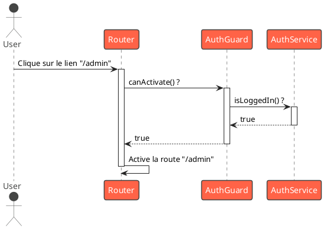
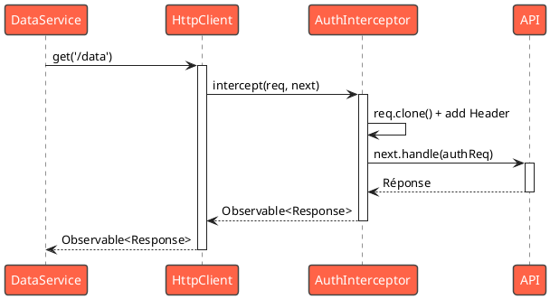

# Module 4 : L'essentiel - Gardiens et Intercepteurs, les Maîtres du Flux

### Objectifs pédagogiques

À la fin de ce module, vous serez en mesure de :

* **Sécuriser** l'accès à vos routes en utilisant les `Route Guards` (`CanActivate`).
* **Prévenir** la perte de données en empêchant l'utilisateur de quitter une route avec des changements non
  sauvegardés (`CanDeactivate`).
* **Comprendre** le concept de middleware pour les requêtes HTTP avec les `HttpInterceptors`.
* **Implémenter** un intercepteur pour ajouter un jeton d'authentification à toutes vos requêtes sortantes de manière
  centralisée.

### Introduction

Votre application commence à prendre forme. Vous avez des sections distinctes, peut-être même une section "
Administration" ou un "Espace Membre". Une question évidente se pose : comment s'assurer que seules les bonnes personnes
peuvent y accéder ?

Imaginez votre application comme un bâtiment de prestige. Vous ne laisseriez pas n'importe qui entrer dans le bureau du
PDG. Il vous faut un agent de sécurité à la porte. C'est exactement le rôle des **`Route Guards`**. Ils se placent avant
l'accès à une route et décident si la navigation peut continuer.

Maintenant, imaginez que tous les colis qui entrent et sortent de ce bâtiment doivent passer par un bureau de douane
central pour être inspectés, étiquetés ou estampillés. Ce bureau de douane, c'est votre **`HttpInterceptor`**. Il permet
d'attraper, d'inspecter et de modifier chaque requête HTTP qui part de votre application, et chaque réponse qui arrive.

Dans ce module, nous allons apprendre à maîtriser ces deux outils fondamentaux qui opèrent à la croisée des chemins de
votre application, pour contrôler les flux de navigation et de données.

### Les Route Guards : Protéger vos Routes

Un "Guard" est simplement une fonction ou une classe qui retourne un `boolean`, une `Promise<boolean>`, ou un
`Observable<boolean>`. Le routeur Angular exécute cette logique avant d'activer une route et attend la réponse. Si la
réponse est `true`, la navigation continue. Si c'est `false`, elle est annulée.

<tabs>
<tab title="CanActivate : Le Videur">
`CanActivate` est le garde le plus courant. Il répond à la question : "L'utilisateur a-t-il le droit d'accéder à cette route ?". Le cas d'usage le plus fréquent est la gestion de l'authentification.

**Comment ça marche ?**

1. On crée une fonction (ou une classe `Injectable`) qui contient notre logique.
2. Cette fonction a accès aux services nécessaires (ex: `AuthService`).
3. Elle retourne `true` si l'utilisateur est authentifié, `false` sinon (et peut même le rediriger vers la page de
   connexion).
4. On applique ce garde à la route que l'on veut protéger.

```typescript
// src/app/auth/auth.guard.ts
import {inject} from '@angular/core';
import {Router} from '@angular/router';
import {AuthService} from './auth.service';

// Une fonction garde est l'approche moderne et concise
export const authGuard = () => {
    const authService = inject(AuthService);
    const router = inject(Router);

    if (authService.isLoggedIn()) {
        return true; // L'utilisateur peut passer
    }

    // L'utilisateur n'est pas connecté, on le redirige
    return router.parseUrl('/login');
};
```

```typescript
// src/app/app.routes.ts
import {Routes} from '@angular/router';
import {authGuard} from './auth/auth.guard';
import {AdminDashboardComponent} from './admin/admin-dashboard.component';

export const routes: Routes = [
    // ...
    {
        path: 'admin',
        component: AdminDashboardComponent,
        canActivate: [authGuard] // On applique notre garde ici
    }
];
```



</tab>
<tab title="CanDeactivate : L'Avertissement de Sortie">
`CanDeactivate` est différent. Il se déclenche quand on essaie de **quitter** une route. Il répond à la question : "L'utilisateur a-t-il le droit de quitter cette page ?". C'est l'outil parfait pour éviter la perte de données, par exemple lorsqu'un formulaire a été modifié mais pas encore sauvegardé.

Pour le rendre réutilisable, on crée une interface que nos composants devront implémenter.

```typescript
// src/app/guards/confirm-deactivate.guard.ts
import {CanDeactivateFn} from '@angular/router';
import {Observable} from 'rxjs';

// Le composant qui veut être protégé par ce garde
// doit implémenter cette interface.
export interface CanComponentDeactivate {
    canDeactivate: () => Observable<boolean> | Promise<boolean> | boolean;
}

export const confirmDeactivateGuard: CanDeactivateFn<CanComponentDeactivate> =
    (component, currentRoute, currentState, nextState) => {
        // Le garde appelle la méthode du composant lui-même
        // pour savoir s'il peut être désactivé.
        return component.canDeactivate ? component.canDeactivate() : true;
    };
```

```typescript
// src/app/components/user-form/user-form.component.ts
import {Component} from '@angular/core';
import {CanComponentDeactivate}
    from '../../guards/confirm-deactivate.guard.ts';

@Component({...})
export class UserFormComponent implements CanComponentDeactivate {
    isFormDirty = false; // Simule un formulaire modifié

    canDeactivate(): boolean {
        if (this.isFormDirty) {
            return confirm('Vous avez des modifications non enregistrées. Quitter ?');
        }
        return true;
    }
}
```

</tab>
</tabs>

### Les HTTP Interceptors : La Douane de vos Données

Un intercepteur est un service qui s'interpose entre votre code qui utilise `HttpClient` et le backend. Il vous permet
d'opérer sur toutes les requêtes sortantes et toutes les réponses entrantes depuis un seul et unique endroit.

**Pourquoi est-ce si puissant ?**
Imaginez que vous devez ajouter un header d'authentification à 50 appels API différents, répartis dans 20 services. Sans
intercepteur, c'est un copier-coller cauchemardesque. Avec un intercepteur, vous l'écrivez **une seule fois**.

**Comment ça marche ?**
Un intercepteur est une fonction qui reçoit la requête (`HttpRequest`) et un "handler" (`HttpHandler`). Son travail est
de passer la requête (potentiellement modifiée) au handler suivant dans la chaîne, via `next.handle(request)`.

```typescript
// src/app/auth/auth.interceptor.ts
import {HttpInterceptorFn} from '@angular/common/http';
import {inject} from '@angular/core';
import {AuthService} from './auth.service';

export const authInterceptor: HttpInterceptorFn = (req, next) => {
    const authService = inject(AuthService);
    const authToken = authService.getToken();

    // Si pas de token, on ne fait rien
    if (!authToken) {
        return next(req);
    }

    // Les requêtes sont immuables, on doit donc la cloner
    // pour y ajouter le header.
    const authReq = req.clone({
        setHeaders: {
            Authorization: `Bearer ${authToken}`
        }
    });

    // On passe la requête modifiée au handler suivant.
    return next(authReq);
};
```

Pour l'activer, on le fournit dans la configuration de l'application :

```typescript
// src/app/app.config.ts
import {ApplicationConfig} from '@angular/core';
import {provideHttpClient, withInterceptors} from '@angular/common/http';
import {authInterceptor} from './auth/auth.interceptor';

export const appConfig: ApplicationConfig = {
    providers: [
        // ...
        // Active HttpClient et enregistre notre intercepteur
        provideHttpClient(withInterceptors([authInterceptor]))
    ]
};
```



### Exercice 4.1 : Protéger une section "Profil"

**Objectif :** Créer une page "Profil" accessible uniquement si un utilisateur est "connecté" (nous allons simuler cet
état).

**Instructions :**

1. **Créez un `AuthService`** simple. Il doit avoir :
    * Une propriété privée, par exemple `private _isLoggedIn = false;`.
    * Une méthode `isLoggedIn()` qui retourne cette valeur.
    * Des méthodes `login()` et `logout()` qui changent la valeur de cette propriété.
2. **Créez un `authGuard`** qui injecte `AuthService` et `Router`. Si `authService.isLoggedIn()` est faux, il doit
   rediriger vers la page d'accueil (`/`).
3. **Créez un `ProfileComponent`** simple qui affiche "Bienvenue sur votre profil !".
4. **Créez un `AppComponent` (ou autre composant principal)** qui contient :
    * Deux boutons : "Login" et "Logout", qui appellent les méthodes correspondantes du `AuthService`.
    * Un lien `routerLink` vers `/profile`.
5. **Configurez vos routes** pour que la route `/profile` soit protégée par votre `authGuard`.

#### Correction exercice 4.1 {collapsible='true'}

<procedure>
<p>Voici l'implémentation complète de ce mini-système d'authentification.</p>

**1. `auth.service.ts`**

```typescript
// src/app/auth/auth.service.ts
import {Injectable} from '@angular/core';

@Injectable({
    providedIn: 'root'
})
export class AuthService {
    private _isLoggedIn = false;

    isLoggedIn(): boolean {
        console.log(`Checking auth status: ${this._isLoggedIn}`);
        return this._isLoggedIn;
    }

    login(): void {
        this._isLoggedIn = true;
        console.log('User logged in.');
    }

    logout(): void {
        this._isLoggedIn = false;
        console.log('User logged out.');
    }
}
```

**2. `auth.guard.ts`**

```typescript
// src/app/auth/auth.guard.ts
import {inject} from '@angular/core';
import {Router, CanActivateFn} from '@angular/router';
import {AuthService} from './auth.service';

export const authGuard: CanActivateFn = (route, state) => {
    const authService = inject(AuthService);
    const router = inject(Router);

    if (authService.isLoggedIn()) {
        return true;
    }

    alert("Vous n'êtes pas autorisé à voir cette page !");
    return router.parseUrl('/');
};
```

**3. `profile.component.ts`**

```typescript
// src/app/profile/profile.component.ts
import {Component} from '@angular/core';

@Component({
    selector: 'app-profile',
    standalone: true,
    template: `<h1>Bienvenue sur votre profil !</h1>`
})
export class ProfileComponent {
}
```

**4. `app.routes.ts`**

```typescript
// src/app/app.routes.ts
import {Routes} from '@angular/router';
import {HomeComponent} from './home/home.component'; // Supposez que ce composant existe
import {ProfileComponent} from './profile/profile.component';
import {authGuard} from './auth/auth.guard';

export const routes: Routes = [
    {path: '', component: HomeComponent},
    {
        path: 'profile',
        component: ProfileComponent,
        canActivate: [authGuard]
    }
];
```

**5. `app.component.ts` (Le composant principal avec les boutons)**

```typescript
// src/app/app.component.ts
import {Component, inject} from '@angular/core';
import {RouterLink, RouterOutlet} from '@angular/router';
import {AuthService} from './auth/auth.service';

@Component({
    selector: 'app-root',
    standalone: true,
    imports: [RouterOutlet, RouterLink],
    template: `
    <nav>
      <a routerLink="/">Accueil</a> | 
      <a routerLink="/profile">Profil</a>
    </nav>
    <hr>
    <button (click)="login()">Login</button>
    <button (click)="logout()">Logout</button>
    <hr>
    <router-outlet></router-outlet>
  `
})
export class AppComponent {
    private authService = inject(AuthService);

    login() {
        this.authService.login();
    }

    logout() {
        this.authService.logout();
    }
}
```

</procedure>

### Auto-évaluation

1. **Quel est le rôle principal d'un garde `CanActivate` ?**
   a. Pré-charger les données pour une route.
   b. Contrôler si un utilisateur peut accéder à une route.
   c. Intercepter les requêtes HTTP pour y ajouter des headers.
   d. Empêcher un utilisateur de quitter une route.

2. **Dans un `HttpInterceptor`, pourquoi doit-on utiliser `request.clone()` pour ajouter un header ?**

3. **Vous voulez afficher une boîte de dialogue de confirmation "Voulez-vous vraiment quitter ?" si l'utilisateur a un
   formulaire non sauvegardé. Quel type de `Route Guard` est le plus approprié pour ce cas ?**

4. **Comment un `HttpInterceptor` est-il "activé" ou enregistré dans une application Angular moderne (standalone) ?**
   a. En l'ajoutant dans le tableau `providers` du `AppComponent`.
   b. En utilisant la fonction `withInterceptors()` dans l'appel à `provideHttpClient()`.
   c. En le déclarant dans le fichier `angular.json`.
   d. Il est activé automatiquement dès que le fichier est créé.

5. **Un `Route Guard` peut-il rediriger un utilisateur vers une autre page ? Si oui, comment ?**

### Conclusion

Vous avez maintenant ajouté deux des outils les plus importants de l'arsenal d'un développeur Angular avancé. Avec les *
*`Route Guards`**, vous êtes le maître des flux de navigation, capable de protéger des sections entières de votre
application. Avec les **`HttpInterceptors`**, vous avez un point de contrôle central pour toute votre communication avec
le monde extérieur, ce qui rend votre code plus propre, plus sûr et plus facile à maintenir.

Ces outils gèrent l'accès et la communication. Mais que se passe-t-il si, avant même d'accorder l'accès à une route,
nous voulions nous assurer que les données nécessaires à son affichage sont déjà prêtes et disponibles ? Cela éviterait
les spinners de chargement disgracieux qui apparaissent après que la page soit affichée. C'est le rôle des **`Resolvers`
**, que nous allons découvrir dans la partie "Pour aller plus loin", avant de tout synthétiser dans un cas pratique
d'authentification complet.