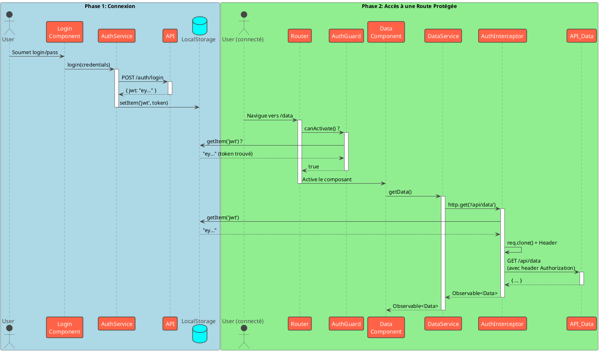

# Module 4 : Pour aller plus loin - Le Cycle de Vie d'une Route : Préparation et Synthèse

### Objectifs pédagogiques

À la fin de cette partie, vous serez capable de :

* **Pré-charger** les données nécessaires à un composant *avant* l'activation de sa route en utilisant un `Resolver`.
* **Améliorer** l'expérience utilisateur en éliminant les écrans de chargement partiels ("flickering UI").
* **Accéder** aux données pré-chargées depuis le composant de la route.
* **Synthétiser** toutes les notions du module (Guards, Interceptors, Resolvers) pour construire un flux
  d'authentification JWT complet et réaliste.

### Introduction

Dans la partie "L'essentiel", nous avons posté des gardes du corps (`CanActivate`) devant les portes de nos routes et
mis en place un service de douane (`HttpInterceptor`) pour nos données. Notre application est plus sûre, mais est-elle
plus agréable à utiliser ?

Imaginez que vous entrez dans un restaurant chic. Le portier vérifie votre réservation (`CanActivate`) et vous laisse
entrer. Vous vous installez à votre table, et seulement là, le serveur vient prendre votre commande, la transmet en
cuisine, et vous attendez que votre plat arrive. Pendant ce temps, votre table est vide. C'est fonctionnel, mais pas
exceptionnel.

Maintenant, imaginez une autre expérience. Le portier vous laisse entrer, et comme le restaurant connaît vos habitudes,
au moment où vous vous asseyez, votre apéritif préféré est déjà sur la table, vous attend. L'expérience est instantanée,
fluide, sans temps mort.

C'est précisément ce que les **`Resolvers`** nous permettent de faire. Ils agissent comme un majordome qui prépare les
données nécessaires à une route *avant même* que le composant ne soit affiché. Nous éliminons ainsi l'effet "la page
s'affiche, puis un spinner apparaît", pour une expérience utilisateur bien plus professionnelle. Pour finir, nous
assemblerons toutes ces pièces pour construire un véritable système d'authentification, le cœur de nombreuses
applications web.

### Les Resolvers : Pré-charger les Données d'une Route

Un `Resolver` est une fonction qui s'exécute après les `Guards` mais avant l'activation de la route. Le routeur attend
que le `Resolver` ait terminé son travail (généralement, un appel API) avant d'afficher le composant.

**Le flux de navigation devient :**

1. L'utilisateur clique sur un lien.
2. Les gardes `CanActivate` s'exécutent. S'ils retournent `true`...
3. ... Les `Resolvers` s'exécutent. Ils récupèrent les données.
4. Le routeur attend que les `Resolvers` complètent leur `Observable`.
5. La route est activée, et le composant est affiché. Les données sont **déjà disponibles**.

#### Comment implémenter un `Resolver` ?

C'est une fonction qui, comme un garde, a accès aux informations de la route et peut injecter des services.

```typescript
// src/app/users/user-detail.resolver.ts
import {inject} from '@angular/core';
import {ActivatedRouteSnapshot, ResolveFn, RouterStateSnapshot}
    from '@angular/router';
import {Observable} from 'rxjs';
import {UserService} from './user.service';
import {User} from '../models/user.model';

// Le resolver est une fonction typée avec ResolveFn<T>
// où T est le type de données que le resolver va retourner.
export const userDetailResolver: ResolveFn<User> =
    (route: ActivatedRouteSnapshot, state: RouterStateSnapshot): Observable<User> => {

        const userService = inject(UserService);
        // On récupère l'ID depuis les paramètres de l'URL
        const userId = route.paramMap.get('id');

        if (!userId) {
            // Gérer le cas où l'ID est manquant
            // Idéalement, rediriger ou retourner une erreur
        }

        return userService.getUserById(userId!);
    };
```

On l'attache ensuite à la route via la propriété `resolve` :

```typescript
// Dans votre fichier de routes
{
    path: 'users/:id',
        component
:
    UserDetailComponent,
        canActivate
:
    [authGuard], // D'abord le garde
        resolve
:
    {
        // La clé 'user' sera utilisée pour récupérer les données
        user: userDetailResolver
    }
}
```

#### Comment accéder aux données résolues ?

Dans le composant cible, les données résolues sont disponibles dans l'objet `data` de l'`ActivatedRoute`, qui est un
`Observable`.

```typescript
// src/app/users/user-detail.component.ts
import {Component, OnInit, inject} from '@angular/core';
import {ActivatedRoute} from '@angular/router';
import {map, Observable} from 'rxjs';
import {User} from '../models/user.model';

@Component({
    selector: 'app-user-detail',
    template: `
    <!-- On utilise le pipe async, pas besoin de s'abonner manuellement -->
    <div *ngIf="user$ | async as user">
      <h1>{{ user.name }}</h1>
      <p>Email: {{ user.email }}</p>
    </div>
  `
})
export class UserDetailComponent implements OnInit {
    private route = inject(ActivatedRoute);
    user$!: Observable<User>;

    ngOnInit(): void {
        // Les données sont dans `this.route.data`.
        // C'est un Observable, on peut donc le piper.
        this.user$ = this.route.data.pipe(
            // On extrait la propriété 'user' (la clé définie dans le resolver)
            map(data => data['user'])
        );
    }
}
```

### Cas Pratique Complet : L'Authentification avec JWT

Assemblons toutes les pièces du puzzle : `AuthService`, `HttpInterceptor`, `CanActivate` Guard, et le stockage du JWT.

**Le Flux Complet :**



#### L'implémentation (Correction de l'exercice implicite)

<procedure title="Mise en place du flux JWT complet" collapsible="true">

**1. Le `AuthService` (mis à jour)**
Il gère maintenant le stockage et la récupération du JWT depuis `localStorage`.

```typescript
// src/app/auth/auth.service.ts
import {Injectable} from '@angular/core';
import {tap} from 'rxjs/operators';

// ...

@Injectable({providedIn: 'root'})
export class AuthService {
    // private http = inject(HttpClient);
    private readonly JWT_KEY = 'my_app_jwt';

    // Simulation, en vrai on appellerait le backend
    login(credentials: any) {
        // return this.http.post<{ token: string }>('/api/login', credentials).pipe(
        //   tap(response => localStorage.setItem(this.JWT_KEY, response.token))
        // );

        // Pour la démo :
        const fakeToken = 'fake-jwt-token.' + Date.now();
        localStorage.setItem(this.JWT_KEY, fakeToken);
        console.log('Token stocké:', fakeToken);
    }

    logout(): void {
        localStorage.removeItem(this.JWT_KEY);
        // On pourrait aussi rediriger l'utilisateur ici
    }

    getToken(): string | null {
        return localStorage.getItem(this.JWT_KEY);
    }

    isLoggedIn(): boolean {
        return !!this.getToken(); // Convertit en booléen
    }
}
```

**2. L'`authInterceptor` (identique au module précédent)**
Il n'a pas besoin de changer. Son rôle est d'utiliser `authService.getToken()` et d'ajouter le header, ce qu'il fait
déjà.

**3. Le `authGuard` (`CanActivate`) (identique au module précédent)**
Lui non plus ne change pas, car il se base sur `authService.isLoggedIn()`, qui est maintenant connecté au
`localStorage`.

C'est la beauté de la séparation des préoccupations : en changeant la logique interne du `AuthService` (passer d'une
variable en mémoire au `localStorage`), le reste de l'application (le guard, l'intercepteur) continue de fonctionner
sans aucune modification !

</procedure>

### Auto-évaluation

1. **Quel est le principal avantage de l'utilisation d'un `Resolver` ?**
   a. Il protège une route contre les accès non autorisés.
   b. Il permet de charger les données nécessaires à un composant avant son affichage, améliorant l'UX.
   c. Il intercepte les requêtes HTTP pour les modifier.
   d. Il permet de charger paresseusement des modules.

2. **Comment un composant accède-t-il aux données qui ont été pré-chargées par un `Resolver` ?**

3. **Dans le cycle de vie d'une navigation Angular, dans quel ordre ces éléments sont-ils exécutés ?**
   a. `Resolver` -> `CanActivate` Guard -> Affichage du Composant
   b. Affichage du Composant -> `CanActivate` Guard -> `Resolver`
   c. `CanActivate` Guard -> `Resolver` -> Affichage du Composant
   d. `Resolver` -> Affichage du Composant -> `CanActivate` Guard

4. **Dans un système d'authentification par JWT, où est le meilleur endroit pour stocker le token côté client afin qu'il
   persiste même après la fermeture du navigateur ?**
   a. Dans une variable de service.
   b. Dans `sessionStorage`.
   c. Dans `localStorage`.
   d. Dans un cookie HTTP-only (côté serveur).

5. **Quel est le rôle PRÉCIS de l'`HttpInterceptor` dans le flux d'authentification JWT que nous avons décrit ?**

### Conclusion

Vous avez atteint la fin de ce module intense mais crucial. Vous ne vous contentez plus de construire des pages, vous
orchestrez des flux de navigation et de données complexes. Vous savez désormais comment :

* **Protéger** vos routes avec `CanActivate` et `CanDeactivate`.
* **Préparer** vos routes avec des données prêtes à l'emploi grâce aux `Resolvers`.
* **Centraliser** et **standardiser** vos appels API avec les `HttpInterceptors`.

Plus important encore, vous avez assemblé toutes ces briques pour construire un flux d'authentification complet, robuste
et réaliste. C'est un schéma que vous retrouverez et adapterez dans de très nombreuses applications professionnelles.

Maintenant que notre application est bien architecturée, sécurisée, performante et que ses flux sont maîtrisés, comment
pouvons-nous nous assurer qu'elle le reste au fil des évolutions ? Comment garantir que l'ajout d'une nouvelle
fonctionnalité ne casse pas l'existant ? La réponse est dans notre prochain module : **les tests unitaires en détails**.