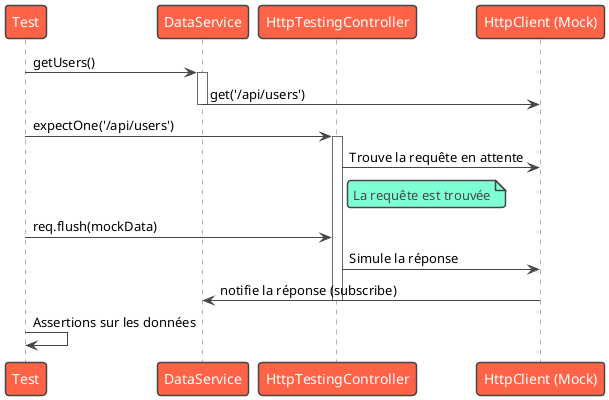

# Module 5 : L'essentiel - Garantir la Qualité avec les Tests Unitaires

### Objectifs pédagogiques

À la fin de ce module, vous serez capable de :

* **Comprendre** le rôle et l'importance des tests unitaires dans un projet professionnel.
* **Distinguer** les outils de l'écosystème de test Angular : Jasmine et Karma.
* **Écrire** des tests unitaires pour des services, y compris ceux avec des dépendances comme `HttpClient`.
* **Utiliser** le `TestBed` pour créer un environnement de test isolé pour vos composants.
* **Accéder** à l'instance d'un composant et à son DOM pour vérifier son comportement et son rendu.

### Introduction

Vous avez construit une application avec une belle architecture, des flux de données maîtrisés et des routes sécurisées.
C'est comme avoir bâti une maison magnifique. Mais comment vous assurer que les fondations sont solides ? Comment savoir
si, en repeignant le salon (en ajoutant une nouvelle fonctionnalité), vous n'avez pas accidentellement créé une fissure
dans le mur de la cuisine (cassé une autre fonctionnalité) ?

La réponse est le **test**. Les tests unitaires sont votre filet de sécurité. Ils vous donnent la confiance nécessaire
pour refactoriser, faire évoluer et maintenir votre application sur le long terme sans crainte de régressions.

Beaucoup de développeurs voient les tests comme une corvée. Dans ce module, je veux vous montrer qu'ils sont en réalité
un super-pouvoir. Un super-pouvoir qui vous permet de livrer un code de meilleure qualité, de collaborer plus
sereinement en équipe et, paradoxalement, d'aller plus vite, car vous passerez moins de temps à déboguer des problèmes
inattendus. Nous allons apprendre à tester les deux briques fondamentales de notre application : les services et les
composants.

### L'Écosystème de Test : Jasmine & Karma

Quand vous lancez `ng test`, deux acteurs principaux entrent en scène :

1. **Jasmine :** C'est le **framework de test**. Il vous fournit la syntaxe et les outils pour écrire vos tests.
   Pensez-y comme au langage que vous utilisez pour décrire ce que votre code devrait faire. Ses mots-clés principaux
   sont :
    * `describe('Sujet du test', () => { ... })` : Regroupe un ensemble de tests liés (une suite de tests).
    * `it('devrait faire ceci...', () => { ... })` : Représente un cas de test individuel.
    * `expect(valeur_actuelle).toBe(valeur_attendue)` : C'est l'**assertion**. C'est là que vous vérifiez si votre code
      se comporte comme prévu. `toBe`, `toEqual`, `toBeTruthy` sont des "matchers".
    * `beforeEach(() => { ... })` : Une fonction de configuration qui s'exécute avant *chaque* test `it` dans une suite
      `describe`. Idéal pour initialiser les objets.

2. **Karma :** C'est le **lanceur de tests (Test Runner)**. Son travail est de prendre vos tests écrits avec Jasmine, de
   démarrer un vrai navigateur (comme Chrome), d'exécuter les tests à l'intérieur de ce navigateur, puis de vous
   afficher les résultats dans la console.

### Tester les Services

Les services sont souvent le point de départ le plus simple pour les tests, car ils n'ont pas de template ni de cycle de
vie de composant complexe.

#### Cas 1 : Service simple, sans dépendances

C'est le cas le plus facile. On crée une instance du service et on teste ses méthodes.

```typescript
// a-simple.service.ts
@Injectable({providedIn: 'root'})
export class SimpleCalculatorService {
    add(a: number, b: number): number {
        return a + b;
    }
}
```

```typescript
// a-simple.service.spec.ts
import {SimpleCalculatorService} from './a-simple.service';

describe('SimpleCalculatorService', () => {
    let service: SimpleCalculatorService;

    // Avant chaque test, on crée une nouvelle instance fraîche
    beforeEach(() => {
        service = new SimpleCalculatorService();
    });

    it('devrait être créé', () => {
        expect(service).toBeTruthy();
    });

    it('devrait additionner deux nombres correctement', () => {
        // On appelle la méthode à tester
        const result = service.add(2, 3);
        // On vérifie que le résultat est celui attendu
        expect(result).toBe(5);
    });
});
```

#### Cas 2 : Service avec des dépendances (`HttpClient`)

Comment tester un service qui fait des appels API sans réellement appeler votre backend ? En utilisant un **mock**.
`HttpClientTestingModule` est un module fourni par Angular qui remplace le vrai `HttpClient` par un faux, que nous
pouvons contrôler.

`HttpTestingController` est l'outil qui nous permet d'interagir avec ce faux `HttpClient`, de simuler des réponses et de
vérifier que les bonnes requêtes sont faites.

```typescript
// data.service.ts
@Injectable({providedIn: 'root'})
export class DataService {
    constructor(private http: HttpClient) {
    }

    getUsers() {
        return this.http.get<User[]>('/api/users');
    }
}
```

```typescript
// data.service.spec.ts
import {TestBed} from '@angular/core/testing';
import {HttpClientTestingModule, HttpTestingController}
    from '@angular/common/http/testing';
import {DataService} from './data.service';

describe('DataService', () => {
    let service: DataService;
    let httpTestingController: HttpTestingController;

    beforeEach(() => {
        TestBed.configureTestingModule({
            // On importe le module de test HTTP
            imports: [HttpClientTestingModule],
            providers: [DataService]
        });
        // On injecte le service et le contrôleur de test
        service = TestBed.inject(DataService);
        httpTestingController = TestBed.inject(HttpTestingController);
    });

    it('devrait récupérer les utilisateurs via une requête GET', () => {
        const mockUsers = [{id: 1, name: 'Test User'}];

        service.getUsers().subscribe(users => {
            // On vérifie que les données reçues sont correctes
            expect(users).toEqual(mockUsers);
        });

        // On s'attend à ce qu'une requête ait été faite vers cette URL
        const req = httpTestingController.expectOne('/api/users');
        // On vérifie que la méthode était bien GET
        expect(req.request.method).toEqual('GET');

        // On simule une réponse du serveur avec nos données mockées
        req.flush(mockUsers);
    });
});
```


### Tester les Composants : `TestBed`

Pour tester un composant, nous avons besoin de plus qu'un simple `new MyComponent()`. Nous avons besoin d'un
mini-environnement Angular pour gérer le template, l'injection de dépendances et la détection de changement. C'est le
rôle de `TestBed`.

`TestBed.configureTestingModule({...})` vous permet de créer un module de test "à la volée".
`TestBed.createComponent(MyComponent)` crée une instance du composant et retourne un `ComponentFixture`.

Le `fixture` est un objet qui nous donne accès à tout ce dont nous avons besoin :

* `fixture.componentInstance`: L'instance de la classe TypeScript de notre composant.
* `fixture.nativeElement`: L'élément DOM racine de notre composant.
* `fixture.detectChanges()`: Déclenche un cycle de détection de changement (essentiel pour mettre à jour la vue après
  avoir changé une propriété).

```typescript
// simple-hello.component.ts
@Component({
    selector: 'app-simple-hello',
    template: `<h1>Hello, {{ name }}!</h1>`
})
export class SimpleHelloComponent {
    name = 'World';
}
```

```typescript
// simple-hello.component.spec.ts
import {ComponentFixture, TestBed} from '@angular/core/testing';
import {SimpleHelloComponent} from './simple-hello.component';

describe('SimpleHelloComponent', () => {
    let component: SimpleHelloComponent;
    let fixture: ComponentFixture<SimpleHelloComponent>;

    beforeEach(async () => {
        // Configure le "module" de test
        await TestBed.configureTestingModule({
            imports: [SimpleHelloComponent] // Pour les composants Standalone
        }).compileComponents();

        // Crée le composant
        fixture = TestBed.createComponent(SimpleHelloComponent);
        component = fixture.componentInstance;
        // Déclenche le premier rendu
        fixture.detectChanges();
    });

    it('devrait afficher "Hello, World!" par défaut', () => {
        const h1 = fixture.nativeElement.querySelector('h1');
        expect(h1.textContent).toContain('Hello, World!');
    });

    it('devrait mettre à jour le h1 quand le nom change', () => {
        // On modifie la propriété dans la classe
        component.name = 'Angular';
        // On dit à Angular de mettre à jour la vue
        fixture.detectChanges();

        const h1 = fixture.nativeElement.querySelector('h1');
        expect(h1.textContent).toContain('Hello, Angular!');
    });
});
```

### Exercice 5.1 : Tester un service d'authentification

**Objectif :** Écrire les tests unitaires pour le `AuthService` que nous avons vu dans le module précédent (la version
qui utilise `localStorage`).

**Rappel du service :**

```typescript

@Injectable({providedIn: 'root'})
export class AuthService {
    private readonly JWT_KEY = 'my_app_jwt';

    getToken(): string | null {
        return localStorage.getItem(this.JWT_KEY);
    }

    isLoggedIn(): boolean {
        return !!this.getToken();
    }

    login(): void {
        localStorage.setItem(this.JWT_KEY, 'fake-token');
    }

    logout(): void {
        localStorage.removeItem(this.JWT_KEY);
    }
}
```

**Instructions :**

1. Créez le fichier de test `auth.service.spec.ts`.
2. Dans le `beforeEach`, assurez-vous de bien nettoyer le `localStorage` pour que les tests soient indépendants les uns
   des autres.
3. Écrivez un test pour `isLoggedIn()` qui vérifie qu'il retourne `false` par défaut.
4. Écrivez un test pour la méthode `login()`. Après l'avoir appelée, vérifiez que `isLoggedIn()` retourne `true`.
5. Écrivez un test pour la méthode `logout()`. Après `login()` puis `logout()`, vérifiez que `isLoggedIn()` retourne
   bien `false`.

#### Correction exercice 5.1 {collapsible='true'}

<procedure>
<p>Voici une solution possible. La clé ici est de bien isoler chaque test en utilisant `beforeEach` et `afterEach` pour gérer l'état global du `localStorage`.</p>

```typescript
// src/app/auth/auth.service.spec.ts
import {TestBed} from '@angular/core/testing';
import {AuthService} from './auth.service';

describe('AuthService', () => {
    let service: AuthService;

    beforeEach(() => {
        TestBed.configureTestingModule({
            providers: [AuthService]
        });
        service = TestBed.inject(AuthService);

        // On nettoie le localStorage avant chaque test pour l'isolation
        localStorage.removeItem('my_app_jwt');
    });

    it('devrait être créé', () => {
        expect(service).toBeTruthy();
    });

    it('#isLoggedIn devrait retourner false quand aucun token n-est présent', () => {
        expect(service.isLoggedIn()).toBeFalse();
    });

    it('#login devrait stocker un token et #isLoggedIn devrait retourner true', () => {
        // Appel de la méthode à tester
        service.login();

        // Assertion
        expect(service.isLoggedIn()).toBeTrue();
        // On peut même vérifier directement le localStorage
        expect(localStorage.getItem('my_app_jwt')).toBe('fake-token');
    });

    it('#logout devrait supprimer le token et #isLoggedIn retourner false', () => {
        // D'abord, on se connecte pour avoir un état de départ
        service.login();
        expect(service.isLoggedIn()).toBeTrue();

        // Ensuite, on appelle la méthode à tester
        service.logout();

        // Assertion
        expect(service.isLoggedIn()).toBeFalse();
        expect(localStorage.getItem('my_app_jwt')).toBeNull();
    });
});

```

</procedure>

### Auto-évaluation

1. **Quel est le rôle de `Karma` dans l'écosystème de test Angular ?**
   a. Il fournit la syntaxe `describe` et `it`.
   b. Il exécute les tests dans un vrai navigateur et affiche les résultats.
   c. Il permet de mocker les appels `HttpClient`.
   d. Il analyse la couverture de code des tests.

2. **Expliquez en une phrase l'utilité du `HttpTestingController`.**

3. **Dans un test de composant, à quoi sert `fixture.detectChanges()` ?**

4. **Quelle est la différence fondamentale entre `fixture.componentInstance` et `fixture.nativeElement` ?**
   a. Il n'y en a aucune, ce sont des alias.
   b. `componentInstance` est la classe TypeScript, `nativeElement` est l'élément HTML rendu.
   c. `componentInstance` est utilisé pour les tests de services, `nativeElement` pour les composants.
   d. `componentInstance` est l'objet, `nativeElement` est une chaîne de caractères représentant le DOM.

5. **Pourquoi est-il important d'isoler les tests les uns des autres (par exemple, en nettoyant le `localStorage` dans
   un `beforeEach`) ?**

### Conclusion

Vous avez fait vos premiers pas, et les plus importants, dans le monde du test unitaire avec Angular. Vous savez
désormais comment isoler et vérifier le comportement de vos services et de vos composants. Vous avez appris à mocker des
dépendances externes comme `HttpClient` et à interagir avec vos composants via `TestBed`.

C'est une base solide, mais que se passe-t-il lorsque nos composants ont des dépendances vers nos propres services ?
Comment simuler des actions utilisateur comme des clics ? Et comment tester du code asynchrone, comme des `Observables`
RxJS ? C'est ce que nous allons explorer dans la partie "Pour aller plus loin", où nous aborderons les techniques de
mocking avancées et les tests asynchrones.