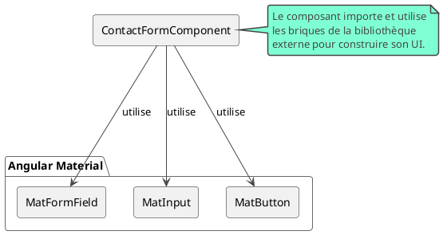
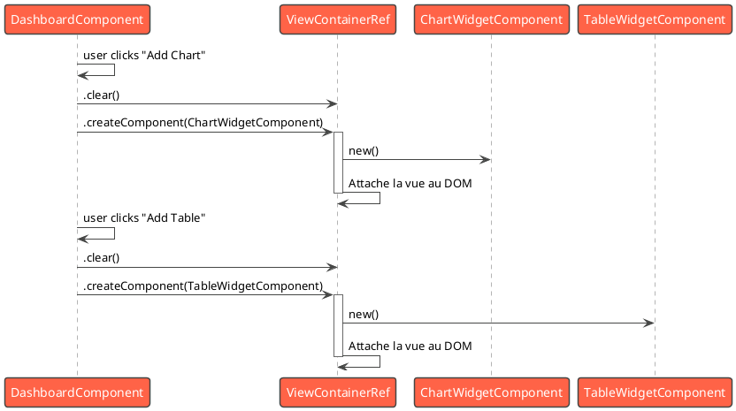

# Module 6, Partie A : Intégration d'un Design System et Composants Dynamiques

### Objectifs pédagogiques

À la fin de cette partie, vous serez capable de :

* **Intégrer** un Design System externe comme Angular Material pour accélérer le développement et garantir la cohérence
  visuelle.
* **Construire** vos propres composants "Wrapper" hautement réutilisables grâce à la projection de contenu avec
  `ng-content`.
* **Maîtriser** la création de composants dynamiques pour les cas d'usage où l'interface est définie à l'exécution.

### Introduction

Jusqu'à présent, nous avons surtout travaillé sur l'architecture invisible de notre application : la gestion des
données, les flux, la sécurité. Mais pour l'utilisateur, ce qui compte, c'est ce qu'il voit et ce avec quoi il
interagit. Comment s'assurer que notre application est non seulement fonctionnelle, mais aussi belle, cohérente et
intuitive ?

On peut, bien sûr, créer chaque bouton, chaque champ de formulaire, chaque boîte de dialogue à partir de zéro. C'est
comme construire une maison en fabriquant chaque brique soi-même. C'est long et le résultat peut manquer d'uniformité.
Une approche plus professionnelle consiste à utiliser un **Design System** : une bibliothèque de composants
pré-fabriqués, testés, accessibles et visuellement cohérents. Nous verrons comment intégrer le plus populaire d'entre
eux, **Angular Material**.

Mais parfois, nous avons besoin de créer nos propres "briques" réutilisables, comme une carte ou une fenêtre modale qui
peut accueillir n'importe quel contenu. C'est là que la **projection de contenu** avec `ng-content` entre en jeu. Et
pour le summum de la flexibilité, nous apprendrons à créer des composants **dynamiquement**, à la volée, une technique
puissante pour des interfaces entièrement configurables par l'utilisateur.

### 1. Utiliser un Design System Externe (ex: Angular Material)

Angular Material est la bibliothèque de composants officielle de l'équipe Angular. Elle implémente les spécifications
du "Material Design" de Google. L'utiliser, c'est bénéficier instantanément de dizaines de composants de haute qualité.

#### Installation et Configuration

Angular CLI rend l'intégration incroyablement simple grâce à la commande `ng add`.

```bash
ng add @angular/material
```

Cette commande magique va :

1. Installer les dépendances (`@angular/material`, `@angular/cdk`).
2. Vous demander de choisir un thème de couleurs pré-défini.
3. Configurer la typographie Material Design dans votre `styles.scss`.
4. Importer `provideAnimations()` dans votre `app.config.ts` pour que les animations fonctionnent.

#### Utilisation des Composants (Approche Standalone)

L'approche moderne consiste à importer directement les composants dont vous avez besoin dans le tableau `imports` de
votre composant Standalone.

```typescript
// src/app/contact-form/contact-form.component.ts
import {Component} from '@angular/core';
import {CommonModule} from '@angular/common';

// On importe les composants Material dont on a besoin
import {MatFormFieldModule} from '@angular/material/form-field';
import {MatInputModule} from '@angular/material/input';
import {MatButtonModule} from '@angular/material/button';

@Component({
    selector: 'app-contact-form',
    standalone: true,
    imports: [
        CommonModule,
        MatFormFieldModule, // Chaque composant Material est dans son propre module
        MatInputModule,
        MatButtonModule
    ],
    template: `
    <mat-form-field appearance="fill">
      <mat-label>Votre nom</mat-label>
      <input matInput>
    </mat-form-field>
    
    <button mat-raised-button color="primary">Envoyer</button>
  `
})
export class ContactFormComponent {
}
```



### 2. Créer des Composants Réutilisables avec `ng-content` (Projection de Contenu)

Parfois, ce dont on a besoin, ce n'est pas un composant spécifique (un bouton), mais un **contenant** réutilisable (une
carte, un panneau, une modale). Comment créer un composant `<app-card>` qui puisse afficher n'importe quoi à l'
intérieur ? La réponse est `<ng-content>`.

`<ng-content>` est un "trou" dans le template de votre composant, une fente où le composant parent peut projeter son
propre contenu HTML.

#### `ng-content` simple

```typescript
// src/app/ui/card/card.component.ts
import {Component, Input} from '@angular/core';

@Component({
    selector: 'app-card',
    standalone: true,
    template: `
    <div class="card-wrapper">
      <h3 class="card-header" *ngIf="title">{{ title }}</h3>
      <div class="card-body">
        <!-- Le contenu fourni par le parent sera projeté ici -->
        <ng-content></ng-content>
      </div>
    </div>
  `,
    styles: [`/* ... styles pour la carte ... */`]
})
export class CardComponent {
    @Input() title?: string;
}
```

**Utilisation :**

```html
<!-- Dans un autre composant -->
<app-card title="Mon Profil">
    <!-- Tout ce qui est ici sera projeté dans le ng-content -->
    <p>Nom: Jean Dupont</p>
    <app-contact-form></app-contact-form>
</app-card>
```

#### `ng-content` avec "slots" nommés (`select`)

Pour des composants plus complexes comme une fenêtre modale, vous pouvez vouloir plusieurs "slots" : un pour l'en-tête,
un pour le corps, un pour le pied de page. On utilise l'attribut `select`.

```typescript
// src/app/ui/modal/modal.component.ts
// ...
template: `
  <div class="modal-header">
    <ng-content select="[modal-header]"></ng-content>
  </div>
  <div class="modal-body">
    <ng-content select="[modal-body]"></ng-content>
  </div>
  <div class="modal-footer">
    <ng-content select="[modal-footer]"></ng-content>
  </div>
`
// ...
```

**Utilisation :**

```html

<app-modal>
    <h2 modal-header>Titre de la modale</h2>
    <p modal-body>Contenu principal...</p>
    <div modal-footer>
        <button>OK</button>
        <button>Annuler</button>
    </div>
</app-modal>
```

### 3. Créer des Composants Dynamiques

C'est le niveau de flexibilité ultime. Imaginez un tableau de bord où l'utilisateur peut ajouter, supprimer et
réorganiser des "widgets". Le type de widget n'est pas connu à l'avance. On ne peut donc pas utiliser `@if` ou
`@switch`. Il faut créer les composants **programmatiquement**.

La clé est `ViewContainerRef`. C'est un service qui représente un conteneur dans votre template, un endroit où de
nouvelles vues (et donc des composants) peuvent être attachées.

**Le processus :**

1. **Marquer un point d'ancrage** dans le template avec `<ng-template>`.
2. **Obtenir une référence** à ce point d'ancrage avec `@ViewChild`.
3. **Appeler `viewContainerRef.createComponent()`** en lui passant le *type* du composant à créer.

```typescript
// src/app/dashboard/dashboard.component.ts
import {Component, ViewChild, ViewContainerRef, inject} from '@angular/core';
import {ChartWidgetComponent} from '../widgets/chart.component';
import {TableWidgetComponent} from '../widgets/table.component';

@Component({
    selector: 'app-dashboard',
    standalone: true,
    template: `
    <h2>Dashboard Dynamique</h2>
    <button (click)="loadWidget('chart')">Ajouter Graphique</button>
    <button (click)="loadWidget('table')">Ajouter Tableau</button>
    
    <!-- 1. Le point d'ancrage -->
    <ng-template #widgetHost></ng-template>
  `
})
export class DashboardComponent {
    // 2. Obtenir une référence au ViewContainerRef
    @ViewChild('widgetHost', {read: ViewContainerRef, static: true})
    private widgetHost!: ViewContainerRef;

    private componentRegistry = {
        chart: ChartWidgetComponent,
        table: TableWidgetComponent
    };

    loadWidget(type: 'chart' | 'table'): void {
        // On nettoie le conteneur avant d'ajouter un nouveau widget
        this.widgetHost.clear();

        const componentToLoad = this.componentRegistry[type];

        // 3. On crée le composant dynamiquement !
        const componentRef = this.widgetHost.createComponent(componentToLoad);

        // On peut même passer des données au composant créé
        // componentRef.instance.data = { ... };
    }
}
```



### Exercice 6.1 : Créer une fenêtre modale réutilisable

**Objectif :** Construire le composant `<app-modal>` en utilisant la projection de contenu avec des "slots" nommés.

**Instructions :**

1. Créez un `ModalComponent` qui sera le "wrapper".
2. Dans son template, définissez 3 slots avec `<ng-content>` et l'attribut `select` : `[modal-title]`, `[modal-body]`,
   `[modal-footer]`.
3. Ajoutez un `@Output() close` qui émet un événement lorsqu'on clique sur un bouton de fermeture (un "X" dans le coin,
   par exemple).
4. Stylisez la modale pour qu'elle ressemble à une vraie fenêtre (un fond semi-transparent, une boîte centrée avec une
   ombre).
5. Dans un autre composant (ex: `AppComponent`), utilisez votre `<app-modal>` :
    * Utilisez une propriété (`isModalOpen`) pour l'afficher ou la cacher avec `@if`.
    * Projetez du contenu dans les 3 slots.
    * Gérez l'événement `(close)` pour mettre `isModalOpen` à `false`.

#### Correction exercice 6.1 {collapsible='true'}

<procedure>
<p>Voici une implémentation complète de la modale réutilisable.</p>

**1. `modal.component.ts`**

```typescript
// src/app/ui/modal/modal.component.ts
import {Component, EventEmitter, Output} from '@angular/core';
import {CommonModule} from '@angular/common';

@Component({
    selector: 'app-modal',
    standalone: true,
    imports: [CommonModule],
    template: `
    <div class="modal-backdrop" (click)="onClose()"></div>
    <div class="modal-content">
      <div class="modal-header">
        <ng-content select="[modal-title]"></ng-content>
        <button class="close-btn" (click)="onClose()">×</button>
      </div>
      <div class="modal-body">
        <ng-content select="[modal-body]"></ng-content>
      </div>
      <div class="modal-footer">
        <ng-content select="[modal-footer]"></ng-content>
      </div>
    </div>
  `,
    styleUrls: ['./modal.component.css'] // Voir CSS ci-dessous
})
export class ModalComponent {
    @Output() close = new EventEmitter<void>();

    onClose() {
        this.close.emit();
    }
}
```

**2. `modal.component.css`**

```css
:host {
    position: fixed;
    top: 0;
    left: 0;
    width: 100%;
    height: 100%;
    display: flex;
    justify-content: center;
    align-items: center;
}

.modal-backdrop {
    position: absolute;
    top: 0;
    left: 0;
    width: 100%;
    height: 100%;
    background-color: rgba(0, 0, 0, 0.5);
}

.modal-content {
    position: relative;
    background: white;
    border-radius: 8px;
    padding: 20px;
    width: 500px;
    max-width: 90%;
    box-shadow: 0 5px 15px rgba(0, 0, 0, 0.3);
    z-index: 10;
}

.modal-header {
    display: flex;
    justify-content: space-between;
    align-items: center;
    border-bottom: 1px solid #eee;
    padding-bottom: 10px;
    margin-bottom: 10px;
}

.close-btn {
    background: none;
    border: none;
    font-size: 1.5rem;
    cursor: pointer;
}

.modal-footer {
    border-top: 1px solid #eee;
    padding-top: 10px;
    margin-top: 10px;
    text-align: right;
}
```

**3. Utilisation dans `app.component.ts`**

```typescript
// src/app/app.component.ts
import {Component} from '@angular/core';
import {CommonModule} from '@angular/common';
import {ModalComponent} from './ui/modal/modal.component';

@Component({
    selector: 'app-root',
    standalone: true,
    imports: [CommonModule, ModalComponent],
    template: `
    <button (click)="isModalOpen = true">Ouvrir la modale</button>

    <app-modal *ngIf="isModalOpen" (close)="isModalOpen = false">
      <h2 modal-title>Confirmation</h2>
      
      <div modal-body>
        <p>Voulez-vous vraiment effectuer cette action ?</p>
      </div>

      <div modal-footer>
        <button (click)="isModalOpen = false">Annuler</button>
        <button>Confirmer</button>
      </div>
    </app-modal>
  `
})
export class AppComponent {
    isModalOpen = false;
}
```

</procedure>

### Auto-évaluation

1. **Quel est le principal avantage d'utiliser `ng add @angular/material` plutôt que d'installer manuellement la
   bibliothèque ?**
   a. C'est plus rapide à télécharger.
   b. La commande configure automatiquement le thème, la typographie et les animations.
   c. Cela installe une version spéciale et plus performante de la bibliothèque.
   d. Cela ne fonctionne que pour les projets non-standalone.

2. **Expliquez le concept de "projection de contenu" et le rôle de la balise `<ng-content>`.**

3. **Dans quel scénario la création de composants dynamiques est-elle la solution la plus appropriée ?**
   a. Pour afficher une liste de produits où chaque produit a la même structure.
   b. Pour afficher un dialogue de confirmation simple.
   c. Pour construire un tableau de bord où l'utilisateur peut choisir les "widgets" à afficher à partir d'une liste.
   d. Pour afficher ou cacher une section de la page en fonction du rôle de l'utilisateur.

4. **Comment peut-on définir plusieurs "slots" de projection dans un même composant ?**

5. **Quelle classe de l'API Angular est fondamentale pour pouvoir créer et insérer des composants dynamiquement dans le
   DOM ?**
   a. `ComponentFactoryResolver` (ancienne méthode)
   b. `Renderer2`
   c. `ElementRef`
   d. `ViewContainerRef` (méthode moderne)

### Conclusion

Vous avez ajouté trois puissants patrons de conception de composants à votre arsenal. Vous savez maintenant comment vous
appuyer sur le travail de la communauté en intégrant un **Design System** complet. Vous savez également créer vos
propres briques d'UI flexibles et réutilisables grâce à la **projection de contenu**. Enfin, pour les cas les plus
complexes, vous êtes capable de construire des interfaces à la volée avec la **création de composants dynamiques**.

Ces techniques vous permettent de créer des interfaces utilisateur riches et complexes. Mais comment les rendre plus
vivantes ? Comment réagir à des événements qui ne proviennent pas de l'utilisateur, mais du serveur ? Dans la prochaine
partie, nous allons explorer le monde du temps réel en intégrant des **WebSockets** dans notre application Angular.