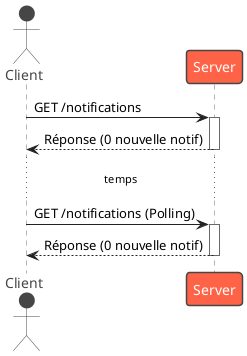
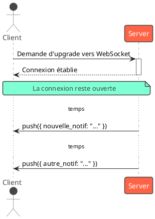
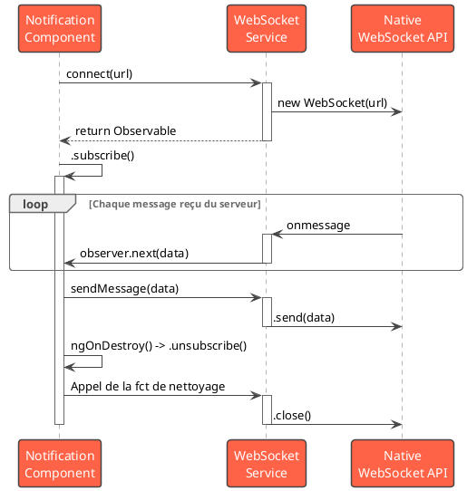

# Module 6, Partie B : Temps Réel avec WebSockets

### Objectifs pédagogiques

À la fin de cette partie, vous serez capable de :

* **Distinguer** fondamentalement le protocole WebSocket du modèle requête-réponse de HTTP.
* **Comprendre** le défi d'intégrer l'API native des WebSockets dans un écosystème réactif comme Angular.
* **"Wrapper"** (encapsuler) l'API WebSocket dans un `Observable` RxJS pour unifier la gestion des données asynchrones.
* **Implémenter** une fonctionnalité de communication en temps réel simple dans votre application.

### Introduction

Jusqu'à maintenant, toutes nos communications avec le serveur ont suivi le même schéma : celui de la requête-réponse.
C'est comme passer un coup de téléphone :

1. Vous composez le numéro (la requête).
2. Vous posez une question.
3. Vous obtenez une réponse.
4. Vous raccrochez (la connexion est fermée).

Si vous voulez savoir s'il y a du nouveau, vous devez **rappeler**. C'est le principe du "polling". C'est parfois lourd
et toujours en retard.

Mais que se passe-t-il si vous avez besoin d'une conversation continue ? D'un talkie-walkie où la ligne reste ouverte et
où les deux interlocuteurs peuvent parler à tout moment ? C'est exactement ce que sont les **WebSockets**. Ils
établissent une connexion persistante et bidirectionnelle entre le client et le serveur. C'est la technologie qui
alimente les chats, les notifications instantanées, les flux de données boursières en direct et les outils de
collaboration. Dans cette partie, nous allons apprendre à ouvrir cette ligne de communication directe dans nos
applications Angular.

### 1. Introduction aux WebSockets : Au-delà de la Requête-Réponse

Le protocole WebSocket a été conçu pour surmonter les limitations de HTTP pour les applications temps réel.

**Le modèle HTTP (Requête-Réponse)**



**Le modèle WebSocket (Connexion Persistante)**



L'API native des WebSockets dans le navigateur est basée sur des événements : `onopen`, `onmessage`, `onclose`,
`onerror`. Ce modèle impératif ne s'intègre pas très élégamment avec le monde réactif et déclaratif de RxJS. Notre
mission est donc de construire un pont entre ces deux mondes.

### 2. Intégrer les WebSockets dans Angular avec RxJS

L'idée est de créer un service qui cache la complexité de l'API native et expose un bel `Observable` propre que nos
composants pourront consommer. C'est le patron de conception du "Wrapper".

**Le Service `WebSocketService`**

```typescript
// src/app/services/websocket.service.ts
import {Injectable} from '@angular/core';
import {Observable, Observer} from 'rxjs';

@Injectable({
    providedIn: 'root'
})
export class WebSocketService {
    private socket!: WebSocket;

    // La méthode principale qui retourne un Observable
    public connect(url: string): Observable<any> {

        return new Observable((observer: Observer<any>) => {
            // On crée l'instance du WebSocket natif
            this.socket = new WebSocket(url);

            // On écoute les messages entrants du serveur
            this.socket.onmessage = (event) => {
                // On pousse les données reçues dans le flux de l'Observable
                try {
                    const data = JSON.parse(event.data);
                    observer.next(data);
                } catch (e) {
                    observer.next(event.data); // Si ce n'est pas du JSON
                }
            };

            // On écoute les erreurs
            this.socket.onerror = (event) => {
                observer.error(event);
            };

            // On écoute la fermeture de la connexion
            this.socket.onclose = (event) => {
                observer.complete();
            };

            // La fonction de "nettoyage" de l'Observable.
            // Elle est appelée quand on se désabonne (unsubscribe).
            return () => {
                if (this.socket.readyState === WebSocket.OPEN) {
                    this.socket.close();
                }
            };
        });
    }

    // Méthode pour envoyer des messages au serveur
    public sendMessage(message: any): void {
        if (this.socket.readyState === WebSocket.OPEN) {
            this.socket.send(JSON.stringify(message));
        } else {
            console.error('WebSocket is not open. Ready state is: '
                + this.socket.readyState);
        }
    }
}
```

<warning>
**La fonction de nettoyage est cruciale !**
Le `return () => { this.socket.close(); }` à la fin de la création de l'`Observable` est fondamental. Il garantit que lorsque le composant qui s'est abonné est détruit (et que le `async` pipe ou un `takeUntil` se désabonne), la connexion WebSocket est proprement fermée. Sans cela, vous laisseriez des connexions ouvertes et créeriez des fuites de mémoire.
</warning>

### Exercice 6.2 : Le Service de Notifications en Temps Réel

**Objectif :** Utiliser notre `WebSocketService` pour se connecter à un serveur de test public et afficher les messages
reçus en temps réel.

**Instructions :**

1. Implémentez le `WebSocketService` comme montré ci-dessus.
2. Créez un `NotificationComponent`.
3. Dans ce composant :
    * Injectez le `WebSocketService`.
    * Dans `ngOnInit`, appelez la méthode `connect()` du service avec l'URL d'un serveur de test public. Une bonne
      option est `wss://socketsbay.com/wss/v2/1/demo/`.
    * Stockez l'`Observable` retourné dans une propriété de votre composant (ex: `notifications$`).
    * Ajoutez une méthode dans le composant qui utilise `webSocketService.sendMessage()` pour envoyer un message.
4. Dans le template du composant :
    * Utilisez le pipe `async` sur `notifications$` pour afficher les messages au fur et à mesure qu'ils arrivent.
    * Ajoutez un champ de saisie et un bouton pour permettre à l'utilisateur d'envoyer ses propres messages.

#### Correction exercice 6.2 {collapsible='true'}

<procedure>
<p>Voici une implémentation complète du composant de notifications.</p>

**1. Le `WebSocketService`**
(Le code est identique à celui présenté ci-dessus.)

**2. Le `notification.component.ts`**

```typescript
// src/app/notification/notification.component.ts
import {Component, OnDestroy, OnInit, inject} from '@angular/core';
import {CommonModule} from '@angular/common';
import {FormsModule} from '@angular/forms';
import {Observable, Subscription} from 'rxjs';
import {WebSocketService} from '../services/websocket.service';

@Component({
    selector: 'app-notification',
    standalone: true,
    imports: [CommonModule, FormsModule],
    template: `
    <h2>Notifications en Temps Réel</h2>
    
    <div>
      <input type="text" [(ngModel)]="messageToSend" 
             placeholder="Écrivez un message...">
      <button (click)="sendMessage()">Envoyer</button>
    </div>

    <h3>Messages Reçus:</h3>
    <ul>
      <!--
        Ici, nous n'utilisons pas le pipe async pour montrer
        comment gérer manuellement la souscription et la désinscription,
        ce qui est une alternative viable.
      -->
      <li *ngFor="let msg of receivedMessages">{{ msg | json }}</li>
    </ul>
    <p *ngIf="receivedMessages.length === 0">
      En attente de messages...
    </p>
  `
})
export class NotificationComponent implements OnInit, OnDestroy {
    private wsService = inject(WebSocketService);

    private WSS_URL = 'wss://socketsbay.com/wss/v2/1/demo/';
    private wsSubscription!: Subscription;

    public receivedMessages: any[] = [];
    public messageToSend = '';

    ngOnInit(): void {
        this.wsSubscription = this.wsService.connect(this.WSS_URL)
            .subscribe({
                next: (msg) => {
                    console.log('Message reçu:', msg);
                    this.receivedMessages.push(msg);
                },
                error: (err) => console.error('Erreur WebSocket:', err),
                complete: () => console.log('Connexion WebSocket fermée.')
            });
    }

    sendMessage(): void {
        if (this.messageToSend.trim()) {
            this.wsService.sendMessage({content: this.messageToSend});
            this.messageToSend = '';
        }
    }

    // C'est ici que la magie de la désinscription opère !
    ngOnDestroy(): void {
        if (this.wsSubscription) {
            this.wsSubscription.unsubscribe();
        }
    }
}
```



</procedure>

### Auto-évaluation

1. **Quelle affirmation décrit le mieux la différence fondamentale entre HTTP et WebSocket ?**
   a. WebSocket est plus sécurisé que HTTP.
   b. HTTP est unidirectionnel, WebSocket est bidirectionnel.
   c. HTTP est un protocole basé sur une connexion qui se ferme après chaque réponse, tandis que WebSocket maintient une
   connexion persistante.
   d. WebSocket ne peut transporter que du texte, HTTP peut transporter des images.

2. **Dans notre service "wrapper" RxJS, à quel événement de l'Observer (`next`, `error`, `complete`) correspond
   l'événement `onmessage` de l'API WebSocket native ?**

3. **Pourquoi est-il crucial de retourner une fonction qui appelle `socket.close()` dans le constructeur de
   notre `Observable` personnalisé ?**

4. **Si vous voulez envoyer un objet JavaScript `{ "user": "test", "action": "typing" }` à un serveur WebSocket, que
   devez-vous généralement faire avec cet objet avant de l'envoyer ?**
   a. Le convertir en XML.
   b. Le passer directement à la méthode `send()`.
   c. Utiliser `JSON.stringify()` pour le convertir en chaîne de caractères.
   d. L'encoder en Base64.

5. **Vrai ou Faux : Une fois qu'une connexion WebSocket est établie, seul le serveur peut initier l'envoi d'un message.
   **

### Conclusion

Félicitations ! Vous avez ouvert une porte sur un aspect passionnant et puissant du développement web moderne. En
encapsulant l'API WebSocket native dans un `Observable` RxJS, vous avez non seulement rendu votre code plus propre et
plus cohérent avec le reste de votre application Angular, mais vous avez aussi rendu l'intégration du temps réel
beaucoup plus facile à gérer. Vous savez maintenant comment construire des fonctionnalités qui réagissent instantanément
aux changements, offrant une expérience utilisateur vivante et engageante.

Maintenant que notre application est fonctionnelle, belle, interactive et même temps réel, il est temps de la préparer
pour le monde réel. Comment la "builder" pour la production ? Comment la déployer sur un serveur ? Et comment la
transformer en une application qui peut même fonctionner hors-ligne ? C'est ce que nous allons voir dans la dernière
partie de ce module.