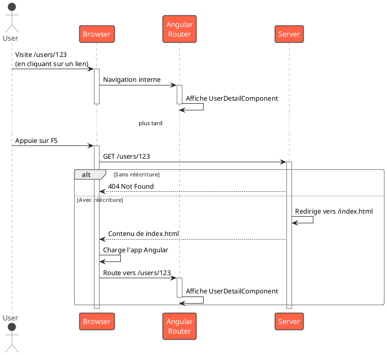

# Module 6, Partie C : Build, Déploiement et Progressive Web Apps (PWA)

### Objectifs pédagogiques

À la fin de cette partie, vous serez capable de :

* **Lancer** un build de production optimisé avec `ng build`.
* **Expliquer** les optimisations clés appliquées par Angular (minification, tree-shaking).
* **Déployer** votre application sur un serveur statique.
* **Diagnostiquer** et **résoudre** le problème de rafraîchissement (F5) sur les routes.
* **Transformer** votre application en une Progressive Web App (PWA) installable et fonctionnant hors-ligne avec
  `ng add @angular/pwa`.

### Introduction

Félicitations ! Vous avez construit une application incroyable. Elle est bien architecturée, performante, sécurisée, et
même temps réel. Elle tourne à merveille sur votre machine de développement. Mais maintenant, vient le moment de
vérité : la mettre au monde, la rendre accessible à vos utilisateurs.

C'est comme avoir passé des mois à construire une voiture de course dans votre garage. Il est temps de la sortir sur le
circuit. Cela implique plusieurs étapes cruciales :

1. **La Préparation pour la Course (`ng build`) :** On enlève tout le superflu, on optimise le moteur, on vérifie chaque
   boulon. On veut la version la plus légère et la plus rapide possible de notre application.
2. **Le Transport sur le Circuit (Déploiement) :** Comment amener notre voiture (nos fichiers) sur le circuit (le
   serveur) et s'assurer qu'elle se comporte bien ?
3. **L'Amélioration Ultime (PWA) :** Comment donner à notre voiture des super-pouvoirs, comme la capacité de rouler même
   si la route disparaît (mode hors-ligne) et de se garer directement sur le bureau de l'utilisateur (installation) ?

Cette partie est la dernière étape pour passer d'un projet de développement à un produit professionnel livré aux
utilisateurs.

### 1. Build de Production : `ng build`

La commande `ng serve` est fantastique pour le développement, mais elle n'est absolument pas faite pour la production.
Pour cela, nous avons `ng build`.

```bash
ng build
```

Par défaut, cette commande construit votre application pour l'environnement de production. Elle effectue une série
d'optimisations magiques pour rendre votre application aussi petite et rapide que possible.

<tabs>
<tab title="Minification">
Le code que vous écrivez est fait pour être lisible par les humains. Le code que le navigateur exécute doit être le plus petit possible. La minification supprime tous les caractères inutiles (espaces, sauts de ligne, commentaires) et raccourcit les noms de variables.

**Avant :**

```javascript
function greetUser(userName) {
    const GREETING_MESSAGE = "Hello";
    console.log(GREETING_MESSAGE + ", " + userName);
}
```

**Après :**

```javascript
function g(a) {
    console.log("Hello, " + a)
}
```

</tab>
<tab title="Tree-Shaking (Élagage)">
Votre application importe peut-être des bibliothèques entières, mais n'utilise que quelques-unes de leurs fonctions. Le "tree-shaking" est un processus qui analyse votre code et élimine tout le code des dépendances que vous n'utilisez pas réellement. C'est comme secouer un arbre pour faire tomber les feuilles mortes. Le résultat est un bundle beaucoup plus léger.
</tab>
<tab title="Compilation Ahead-of-Time (AOT)">
En développement (`ng serve`), vos templates HTML sont compilés en JavaScript par le navigateur (Just-in-Time, JIT). En production, `ng build` fait ce travail à l'avance (Ahead-of-Time, AOT). Le navigateur reçoit directement du JavaScript optimisé, ce qui rend le démarrage de l'application beaucoup plus rapide.
</tab>
</tabs>

Le résultat de cette commande est déposé dans le dossier `dist/nom-de-votre-app/`. Ce dossier contient tous les fichiers
statiques (`index.html`, `main.js`, `styles.css`...) prêts à être déployés.

### 2. Stratégies de Déploiement

Une application Angular, une fois "buildée", est juste un ensemble de fichiers statiques. Vous pouvez l'héberger sur n'
importe quel serveur capable de servir des fichiers statiques : Nginx, Apache, Firebase Hosting, AWS S3, etc.

#### Le Problème du Rafraîchissement (F5)

C'est LE problème que rencontre tout débutant.

1. Vous démarrez sur `www.monsite.com`. Tout va bien.
2. Vous naviguez vers `www.monsite.com/users/123` en cliquant sur un lien. Le routeur Angular intercepte le clic et
   affiche le bon composant. Tout va bien.
3. Vous appuyez sur F5 (ou vous entrez l'URL directement). Le navigateur envoie une requête `GET /users/123` au *
   *serveur**. Le serveur ne connaît pas cette route ! Il vous retourne une erreur 404 (Not Found).

**La Solution : La Réécriture d'URL (URL Rewriting)**
Il faut configurer le serveur pour que **toutes les requêtes** qui ne correspondent pas à un fichier physique (comme
`main.js` ou une image) soient redirigées vers `index.html`. Ainsi, l'application Angular se charge, lit l'URL
`.../users/123`, et le routeur Angular prend le relais pour afficher le bon composant.



**Exemple de configuration pour Nginx :**

```nginx
server {
  listen 80;
  server_name monsite.com;
  root /var/www/html/dist/my-app; # Chemin vers vos fichiers

  location / {
    # Si le fichier ou dossier demandé n'existe pas,
    # sers index.html à la place.
    try_files $uri $uri/ /index.html;
  }
}
```

### 3. Transformer son App en PWA

Une Progressive Web App (PWA) est une application web qui utilise les technologies modernes des navigateurs pour offrir
une expérience similaire à une application native.

Avec Angular, c'est incroyablement simple à mettre en place :

```bash
ng add @angular/pwa
```

Cette commande va :

* Ajouter le package `@angular/pwa`.
* Créer un fichier `manifest.webmanifest`.
* Créer un fichier de configuration du Service Worker `ngsw-config.json`.
* Créer des icônes de différentes tailles.
* Mettre à jour `index.html` pour lier le manifest.
* Enregistrer le Service Worker dans votre `app.config.ts`.

<tabs>
<tab title="Le Manifest : La Carte d'Identité">
Le fichier `manifest.webmanifest` est un simple fichier JSON qui décrit votre application au navigateur. C'est ce qui permet au navigateur de proposer à l'utilisateur d'**"Installer l'application"**.

**`src/manifest.webmanifest` (extrait)**

```json
{
  "name": "Mon App Incroyable",
  "short_name": "Mon App",
  "theme_color": "#1976d2",
  "background_color": "#fafafa",
  "display": "standalone",
  "scope": "/",
  "start_url": "/",
  "icons": [
    {
      "src": "assets/icons/icon-72x72.png",
      "sizes": "72x72",
      "type": "image/png"
    }
  ]
}
```

</tab>
<tab title="Le Service Worker : Le Cerveau Hors-Ligne">
Un Service Worker est un script qui s'exécute en arrière-plan dans le navigateur, séparément de votre page web. Il agit comme un **proxy** entre votre application et le réseau.

Son rôle principal ici est de gérer le **cache**. `ngsw-config.json` lui dit quoi mettre en cache et comment.

* **Les "assets" de l'application :** Le `index.html`, les fichiers JS et CSS.
* **Les données d'API :** On peut lui dire de mettre en cache les réponses de certains appels API.

Grâce à lui, si l'utilisateur perd sa connexion internet, le Service Worker peut intercepter les requêtes et servir les
fichiers depuis le cache. Votre application **continue de fonctionner hors-ligne !**

**`ngsw-config.json` (extrait)**

```json
{
  "assetGroups": [
    {
      "name": "app",
      "installMode": "prefetch",
      // Met en cache dès l'installation
      "resources": {
        "files": [
          "/favicon.ico",
          "/index.html",
          "/*.css",
          "/*.js"
        ]
      }
    }
  ],
  "dataGroups": [
    {
      "name": "api-performance",
      "urls": [
        "/api/**"
      ],
      "cacheConfig": {
        "maxSize": 100,
        "maxAge": "3d",
        "strategy": "performance"
        // Sers depuis le cache d'abord
      }
    }
  ]
}
```

</tab>
</tabs>

### Exercice 6.3 : Builder, déployer localement et transformer en PWA

**Objectif :** Accomplir tout le cycle de production sur votre projet actuel.

**Instructions :**

1. **Build :** Lancez la commande `ng build` dans votre terminal. Explorez le dossier `dist/` qui a été créé.
2. **Déploiement local :**
    * Installez un serveur statique simple : `npm install -g http-server`.
    * Naviguez dans le dossier de votre build : `cd dist/nom-de-votre-app`.
    * Lancez le serveur : `http-server -p 8080 -c-1 --proxy http://localhost:8080?`. Le flag `--proxy` est une astuce
      pour simuler la réécriture d'URL et résoudre le problème F5.
    * Ouvrez votre navigateur sur `http://localhost:8080`.
3. **Transformation PWA :**
    * Arrêtez le serveur et revenez à la racine de votre projet.
    * Lancez `ng add @angular/pwa`. Acceptez les options par défaut.
4. **Re-build et vérification :**
    * Relancez `ng build`.
    * Relancez `http-server` comme à l'étape 2.
    * Ouvrez les DevTools (F12) dans Chrome/Edge. Allez dans l'onglet "Application".
    * Vérifiez que le "Manifest" est bien chargé et que le "Service Worker" est activé et en cours d'exécution. Une
      icône d'installation devrait apparaître dans la barre d'URL.

#### Correction exercice 6.3 {collapsible='true'}

<procedure>
<p>Cet exercice n'a pas de "code" de correction, mais plutôt un ensemble de résultats attendus. Si vous avez suivi les étapes, voici ce que vous devriez observer :</p>

1. Après `ng build`, le dossier `dist/nom-de-votre-app` contient des fichiers `main.[hash].js`, `styles.[hash].css`,
   etc. Les noms de fichiers contiennent un hash pour la gestion du cache par le navigateur.

2. En accédant à `http://localhost:8080`, votre application s'affiche. Si vous naviguez vers une sous-route (ex:
   `/users`) et que vous rafraîchissez la page, elle devrait se recharger correctement grâce à l'option `--proxy` de
   `http-server`.

3. Après `ng add @angular/pwa`, de nouveaux fichiers (`manifest.webmanifest`, `ngsw-config.json`, des icônes dans
   `assets/icons/`) sont apparus dans votre projet.

4. Après le build final et le redémarrage du serveur, l'onglet "Application" des DevTools devrait ressembler à ceci :
    * **Manifest :** Les informations de votre manifest sont listées (nom de l'app, couleurs, icônes...).
    * **Service Workers :** Vous voyez un service worker (`ngsw-worker.js`) avec un statut "activated and is running".
    * **Cache Storage :** Vous pouvez voir les caches créés par le service worker (`ngsw:asset-group:app`, etc.) et
      inspecter leur contenu.

   Vous devriez aussi voir une petite icône "Installer" dans la barre d'adresse de votre navigateur. Félicitations,
   votre application est maintenant une PWA !

</procedure>

### Auto-évaluation

1. **Lequel de ces processus n'est PAS une optimisation effectuée par `ng build` en mode production ?**
   a. Tree-shaking
   b. Minification
   c. Ajout de commentaires détaillés dans le code.
   d. Compilation Ahead-of-Time (AOT).

2. **Expliquez avec vos propres mots le "problème du rafraîchissement F5" et sa solution.**

3. **Quel est le rôle du fichier `manifest.webmanifest` dans une PWA ?**

4. **Quel composant d'une PWA est responsable de la mise en cache des fichiers pour permettre un fonctionnement
   hors-ligne ?**
   a. Le Manifest
   b. Le Service Worker
   c. Le Routeur Angular
   d. Le fichier `index.html`

5. **Quelle commande CLI Angular simplifie grandement la transformation d'une application existante en PWA ?**

### Conclusion

Vous avez bouclé la boucle ! De la conception à la production, vous avez maintenant toutes les clés en main pour non
seulement construire des applications Angular avancées, mais aussi pour les livrer au monde de manière professionnelle.
Vous savez comment les optimiser pour la performance, les déployer correctement, et même les transformer en Progressive
Web Apps pour une expérience utilisateur de premier ordre.

Ce voyage à travers l'écosystème avancé d'Angular vous a équipé de compétences très recherchées. Les prochains sujets,
comme **l'internationalisation (i18n)** et **l'accessibilité (a11y)**, ne sont plus des obstacles techniques, mais des
améliorations que vous pouvez construire sur les fondations solides que vous avez établies.