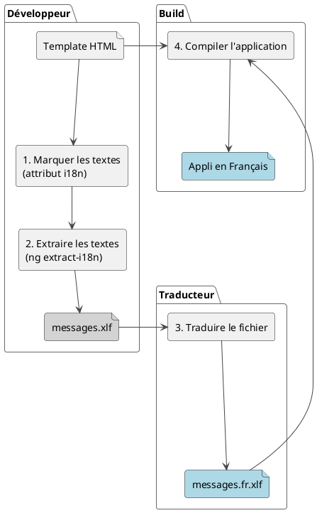

# Module 7 : L'essentiel - Rendre son Application Globale : l'Internationalisation (i18n)

### Objectifs pédagogiques

À la fin de ce module, vous serez capable de :

* **Comprendre** l'importance business et technique de l'internationalisation (i18n).
* **Utiliser** les outils intégrés d'Angular (`@angular/localize`) pour préparer une application à la traduction.
* **Marquer** les textes à traduire dans vos templates en utilisant l'attribut `i18n`.
* **Maîtriser** le flux de travail de l'i18n : extraction, traduction (simulée), et build par langue.
* **Générer** une version de votre application dans une autre langue.

### Introduction

Votre application a du succès. Vos utilisateurs l'adorent. Tellement, que l'entreprise veut maintenant la lancer en
Allemagne, en Espagne et au Japon. C'est une excellente nouvelle ! Mais votre interface est entièrement codée en
français. Allez-vous créer trois copies de votre projet et traduire manuellement chaque template ? Certainement pas !

C'est là qu'intervient l'**internationalisation**, abrégée **i18n** (car il y a 18 lettres entre le 'i' initial et le '
n' final). C'est le processus qui consiste à concevoir une application de manière à ce qu'elle puisse être adaptée à
différentes langues et régions **sans changements d'ingénierie**.

Angular fournit un outillage de première classe pour gérer ce processus de manière propre et robuste. Nous n'allons pas
simplement injecter des traductions à la volée. Nous allons générer des versions distinctes et hautement optimisées de
notre application pour chaque langue, une approche qui garantit des performances maximales. Préparez-vous à ouvrir les
portes du monde à votre application !

### Le Flux de Travail de l'i18n avec Angular

Le processus se déroule en plusieurs étapes claires, séparant le travail du développeur de celui du traducteur.




### 1. Installation et Configuration

La première étape est d'ajouter le package `@angular/localize` à notre projet.

```bash
ng add @angular/localize
```

Cette commande va installer le package et effectuer les modifications nécessaires dans votre projet pour activer le
système d'i18n.

### 2. Marquer les Textes à Traduire

C'est le cœur du travail du développeur. Dans vos templates, vous devez identifier chaque morceau de texte qui doit être
traduit en y ajoutant l'attribut `i18n`.

```html
<!-- simple-greeting.component.html -->

<!-- Texte simple -->
<h1 i18n>Bonjour tout le monde !</h1>

<!-- Texte avec interpolation -->
<p i18n>Mon nom est {userName}.</p>

<!-- Attributs à traduire (ex: title, aria-label) -->

```

<procedure title="Bonnes pratiques pour le marquage">
<p>Pour rendre le travail du traducteur plus facile et vos traductions plus robustes, suivez ces conseils :</p>
<ol>
<li>
<strong>Ajoutez une description :</strong> Aidez le traducteur à comprendre le contexte.
<p><code>&lt;h1 i18n="Titre principal de la page d'accueil"&gt;...&lt;/h1&gt;</code></p>
</li>
<li>
<strong>Utilisez des identifiants personnalisés (<code>@@id</code>) :</strong> Par défaut, Angular génère un ID pour chaque texte. Si le texte change, l'ID change, et la traduction est perdue. En fournissant un ID stable, vous évitez ce problème.
<p><code>&lt;p i18n="Message de bienvenue@@welcomeMessage"&gt;...&lt;/p&gt;</code></p>
</li>
</ol>
</procedure>

### 3. Extraire les Textes

Une fois tous les textes marqués, nous utilisons Angular CLI pour les extraire dans un fichier standardisé que les
traducteurs peuvent utiliser.

```bash
ng extract-i18n --output-path src/locale
```

Cette commande va scanner votre code et créer un fichier `src/locale/messages.xlf`. XLIFF (`.xlf`) est un format
standard basé sur XML pour la traduction.

**Extrait de `messages.xlf` :**

```xml
<!-- ... en-tête XML ... -->
<body>
    <trans-unit id="f9e87afd355c43277727174543743c799dc3be3d"
                datatype="html">
        <source>Bonjour tout le monde !</source>
        <context-group purpose="location">
            <context context-type="sourcefile">
                src/app/simple-greeting/simple-greeting.component.html
            </context>
            <context context-type="linenumber">2</context>
        </context-group>
    </trans-unit>
    <!-- ... autres trans-unit ... -->
</body>
```

### 4. Traduire le Fichier

C'est ici que le travail du traducteur commence. On crée une copie du fichier `messages.xlf` pour chaque langue cible,
par exemple `messages.es.xlf` pour l'espagnol. Dans ce fichier, le traducteur ajoute une balise `<target>` avec la
traduction.

**Extrait de `messages.es.xlf` (après traduction) :**

```xml
<!-- ... -->
<trans-unit id="f9e87afd355c43277727174543743c799dc3be3d" ...>
<source>Bonjour tout le monde !</source>
<target>¡Hola, mundo!</target> <!-- LA TRADUCTION -->
        <!-- ... -->
        </trans-unit>
        <!-- ... -->
```

### 5. Configurer le Build et Lancer

La dernière étape est de dire à Angular où se trouvent nos traductions. On modifie le fichier `angular.json`.

```json
// angular.json
{
  // ...
  "projects": {
    "my-app": {
      // ...
      "i18n": {
        // La langue par défaut de l'application (source)
        "sourceLocale": "fr",
        // Les langues pour lesquelles on veut générer un build
        "locales": {
          "es": "src/locale/messages.es.xlf"
          // code langue -> chemin du fichier
        }
      },
      "architect": {
        "build": {
          "options": {
            // ...
          },
          "configurations": {
            "production": {
              // ...
            },
            // On peut créer une config spécifique pour une langue
            "es": {
              "localize": [
                "es"
              ]
            }
          }
        }
      }
    }
  }
}
```

Maintenant, pour générer toutes les versions localisées de votre application en mode production :

```bash
ng build --localize
```

Cette commande va créer un dossier `dist/my-app/fr/` et `dist/my-app/es/`, chacun contenant une version entièrement
traduite et optimisée de l'application.

### Exercice 7.1 : Traduire une page de profil

**Objectif :** Mettre en pratique tout le flux i18n sur un petit composant.

**Instructions :**

1. Créez un `ProfileComponent` avec le template suivant :
   ```html
   <h2>Mon Profil</h2>
   <p>Bienvenue sur votre espace personnel.</p>
   <button>Modifier le profil</button>
   ```
2. **Marquez** les trois textes (`h2`, `p`, `button`) avec l'attribut `i18n`. Ajoutez des descriptions et des ID
   personnalisés.
3. **Lancez l'extraction** avec `ng extract-i18n`.
4. **Créez manuellement** une copie du fichier `messages.xlf` et nommez-la `messages.en.xlf`.
5. **Traduisez** les textes en anglais à l'intérieur de ce nouveau fichier.
6. **Configurez `angular.json`** pour déclarer le français (`fr`) comme `sourceLocale` et l'anglais (`en`) comme une
   locale disponible.
7. **Lancez** `ng build --configuration=en` pour ne générer que la version anglaise et vérifiez le résultat dans le
   dossier `dist/`.

#### Correction exercice 7.1 {collapsible='true'}

<procedure>

**1. `profile.component.html` marqué**

```html
<h2 i18n="Titre de la page profil@@profilePageTitle">Mon Profil</h2>
<p i18n="Message d'accueil de la page profil@@profileWelcomeMessage">
    Bienvenue sur votre espace personnel.
</p>
<button i18n="Bouton d'action pour éditer le profil@@profileEditButton">
    Modifier le profil
</button>
```

**2. Commande d'extraction**

```bash
ng extract-i18n --output-path src/locale
```

**3. Fichier de traduction `src/locale/messages.en.xlf`**

```xml
<?xml version="1.0" encoding="UTF-8" ?>
<xliff version="1.2" xmlns="urn:oasis:names:tc:xliff:document:1.2">
    <file source-language="fr" datatype="plaintext" original="ng2.template">
        <body>
            <trans-unit id="profilePageTitle" datatype="html">
                <source>Mon Profil</source>
                <target>My Profile</target>
                <note priority="1" from="description">Titre de la page profil</note>
            </trans-unit>
            <trans-unit id="profileWelcomeMessage" datatype="html">
                <source>Bienvenue sur votre espace personnel.</source>
                <target>Welcome to your personal space.</target>
                <note priority="1" from="description">Message d'accueil de la page profil</note>
            </trans-unit>
            <trans-unit id="profileEditButton" datatype="html">
                <source>Modifier le profil</source>
                <target>Edit Profile</target>
                <note priority="1" from="description">Bouton d'action pour éditer le profil</note>
            </trans-unit>
        </body>
    </file>
</xliff>
```

**4. Configuration `angular.json`**

```json
// ...
"i18n": {
"sourceLocale": "fr",
"locales": {
"en": "src/locale/messages.en.xlf"
}
},
"architect": {
"build": {
"configurations": {
"production": {
"localize": true,
// ...
},
"en": {
"localize": ["en"]
}
}
}
}
//...
```

**5. Commande de build**

```bash
ng build --configuration=en
```

Vous devriez trouver un dossier `dist/nom-de-votre-app/en/` contenant l'application avec les textes en anglais.

</procedure>

### Auto-évaluation

1. **Quelle est la commande CLI pour extraire les textes marqués `i18n` d'une application ?**
   a. `ng generate translations`
   b. `ng i18n --extract`
   c. `ng extract-i18n`
   d. `ng build --i18n`

2. **Quel est le principal avantage d'utiliser un identifiant personnalisé `@@id` dans un attribut `i18n` ?**

3. **Dans quel fichier de configuration du projet déclare-t-on la langue source (`sourceLocale`) et les chemins vers les
   fichiers de traduction ?**

4. **Vrai ou Faux : L'approche i18n d'Angular avec `@angular/localize` permet de changer de langue dynamiquement sans
   recharger la page.**

5. **Quel format de fichier est utilisé par défaut par Angular pour stocker les textes extraits et les traductions ?**
   a. JSON (`.json`)
   b. YAML (`.yml`)
   c. XLIFF (`.xlf`)
   d. CSV (`.csv`)

### Conclusion

Vous savez maintenant comment briser la barrière de la langue. En maîtrisant le flux de travail de
l'internationalisation avec Angular, vous avez acquis une compétence essentielle pour le développement d'applications à
grande échelle. Vous savez comment séparer proprement le code de la traduction, comment utiliser les outils standards de
l'industrie, et comment générer des applications performantes et optimisées pour chaque public.

Votre application peut maintenant être lue par tout le monde. Mais peut-elle être *utilisée* par tout le monde ? Qu'en
est-il des utilisateurs qui naviguent avec un lecteur d'écran, ou qui ne peuvent pas utiliser de souris ? C'est le défi
de l'**accessibilité (a11y)**, que nous allons aborder dans la partie "Pour aller plus loin".