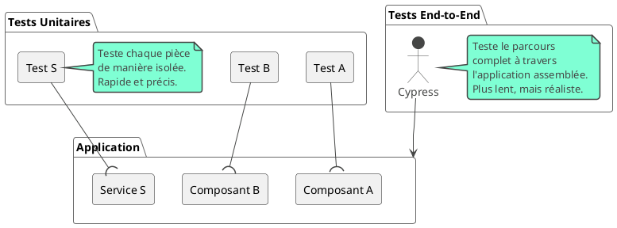

# Module 8 : L'essentiel - Tests End-to-End (E2E) : La Vérification Ultime

### Objectifs pédagogiques

À la fin de ce module, vous serez capable de :

* **Distinguer** clairement un test unitaire d'un test End-to-End (E2E).
* **Comprendre** le rôle et l'importance des tests E2E dans la chaîne de qualité logicielle.
* **Identifier** Cypress comme l'outil moderne de référence pour les tests E2E dans l'écosystème Angular.
* **Écrire** un scénario de test E2E simple avec Cypress pour simuler un parcours utilisateur.

### Introduction

Vous avez écrit des tests unitaires. Vous avez testé vos services, vos composants, vos `pipes`. Chaque pièce de votre
voiture a passé le contrôle qualité avec succès. Mais comment savoir si, une fois assemblées, ces pièces fonctionnent
harmonieusement ? Comment être sûr que lorsque le conducteur tourne le volant (clique sur un bouton), les roues tournent
réellement dans la bonne direction (la bonne page s'affiche) ?

C'est la mission des **tests End-to-End (E2E)**. Ils ne testent pas une unité de code isolée, mais un **parcours
utilisateur complet**, du début à la fin, dans un vrai navigateur. Un test E2E va simuler un utilisateur qui ouvre votre
application, se connecte, navigue vers une page, remplit un formulaire, et vérifie que le résultat attendu s'affiche.

Les tests E2E sont le niveau de test le plus élevé. Ils sont plus lents et plus complexes à écrire que les tests
unitaires, mais ils sont aussi votre meilleur filet de sécurité contre les régressions critiques, celles qui empêchent
vos utilisateurs d'accomplir leurs tâches. Ils répondent à la question la plus importante : **"Est-ce que mon
application fonctionne pour un vrai utilisateur ?"**

### Test Unitaire vs. Test End-to-End

Visualisons la différence :



### Les Outils : Cypress (Le Standard Moderne) vs. Protractor (L'Ancien)

<tabs>
<tab title="Cypress : Le choix moderne">
Cypress est aujourd'hui l'outil de référence pour les tests E2E dans l'écosystème JavaScript. Il a été adopté par Angular CLI comme solution par défaut.

**Ses avantages :**

* **Rapidité et fiabilité :** Cypress s'exécute dans la même boucle d'événements que votre application, ce qui lui donne
  un contrôle direct et élimine les problèmes de "flakiness" (tests qui échouent de manière aléatoire) courants avec
  d'autres outils.
* **Expérience de développement (DX) exceptionnelle :** Il offre une interface visuelle qui vous montre exactement ce
  que le test fait, étape par étape, avec des messages d'erreur clairs et la possibilité de "voyager dans le temps".
* **API simple et intuitive :** Son API enchaînable est très facile à lire et à écrire.

</tab>
<tab title="Protractor : L'outil historique">
Protractor était l'outil E2E officiel d'Angular pendant de nombreuses années. Il est maintenant déprécié et n'est plus inclus dans les nouveaux projets. Il était basé sur Selenium WebDriver, une technologie qui pilote le navigateur depuis l'extérieur, ce qui le rendait plus lent et parfois moins fiable que Cypress. Si vous travaillez sur un ancien projet, vous pourriez encore le rencontrer.
</tab>
</tabs>

### Écrire des Tests E2E avec Cypress

L'écriture d'un test Cypress suit une recette simple en 4 étapes : **Visiter, Trouver, Agir, Vérifier**.

1. **Installation :** Si Cypress n'est pas déjà dans votre projet, vous pouvez l'ajouter :
   ```bash
   ng add @cypress/schematic
   ```
   Puis lancez l'interface de test avec `ng e2e` ou `npx cypress open`.

2. **Structure d'un test :** Cypress utilise `describe()` et `it()`, une syntaxe que vous connaissez déjà grâce à
   Jasmine. Les fichiers de test se trouvent dans le dossier `cypress/e2e`.

3. **La Recette en 4 Étapes :**
    * **`cy.visit('/')` :** (Visiter) Ouvre le navigateur à l'URL spécifiée.
    * **`cy.get('.selector')` :** (Trouver) Sélectionne un ou plusieurs éléments dans le DOM en utilisant un sélecteur
      CSS.
    * **`.click()`, `.type('texte')` :** (Agir) Déclenche une action sur l'élément sélectionné.
    * **`.should('assertion', 'valeur')` :** (Vérifier) Fait une assertion sur l'élément. Par exemple, vérifier qu'il
      contient un certain texte, qu'il est visible, etc.

<warning title="Le secret des sélecteurs robustes">
Évitez de sélectionner vos éléments avec des classes CSS (`.ma-classe`) ou des balises (`button`), car ils peuvent changer pour des raisons de style. La meilleure pratique est d'ajouter un attribut dédié aux tests, comme `data-cy`.

**Mauvais :** `cy.get('.btn-primary')`
**Bon :** `cy.get('[data-cy="submit-login-button"]')`

Cela rend vos tests résistants aux changements de style et de structure.
</warning>

### Exercice 8.1 : Tester un formulaire de contact

**Objectif :** Écrire un test E2E qui vérifie que le formulaire de contact peut être rempli et qu'un message de succès
s'affiche.

**Composant à tester `contact-form.component.ts` :**

```typescript

@Component({
    selector: 'app-contact-form',
    standalone: true,
    imports: [ReactiveFormsModule, CommonModule],
    template: `
    <form [formGroup]="contactForm" (ngSubmit)="onSubmit()">
      <input formControlName="email" data-cy="contact-email">
      <textarea formControlName="message" data-cy="contact-message"></textarea>
      <button type="submit" data-cy="contact-submit">Envoyer</button>
    </form>
    <div *ngIf="successMessage" data-cy="success-message">
      {{ successMessage }}
    </div>
  `
})
export class ContactFormComponent {
    successMessage = '';
    contactForm = new FormGroup({
        email: new FormControl(''),
        message: new FormControl('')
    });

    onSubmit() {
        this.successMessage = 'Merci pour votre message !';
    }
}
```

**Instructions :**

1. Créez un nouveau fichier de test `cypress/e2e/contact.cy.ts`.
2. Écrivez un test `it('devrait soumettre le formulaire et afficher un message')`.
3. Dans le test, suivez la recette :
    * **Visitez** la page où se trouve votre formulaire.
    * **Trouvez** le champ email et **agissez** dessus en tapant une adresse email.
    * **Trouvez** le champ message et **agissez** dessus en tapant un message.
    * **Trouvez** le bouton de soumission et **agissez** dessus en cliquant.
    * **Trouvez** l'élément du message de succès et **vérifiez** qu'il contient le bon texte.

#### Correction exercice 8.1 {collapsible='true'}

<procedure>
<p>Voici le code Cypress complet pour tester ce scénario.</p>

**`cypress/e2e/contact.cy.ts`**

```typescript
describe('Formulaire de Contact', () => {
    it('devrait soumettre le formulaire et afficher un message de succès', () => {
        // Étape 1 : Visiter la page (adaptez l'URL si nécessaire)
        cy.visit('/contact');

        // Étape 2 & 3 : Trouver et Agir sur le champ email
        cy.get('[data-cy="contact-email"]')
            .type('test@example.com');

        // Étape 2 & 3 : Trouver et Agir sur le champ message
        cy.get('[data-cy="contact-message"]')
            .type('Bonjour, ceci est un test !');

        // Étape 2 & 3 : Trouver et Agir sur le bouton de soumission
        cy.get('[data-cy="contact-submit"]')
            .click();

        // Étape 4 : Trouver et Vérifier le résultat
        cy.get('[data-cy="success-message"]')
            .should('be.visible')
            .and('contain.text', 'Merci pour votre message !');
    });
});
```

</procedure>

### Auto-évaluation

1. **Quelle est la principale différence entre un test unitaire et un test E2E ?**
   a. Les tests E2E sont écrits en JavaScript, les tests unitaires en TypeScript.
   b. Les tests unitaires vérifient des pièces de code isolées, les tests E2E vérifient un parcours utilisateur complet
   dans un navigateur.
   c. Les tests E2E n'utilisent pas `describe` et `it`.
   d. Les tests unitaires sont plus lents que les tests E2E.

2. **Pourquoi Cypress est-il généralement considéré comme plus fiable et plus rapide que les outils basés sur
   Selenium/WebDriver comme Protractor ?**

3. **Quelle est la meilleure pratique pour sélectionner des éléments dans un test Cypress afin de le rendre résistant
   aux changements de style ?**
   a. Utiliser des sélecteurs CSS très spécifiques.
   b. Utiliser le texte de l'élément.
   c. Utiliser un attribut HTML dédié aux tests, comme `data-cy`.
   d. Utiliser des sélecteurs XPath.

4. **Quelle commande Cypress utiliseriez-vous pour taper du texte dans un champ de saisie ?**
   a. `.fill()`
   b. `.input()`
   c. `.text()`
   d. `.type()`

5. **Quelle est la dernière étape dans la "recette" de base d'un test Cypress, après avoir visité, trouvé et agi ?**

### Conclusion

Vous avez franchi la dernière étape de la pyramide des tests. Vous comprenez maintenant la place et l'importance
cruciale des tests End-to-End. Vous savez que Cypress est l'outil de choix et vous avez écrit votre premier scénario en
suivant la recette simple et efficace : **Visiter, Trouver, Agir, Vérifier**.

C'est un excellent début. Mais comment gérer des scénarios plus complexes, comme l'attente d'une réponse API ? Et
au-delà des tests, comment s'assurer que notre projet reste sain et à jour sur le long terme ? C'est ce que nous allons
voir dans la partie "Pour aller plus loin", où nous aborderons des pratiques E2E avancées et la maintenance de notre
application Angular.