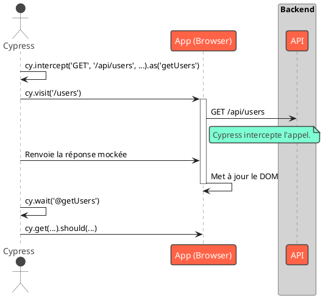

# Module 8 : Pour aller plus loin - Tests Avancés et Maintenance à Long Terme

### Objectifs pédagogiques

À la fin de cette partie, vous serez capable de :

* **Intercepter** des requêtes réseau dans Cypress pour contrôler les réponses de l'API et rendre les tests E2E plus
  rapides et plus fiables.
* **Comprendre** et **appliquer** l'importance de maintenir votre application à jour.
* **Utiliser** la commande `ng update` et le site `update.angular.io` pour faciliter les mises à jour du framework.
* **Adopter** une vision à long terme de la maintenance et de la qualité de votre base de code.

### Introduction

Vous savez maintenant écrire un test E2E de base. C'est un énorme pas en avant. Mais que se passe-t-il lorsque votre
parcours utilisateur dépend d'une réponse d'une API externe ? Allez-vous faire dépendre vos tests de la disponibilité de
votre serveur de test ? Que faire si ce serveur est lent ou en panne ? Votre suite de tests E2E, qui devrait tester
votre frontend, devient dépendante du backend.

Dans cette partie, nous allons apprendre à briser cette dépendance en utilisant l'une des fonctionnalités les plus
puissantes de Cypress : l'**interception de requêtes réseau**. Nous allons devenir le "man-in-the-middle" de nos propres
tests, en attrapant les appels API à la volée pour leur fournir des réponses contrôlées.

Ensuite, nous changerons de perspective pour aborder un sujet crucial pour la vie d'un projet : la **maintenance**. Une
application n'est pas un sprint, c'est un marathon. Comment s'assurer que notre code, qui est à la pointe aujourd'hui,
ne devienne pas une relique obsolète et vulnérable dans deux ans ? Nous découvrirons les outils qu'Angular nous fournit
pour faire de la maintenance une routine saine plutôt qu'une corvée redoutée.

### 1. Intercepter les Requêtes Réseau avec Cypress

Le secret pour des tests E2E rapides, fiables et indépendants est de **mocker l'API**. La commande `cy.intercept()` de
Cypress est l'outil parfait pour cela.

Elle vous permet de :

* **Déclarer** une "écoute" sur une requête réseau correspondant à un motif (URL, méthode...).
* **Attendre** que cette requête se produise en lui donnant un alias.
* **Fournir une réponse factice (stub)** à la place de la vraie réponse du serveur.

**Le Scénario :** Une page affiche une liste d'utilisateurs chargée depuis `/api/users`. On veut tester l'affichage sans
dépendre du vrai backend.

```typescript
// cypress/e2e/user-list.cy.ts

describe('Liste des utilisateurs', () => {
    it('devrait afficher les utilisateurs retournés par l-API mockée', () => {
        // 1. Définir la réponse mockée
        const mockUsers = [
            {id: 1, name: 'Alice Cypress'},
            {id: 2, name: 'Bob Testeur'}
        ];

        // 2. Intercepter la requête
        // Quand une requête GET vers /api/users est faite...
        cy.intercept('GET', '/api/users', {
            statusCode: 200,
            body: mockUsers
        }).as('getUsers'); // ...on lui donne l'alias 'getUsers'

        // 3. Visiter la page. La page va déclencher l'appel API.
        cy.visit('/users');

        // 4. Attendre que l'interception ait eu lieu
        cy.wait('@getUsers');

        // 5. Vérifier que le DOM a été mis à jour avec les données mockées
        cy.get('[data-cy="user-item"]').should('have.length', 2);
        cy.contains('[data-cy="user-item"]', 'Alice Cypress').should('be.visible');
    });

    it('devrait afficher un message d-erreur si l-API échoue', () => {
        // On peut aussi simuler une erreur serveur !
        cy.intercept('GET', '/api/users', {
            statusCode: 500,
            body: {message: 'Erreur interne du serveur'}
        }).as('getUsersFailure');

        cy.visit('/users');

        cy.wait('@getUsersFailure');

        cy.get('[data-cy="error-message"]')
            .should('be.visible')
            .and('contain.text', 'Impossible de charger les utilisateurs');
    });
});
```



### 2. L'Importance de Rester à Jour

L'écosystème web évolue à une vitesse fulgurante. Angular sort une nouvelle version majeure tous les 6 mois. Ignorer ces
mises à jour, c'est prendre le risque de :

* **Failles de sécurité :** Les mises à jour corrigent des vulnérabilités découvertes.
* **Dette technique :** Plus vous attendez, plus l'écart se creuse et plus la mise à jour sera difficile et coûteuse.
* **Obsolescence :** Vous ne bénéficiez pas des nouvelles fonctionnalités, des améliorations de performance et des
  outils qui facilitent le développement.
* **Difficulté de recrutement :** Les bons développeurs veulent travailler avec des technologies modernes.

La politique d'Angular est de rendre les mises à jour aussi fluides que possible.

### 3. Faciliter les Mises à Jour avec `ng update`

La commande `ng update` est votre meilleure amie pour la maintenance. Elle fait bien plus qu'un simple `npm install`.

```bash
# Analyse le projet et liste les packages à mettre à jour
ng update

# Met à jour @angular/core et @angular/cli vers la dernière version
# et applique les "schematics" de migration automatique
ng update @angular/core @angular/cli
```

**Que sont les "schematics" de migration ?**
Ce sont des scripts fournis par l'équipe Angular (et d'autres bibliothèques comme NgRx ou Angular Material) qui *
*modifient automatiquement votre code** pour l'adapter aux changements d'API d'une version à l'autre. Ils peuvent
renommer une méthode, changer les arguments d'une fonction, etc. C'est ce qui rend les mises à jour Angular beaucoup
moins pénibles que dans d'autres écosystèmes.

#### `update.angular.io` : Votre Guide Pas-à-Pas

Pour des mises à jour plus complexes, en particulier si vous sautez plusieurs versions, l'équipe Angular a créé un site
web fantastique : **[update.angular.io](https://update.angular.io/)**.

Il vous suffit de sélectionner votre version actuelle et la version cible, et le site vous génère une checklist
détaillée de toutes les étapes à suivre, des commandes à lancer et des changements manuels potentiels à effectuer. C'est
un outil indispensable.

### Exercice 8.2 : Recherche et Planification d'une Mise à Jour

**Objectif :** Se familiariser avec le processus de planification d'une mise à jour Angular. Il n'y a pas de code à
écrire, c'est un exercice de recherche.

**Instructions :**

1. Ouvrez un de vos projets Angular (ou un projet de démo). Regardez le fichier `package.json` pour identifier la
   version de `@angular/core` que vous utilisez (par exemple, `~16.2.0`).
2. Rendez-vous sur le site **[update.angular.io](https://update.angular.io/)**.
3. Dans le formulaire, sélectionnez votre version actuelle (ex: 16) et la version cible (ex: 17, la dernière LTS).
4. Lisez attentivement la checklist générée.
5. **Répondez à ces questions :**
    * Quelles sont les commandes `ng update` recommandées ?
    * Y a-t-il des changements majeurs (breaking changes) entre ces deux versions qui nécessiteraient une attention
      particulière ? (Par exemple, le passage aux vues déféreables, la nouvelle syntaxe de flux de contrôle, la fin de
      vie des NgModules...).
    * Le guide mentionne-t-il des mises à jour pour d'autres packages comme RxJS ou TypeScript ?

#### Correction exercice 8.2 {collapsible='true'}

<procedure>
<p>La réponse dépend des versions que vous avez choisies, mais voici un exemple typique pour une mise à jour de la v16 à la v17.</p>

1. **Commandes recommandées :** Le guide va probablement vous dire de lancer
   `ng update @angular/core@17 @angular/cli@17`. Il peut aussi suggérer de mettre à jour Angular Material (
   `ng update @angular/material@17`).

2. **Changements majeurs :** Pour v16 -> v17, la liste serait longue !
    * **Nouveau flux de contrôle (`@if`, `@for`...) :** Le guide expliquera que c'est maintenant la norme pour les
      nouveaux projets et fournira des schémas pour migrer l'existant.
    * **Vues déféreables (`@defer`) :** Une nouvelle manière puissante de faire du lazy loading au niveau du composant.
    * **Vite et esbuild par défaut :** Le build de l'application est maintenant beaucoup plus rapide.
    * **Applications "standalone" par défaut :** `ng new` crée maintenant des projets sans `NgModule`.
    * Le guide mettra en évidence les API qui ont été modifiées ou dépréciées.

3. **Autres packages :** Oui, le guide mentionne souvent les versions requises de Node.js, TypeScript et RxJS, car le
   framework en dépend. Il vous conseillera de vérifier que vous utilisez des versions compatibles.

Cet exercice vous montre que les mises à jour ne se font pas à l'aveugle. Elles se planifient en s'appuyant sur l'
excellente documentation fournie par l'équipe Angular.

</procedure>

### Auto-évaluation

1. **Quel est le principal avantage d'utiliser `cy.intercept()` dans les tests E2E ?**
   a. Cela accélère la vitesse de frappe de `cy.type()`.
   b. Cela rend les tests plus rapides et plus fiables en les découplant du backend.
   c. Cela permet de tester des applications non-Angular.
   d. Cela intercepte les erreurs JavaScript dans la console.

2. **Expliquez ce qu'est un "schematic de migration" dans le contexte de `ng update`.**

3. **Vous êtes sur Angular v15 et vous voulez passer à la v17. Quel est le meilleur outil à consulter pour planifier
   cette mise à jour ?**

4. **Vrai ou Faux : La commande `ng update` met uniquement à jour les packages dans `node_modules`, mais ne modifie
   jamais votre code source.**

5. **En plus de corriger des bugs, quelle est la raison la plus critique de maintenir à jour ses dépendances (framework,
   bibliothèques...) ?**

### Conclusion

Vous avez atteint le sommet de la montagne. Vous savez non seulement construire et tester votre application à tous les
niveaux, mais vous avez aussi acquis la vision à long terme nécessaire pour en assurer la pérennité. En maîtrisant
l'interception réseau dans Cypress, vous pouvez créer des suites de tests E2E robustes. En adoptant une routine de mise
à jour saine avec `ng update` et `update.angular.io`, vous garantissez que votre application restera moderne,
performante et sécurisée.

Ce voyage à travers les concepts avancés d'Angular est maintenant terminé. Vous avez les compétences pour aborder des
projets d'envergure avec confiance. La dernière étape de notre cours sera une conclusion générale, récapitulant les
compétences acquises et ouvrant des pistes vers des sujets encore plus pointus de l'écosystème.