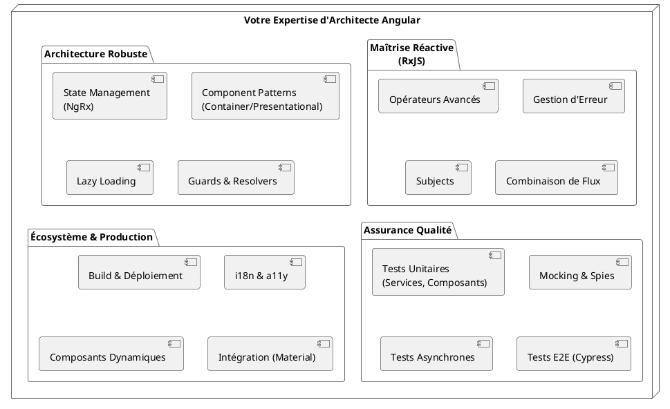
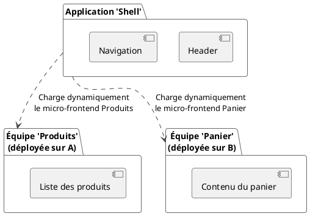

# Module 9 : Conclusion - De l'Apprenti à l'Architecte

### Objectifs pédagogiques

À la fin de ce module de conclusion, vous serez capable de :

* **Synthétiser** les compétences clés acquises tout au long du parcours avancé.
* **Valoriser** votre nouvelle expertise en la positionnant dans le contexte de la construction d'applications
  professionnelles.
* **Identifier** des sujets encore plus avancés pour continuer votre apprentissage et votre spécialisation.
* **Se projeter** avec confiance dans votre rôle de Concepteur Développeur d'Applications, armé d'outils et de
  méthodologies modernes.

### Introduction

Félicitations ! Vous êtes arrivé au terme de ce parcours avancé. Prenez un instant pour regarder le chemin parcouru.
Vous avez commencé ce cours en sachant comment construire les murs d'une maison. Aujourd'hui, vous avez les compétences
pour en dessiner les plans, en concevoir les fondations antisismiques, en orchestrer la plomberie et l'électricité, et
en assurer la sécurité. Vous n'êtes plus simplement des maçons ; vous êtes devenus des **architectes d'applications**.

Ce voyage n'a pas seulement consisté à apprendre de nouvelles syntaxes. Il a consisté à adopter un nouvel état
d'esprit : penser en termes de performance, de maintenabilité, de scalabilité et de qualité. Vous avez appris à poser
les bonnes questions avant d'écrire la première ligne de code.

Ce dernier module n'est pas une nouvelle leçon, mais une célébration de vos nouvelles compétences et une carte pour vos
prochaines aventures.

### Les Piliers de Votre Expertise

Au cours de ces modules, vous avez bâti votre expertise sur quatre piliers fondamentaux qui soutiennent toute
application Angular professionnelle.

1. **Maîtrise Réactive :** Vous ne subissez plus l'asynchronisme, vous le domptez. Avec RxJS, vous savez orchestrer des
   flux de données complexes, gérer les erreurs avec élégance et créer des interactions dynamiques et réactives.

2. **Architecture Robuste :** Vous savez structurer votre code pour qu'il dure. Que ce soit en centralisant l'état avec
   NgRx, en séparant les responsabilités avec le patron Container/Presentational, ou en optimisant le chargement avec le
   Lazy Loading, vous construisez des applications qui peuvent grandir sans s'effondrer.

3. **Assurance Qualité :** Vous codez avec confiance. Les tests unitaires et End-to-End sont votre filet de sécurité.
   Ils garantissent que votre application fonctionne comme prévu et vous permettent de refactoriser sans crainte,
   assurant la pérennité de votre projet.

4. **Écosystème et Production :** Vous savez transformer votre code en un produit réel. Du build optimisé au
   déploiement, en passant par l'internationalisation et l'accessibilité, vous maîtrisez les étapes qui amènent votre
   application entre les mains des utilisateurs, quels qu'ils soient et où qu'ils soient.

### Et Maintenant ? L'Horizon des Experts

Le monde du développement ne s'arrête jamais. Maintenant que vous maîtrisez les concepts avancés, voici trois sujets de
pointe qui pourraient vous intéresser pour aller encore plus loin.

<tabs>
<tab title="Le Rendu Côté Serveur (SSR) avec Angular Universal">
**Le Problème :** Par défaut, une application Angular est une "Single Page Application" (SPA). Le serveur envoie un `index.html` quasi-vide, et c'est JavaScript qui construit toute la page dans le navigateur. C'est mauvais pour le référencement (SEO) et pour la performance perçue (le "First Contentful Paint").

**La Solution :** Angular Universal exécute votre application sur le serveur Node.js. Il génère le HTML complet de la
page demandée et l'envoie au navigateur. L'utilisateur voit le contenu instantanément. Ensuite, la version client de
l'application prend le relais en toute transparence. C'est le meilleur des deux mondes.

**Quand l'utiliser ?** Pour les sites publics où le SEO et le temps de chargement initial sont critiques (blogs, sites
e-commerce, sites de contenu...).
</tab>
<tab title="L'Automatisation du Code avec les Schematics">
**Le Problème :** Dans une grande équipe, comment s'assurer que tout le monde crée des composants qui respectent les mêmes conventions ? Comment automatiser la création de "boilerplate" (code répétitif) ?

**La Solution :** Les Schematics sont des générateurs de code. Vous connaissez déjà `ng generate component`... eh bien,
vous pouvez écrire les vôtres ! Vous pouvez créer un "schematic" qui génère un composant de tableau avec la connexion à
NgRx, la pagination, et les tests unitaires de base, le tout en une seule commande.

**Quand les utiliser ?** Pour renforcer les conventions, accélérer le développement et réduire les erreurs dans les
projets d'équipe de grande taille.
</tab>
<tab title="Les Architectures Distribuées (Micro-frontends)">
**Le Problème :** Votre application est devenue un monolithe gigantesque. Plusieurs équipes travaillent dessus et se marchent sur les pieds. Déployer la moindre petite modification demande de re-tester et de re-déployer l'ensemble de l'application.

**La Solution :** Les Micro-frontends (implémentés dans Angular via Module Federation) permettent de découper une
application en plusieurs "sous-applications" plus petites, développées et déployées de manière indépendante.
L'application principale (le "shell") peut alors charger dynamiquement à l'exécution les fonctionnalités depuis ces
autres applications.

**Quand les utiliser ?** Pour les très grandes applications d'entreprise nécessitant une scalabilité d'équipe et des
cycles de déploiement indépendants.
</tab>
</tabs>

### Auto-évaluation

1. **Dans quel scénario l'utilisation de NgRx est-elle particulièrement justifiée par rapport à un simple service "
   stateful" ?**
   a. Pour une petite application de type "To-do list".
   b. Quand plusieurs composants non liés doivent partager et modifier un état complexe, et que la traçabilité des
   changements est importante.
   c. Chaque fois qu'on utilise `HttpClient`.
   d. Pour stocker des variables temporaires à l'intérieur d'un composant.

2. **Quel est l'objectif principal de la stratégie de détection de changement `OnPush` ?**
   a. Rendre le code plus facile à lire.
   b. Améliorer la sécurité de l'application.
   c. Réduire le nombre de vérifications effectuées par Angular, améliorant ainsi les performances.
   d. Forcer la mise à jour des composants à chaque seconde.

3. **Quel est le but d'un test End-to-End ?**
   a. Vérifier la logique d'une seule fonction de manière isolée.
   b. S'assurer que le code est bien indenté.
   c. Valider qu'un parcours utilisateur complet fonctionne comme prévu dans un vrai navigateur.
   d. Tester la vitesse de la connexion internet de l'utilisateur.

4. **Quel problème majeur le Rendu Côté Serveur (SSR) avec Angular Universal cherche-t-il à résoudre ?**
   a. Les erreurs de compilation TypeScript.
   b. La difficulté de gérer les fuseaux horaires.
   c. Le mauvais référencement (SEO) et la lenteur du premier affichage des Single Page Applications.
   d. L'impossibilité d'utiliser Angular avec des bases de données SQL.

5. **Quelle notion ou quel patron de conception abordé dans ce cours a le plus changé votre manière de penser le
   développement d'applications ? Expliquez brièvement pourquoi.**

### Le Mot de la Fin

Votre parcours de formation touche à sa fin, mais votre aventure de développeur ne fait que commencer. Vous avez
maintenant une boîte à outils remplie d'instruments de précision. N'ayez pas peur de les utiliser. Continuez d'être
curieux, continuez d'apprendre. L'écosystème Angular est vaste et vivant, soutenu par une communauté passionnée.
Participez, partagez, et n'arrêtez jamais de construire.

Le code est votre art. Continuez de peindre de grands tableaux. Bonne chance dans votre carrière de Concepteur
Développeur d'Applications 