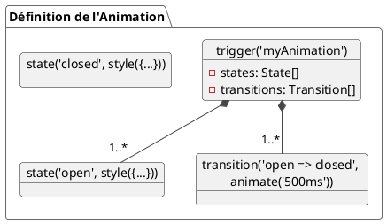

# Bonus 1 : L'Art de l'Animation avec @angular/animations - L'essentiel

### Objectifs pédagogiques

À la fin de cette partie, vous serez capable de :

* **Comprendre** l'utilité d'un framework d'animation dédié par rapport à des solutions CSS pures.
* **Configurer** le module d'animation dans une application Angular Standalone.
* **Maîtriser** les concepts fondamentaux : `trigger`, `state`, `transition`, `style` et `animate`.
* **Implémenter** des animations d'entrée et de sortie (`:enter`, `:leave`) pour des listes dynamiques.

### Introduction

Votre application est fonctionnelle, robuste, bien testée... mais elle est peut-être un peu... statique. Les éléments
apparaissent et disparaissent brusquement. Les changements d'état sont instantanés. Une interface utilisateur de qualité
n'est pas seulement fonctionnelle, elle est aussi agréable à utiliser. Les animations jouent un rôle crucial ici.

Elles ne sont pas de simples décorations. Elles guident l'œil de l'utilisateur, donnent un retour visuel immédiat, et
améliorent considérablement la perception de la qualité et de la fluidité de votre application.

Bien sûr, on peut faire beaucoup de choses avec les transitions CSS. Mais la véritable puissance du module
`@angular/animations` est sa capacité à lier les animations directement à l'**état** de vos composants. L'animation
devient une conséquence directe de votre logique métier. Dans ce module, nous allons apprendre à devenir des
chorégraphes d'interfaces, en donnant vie à nos composants.

### 1. Introduction et Configuration

#### Pourquoi un Framework d'Animation dédié ?

Si les transitions CSS sont parfaites pour des effets simples (un `hover` sur un bouton), elles montrent leurs limites
pour des scénarios plus complexes :

* **Animations d'entrée/sortie :** Animer l'ajout ou la suppression d'un élément du DOM (via `@if` ou `@for`) est
  complexe en CSS pur.
* **Animations basées sur l'état :** Lier une animation à une propriété de votre composant (`isExpanded`, `isSaving`...)
  demande du code de manipulation de classes CSS.
* **Chorégraphies complexes :** Orchestrer plusieurs animations en séquence ou en parallèle est difficile.

`@angular/animations` résout ces problèmes avec une API déclarative, puissante et intégrée au framework.

#### Mise en Place de l'Environnement

L'intégration est simple dans une application Standalone.

<procedure title="Configuration des Animations">
<p>Il suffit d'importer et de fournir la fonction <code>provideAnimations()</code> dans le fichier de configuration de votre application.</p>

```typescript
// src/app/app.config.ts
import {ApplicationConfig} from '@angular/core';
import {provideRouter} from '@angular/router';
import {provideAnimations} from '@angular/platform-browser/animations';

import {routes} from './app.routes';

export const appConfig: ApplicationConfig = {
    providers: [
        provideRouter(routes),
        provideAnimations() // Active le module d'animations
    ]
};
```

<warning title="Et pour les tests ?">
Pour vos tests unitaires, les animations peuvent ralentir leur exécution et les rendre instables. Il est recommandé de fournir `provideNoopAnimations()` dans la configuration de votre `TestBed` pour les désactiver complètement pendant les tests.
</warning>

</procedure>

### 2. Les Concepts Fondamentaux

L'API d'animation d'Angular s'articule autour de quelques fonctions clés que l'on déclare dans la métadonnée
`@Component`.

<tabs>
<tab title="trigger()">

C'est le **déclencheur**, le point d'entrée de votre animation. On lui donne un nom, et c'est ce nom que l'on va lier à un élément HTML dans le template via la syntaxe `[@nomDuTrigger]`.
</tab>
<tab title="state()">

Définit un **état** spécifique de l'animation et les styles CSS associés à cet état. Par exemple, un état `open` avec une opacité de 1, et un état `closed` avec une opacité de 0.
</tab>
<tab title="transition()">

C'est le **cœur de l'animation**. Elle décrit comment passer d'un état à un autre. On peut spécifier des transitions 
unidirectionnelles (<code>'open => closed'</code>) ou bidirectionnelles (`'open <=> closed'`).

</tab>
<tab title="style()">

Applique un ensemble de styles CSS à un moment donné de l'animation.
</tab>
<tab title="animate()">

Définit la **durée** de la transition, avec un éventuel **délai** et une **courbe d'accélération** (easing). C'est `animate()` qui rend la transition visible dans le temps.
</tab>
</tabs>



### 3. Animations d'Entrée et de Sortie (`:enter` & `:leave`)

C'est l'un des cas d'usage les plus puissants. Comment animer l'apparition d'un élément ajouté avec `@if` ou
l'ajout/suppression d'un élément dans une liste `@for` ?

La clé est de comprendre l'état spécial **`void`**. Cet état représente le moment où l'élément n'est pas encore dans le
DOM, ou vient d'en être retiré.

Angular nous fournit deux alias très pratiques pour les transitions avec `void` :

* **:enter** : C'est l'alias pour la transition `void => *` (de "n'existe pas" à "n'importe quel état"). C'est l'
  animation d'apparition.
* **:leave** : C'est l'alias pour la transition `* => void` (de "n'importe quel état" à "n'existe pas"). C'est l'
  animation de disparition.

Voyons cela en action.

### Exercice 9.1 : Animer une liste de tâches

**Objectif :** Créer une simple "To-Do List" où les éléments apparaissent et disparaissent avec une animation de fondu
et de glissement.

**Instructions :**

1. Créez un composant `TodoListComponent`.
2. Dans ce composant, gérez un simple tableau de chaînes de caractères représentant les tâches.
3. Ajoutez un champ de saisie et un bouton pour ajouter une nouvelle tâche au tableau.
4. Affichez la liste des tâches avec `@for`, et ajoutez un bouton sur chaque tâche pour la supprimer.
5. **Créez une animation** (`listAnimation`) attachée à chaque élément de la liste :
    * La transition `:enter` doit animer l'élément depuis une opacité de 0 et une position décalée vers le bas (
      `transform: translateY(-20px)`) vers son état final (opacité 1, pas de transformation).
    * La transition `:leave` doit faire l'inverse : animer vers une opacité de 0 et un décalage vers le haut.

#### Correction exercice 9.1 {collapsible='true'}

<procedure>
<p>Voici l'implémentation complète. Pour une meilleure organisation, nous plaçons la définition de l'animation dans un fichier séparé.</p>

**1. `src/app/animations.ts`**

```typescript
import {trigger, transition, style, animate} from '@angular/animations';

export const listAnimation = trigger('listAnimation', [
    // Animation d'entrée
    transition(':enter', [
        // État de départ (invisible et décalé)
        style({opacity: 0, transform: 'translateY(-20px)'}),
        // Animation vers l'état final
        animate('300ms ease-out', style({
            opacity: 1,
            transform: 'translateY(0)'
        }))
    ]),

    // Animation de sortie
    transition(':leave', [
        // Animation vers un état invisible et décalé
        animate('200ms ease-in', style({
            opacity: 0,
            transform: 'translateY(20px)'
        }))
    ])
]);
```

**2. `src/app/todo-list/todo-list.component.ts`**

```typescript
import {Component} from '@angular/core';
import {CommonModule} from '@angular/common';
import {FormsModule} from '@angular/forms';
import {listAnimation} from '../animations'; // On importe notre animation

@Component({
    selector: 'app-todo-list',
    standalone: true,
    imports: [CommonModule, FormsModule],
    template: `
    <h2>Liste de Tâches Animée</h2>
    <div>
      <input type="text" [(ngModel)]="newTask" 
             placeholder="Nouvelle tâche..." (keyup.enter)="addTask()">
      <button (click)="addTask()">Ajouter</button>
    </div>
    
    <ul>
      @for (task of tasks; track task) {
        <!-- On attache le trigger à chaque élément de la liste -->
        <li @listAnimation>
          <span>{{ task }}</span>
          <button (click)="removeTask(task)">×</button>
        </li>
      }
    </ul>
  `,
    styleUrls: ['./todo-list.component.css'],
    animations: [listAnimation] // On déclare l'animation au composant
})
export class TodoListComponent {
    tasks = ['Apprendre les animations', 'Créer un projet', 'Prendre un café'];
    newTask = '';

    addTask() {
        if (this.newTask.trim()) {
            this.tasks.push(this.newTask.trim());
            this.newTask = '';
        }
    }

    removeTask(taskToRemove: string) {
        this.tasks = this.tasks.filter(task => task !== taskToRemove);
    }
}
```

</procedure>

### Conclusion

Vous avez fait vos premiers pas de chorégraphe ! Vous savez maintenant pourquoi et comment utiliser le framework
d'animation d'Angular. Vous avez disséqué l'anatomie d'une animation, de son déclenchement (`trigger`) à son exécution (
`animate`). Plus important encore, vous avez mis en œuvre l'un des cas d'usage les plus courants et les plus
gratifiants : l'animation d'éléments qui entrent et sortent d'une liste.

Mais ce n'est qu'un début. Et si l'on voulait animer plusieurs éléments en même temps ? Ou les uns après les autres ? Et
si l'on voulait animer le changement de page lui-même ? Dans la partie "Pour aller plus loin", nous allons explorer ces
chorégraphies complexes et les transitions de route.