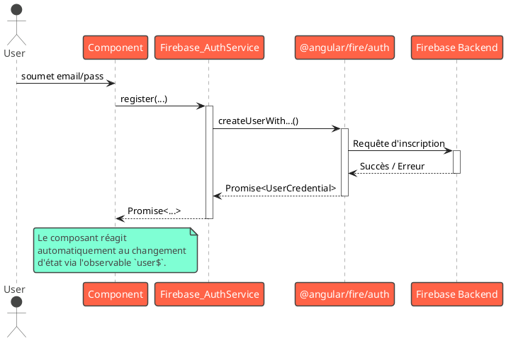

# Bonus 2 : Super-pouvoirs Backend avec Firebase (BaaS) - L'essentiel

### Objectifs pédagogiques

À la fin de cette partie, vous serez capable de :

* **Expliquer** ce qu'est Firebase et le concept de Backend-as-a-Service (BaaS).
* **Intégrer** Firebase à une application Angular en utilisant la bibliothèque `@angular/fire`.
* **Mettre en place** un système d'authentification complet (inscription, connexion) avec Firebase Authentication.
* **Interagir** avec une base de données NoSQL en temps réel (Cloud Firestore) pour lire et écrire des données.

### Introduction

Vous avez bâti une application frontend impressionnante. Mais toute application non-triviale a besoin d'un **backend** :
un endroit pour stocker les données des utilisateurs, gérer l'authentification, etc. Traditionnellement, cela signifie
développer une application serveur séparée (en Node.js, Python, Java...), gérer une base de données, configurer des
serveurs, et s'occuper de la sécurité et de la scalabilité. C'est un travail à part entière, complexe et chronophage.

Et s'il existait une autre solution ? Et si vous pouviez avoir un backend puissant, scalable et en temps réel, sans
écrire une seule ligne de code serveur ? C'est la promesse du **Backend-as-a-Service (BaaS)**, et **Firebase** est le
roi incontesté de cette catégorie.

Firebase est une plateforme de développement d'applications de Google qui fournit une suite d'outils backend prêts à
l'emploi. Pour les développeurs Angular, c'est une combinaison parfaite. Dans ce module, nous allons découvrir comment
intégrer Firebase pour ajouter, en quelques heures, des fonctionnalités qui prendraient des semaines à développer de
manière traditionnelle. Préparez-vous à débloquer des super-pouvoirs pour vos applications.

### 1. Introduction à Firebase et Configuration Initiale

Firebase est un écosystème complet. Nous allons nous concentrer sur ses services les plus populaires :

* **Firebase Authentication :** Un service complet pour gérer les utilisateurs.
* **Cloud Firestore :** Une base de données NoSQL, flexible, scalable et en temps réel.
* **Firebase Hosting :** Un service d'hébergement ultra-rapide pour vos contenus statiques.
* **Cloud Functions :** Pour exécuter du code backend sans serveur lorsque vous en avez vraiment besoin.

#### Installation et Connexion

L'intégration est grandement facilitée par la bibliothèque officielle `@angular/fire`.

<procedure title="Configuration de Firebase dans un projet Angular">
<ol>
<li>
<strong>Créer un projet sur la console Firebase :</strong>
<p>Rendez-vous sur <a href="https://console.firebase.google.com/">console.firebase.google.com</a>, créez un nouveau projet, et suivez les instructions pour créer une application "Web" (icône <code>&lt;/&gt;</code>). Firebase vous fournira un objet de configuration (<code>firebaseConfig</code>) contenant vos clés API. Copiez-le.</p>
</li>
<li>
<strong>Ajouter <code>@angular/fire</code> au projet :</strong>
<p>Dans votre terminal, à la racine de votre projet Angular, lancez la commande magique :</p>
<p><code>ng add @angular/fire</code></p>
<p>Cette commande va vous poser des questions, installer les dépendances, et surtout, créer et remplir vos fichiers d'environnement (`src/environments/environment.ts`) avec la configuration Firebase.</p>
</li>
<li>
<strong>Configurer les providers dans <code>app.config.ts</code> :</strong>
<p><code>ng add</code> fait la plupart du travail, mais il est bon de comprendre ce qu'il se passe. Le provider <code>provideFirebaseApp</code> initialise la connexion, et ensuite vous importez les providers pour chaque service que vous souhaitez utiliser.</p>

```typescript
// src/app/app.config.ts
import {ApplicationConfig, importProvidersFrom} from '@angular/core';
import {initializeApp, provideFirebaseApp} from '@angular/fire/app';
import {getAuth, provideAuth} from '@angular/fire/auth';
import {getFirestore, provideFirestore} from '@angular/fire/firestore';
import {environment} from '../environments/environment';

export const appConfig: ApplicationConfig = {
    providers: [
        // Initialise la connexion à Firebase
        importProvidersFrom(provideFirebaseApp(() =>
            initializeApp(environment.firebase))
        ),
        // Rend le service d'authentification disponible
        importProvidersFrom(provideAuth(() => getAuth())),
        // Rend le service Firestore disponible
        importProvidersFrom(provideFirestore(() => getFirestore())),
    ]
};
```

</li>
</ol>
</procedure>

### 2. Firebase Authentication : La Gestion des Utilisateurs Simplifiée

Oubliez la gestion des mots de passe, des sels, du hachage. Firebase s'occupe de tout.

#### Activer un Fournisseur d'Authentification

Dans la console Firebase, allez dans la section "Authentication", onglet "Sign-in method", et activez les fournisseurs
que vous souhaitez, par exemple "E-mail/Mot de passe".

#### Utilisation dans Angular

Le service `Auth` de `@angular/fire` expose des fonctions simples qui retournent des `Promises`.

```typescript
// src/app/auth/auth.service.ts
import {Injectable, inject} from '@angular/core';
import {Auth, createUserWithEmailAndPassword, signInWithEmailAndPassword, signOut, authState, User}
    from '@angular/fire/auth';
import {Observable} from 'rxjs';

@Injectable({providedIn: 'root'})
export class Firebase_AuthService {
    private auth: Auth = inject(Auth);

    // Le plus important : un Observable qui émet l'utilisateur
    // connecté ou null. C'est notre source de vérité !
    public readonly user$: Observable<User | null> = authState(this.auth);

    register({email, password}) {
        return createUserWithEmailAndPassword(this.auth, email, password);
    }

    login({email, password}) {
        return signInWithEmailAndPassword(this.auth, email, password);
    }

    logout() {
        return signOut(this.auth);
    }
}
```



### 3. Cloud Firestore : Votre Base de Données en Temps Réel

Firestore est une base de données NoSQL. Au lieu de tables et de lignes, elle est organisée en **collections** et *
*documents**.

* Une **collection** est un conteneur d'objets (ex: `users`, `products`).
* Un **document** est un objet JSON-like à l'intérieur d'une collection, avec son propre ID.

#### Lire et Écrire des Données

`@angular/fire` transforme la complexité de Firestore en `Observables` RxJS faciles à utiliser.

```typescript
// src/app/services/data.service.ts
import {Injectable, inject} from '@angular/core';
import {Firestore, collection, collectionData, doc, docData, addDoc, updateDoc, deleteDoc}
    from '@angular/fire/firestore';
import {Observable} from 'rxjs';

export interface Item {
    id?: string;
    name: string;
    // ... autres champs
}

@Injectable({providedIn: 'root'})
export class DataService {
    private firestore: Firestore = inject(Firestore);

    // Lire une collection entière EN TEMPS RÉEL
    getItems(): Observable<Item[]> {
        const itemsCollection = collection(this.firestore, 'items');
        // 'idField' permet de récupérer l'ID du document dans l'objet
        return collectionData(itemsCollection, {idField: 'id'}) as Observable<Item[]>;
    }

    // Lire un seul document
    getItem(id: string): Observable<Item> {
        const itemDoc = doc(this.firestore, `items/${id}`);
        return docData(itemDoc) as Observable<Item>;
    }

    // Ajouter un document
    addItem(item: Item) {
        const itemsCollection = collection(this.firestore, 'items');
        return addDoc(itemsCollection, item); // Retourne une Promise
    }

    // Mettre à jour un document
    updateItem(id: string, data: Partial<Item>) {
        const itemDoc = doc(this.firestore, `items/${id}`);
        return updateDoc(itemDoc, data);
    }

    // Supprimer un document
    deleteItem(id: string) {
        const itemDoc = doc(this.firestore, `items/${id}`);
        return deleteDoc(itemDoc);
    }
}
```

<warning title="Règles de Sécurité : La Clé de Voûte">
Par défaut, votre base de données Firestore est ouverte au monde entier. C'est pratique pour démarrer, mais **extrêmement dangereux** en production. Vous devez absolument configurer les **Règles de Sécurité** dans la console Firebase pour définir qui a le droit de lire et d'écrire dans quelles collections.
Par exemple : `allow read, write: if request.auth.uid != null;` (seuls les utilisateurs connectés peuvent lire/écrire).
</warning>

### Exercice 10.1 : Une "Shoutbox" en Temps Réel

**Objectif :** Créer une simple boîte à messages où les messages de tous les utilisateurs apparaissent en temps réel, en
utilisant Firestore.

**Instructions :**

1. Dans la console Firebase, allez dans "Firestore Database", créez une base de données, et démarrez en **mode test** (
   qui autorise les lectures/écritures pour 30 jours).
2. Créez un `DataService` similaire à celui ci-dessus, mais pour une collection `messages`. Un message aura une
   structure `{ text: string, timestamp: any }`.
3. Créez un `ShoutboxComponent`.
4. Dans ce composant :
    * Injectez `DataService`.
    * Dans `ngOnInit`, appelez la méthode pour récupérer tous les messages et stockez l'observable.
    * Ajoutez une méthode pour envoyer un nouveau message en utilisant `dataService.addItem()`. N'oubliez pas d'ajouter
      un `timestamp` (ex: `serverTimestamp()` de Firestore).
5. Dans le template :
    * Utilisez `@for` et le pipe `async` pour afficher la liste des messages.
    * Ajoutez un champ de saisie et un bouton pour que l'utilisateur puisse poster un nouveau message.

#### Correction exercice 10.1 {collapsible='true'}

<procedure>
<p>Voici une implémentation complète de la Shoutbox.</p>

**1. Le `MessageService` (équivalent de `DataService`)**

```typescript
// src/app/services/message.service.ts
import {Injectable, inject} from '@angular/core';
import {Firestore, collection, collectionData, addDoc, serverTimestamp, orderBy, query}
    from '@angular/fire/firestore';
import {Observable} from 'rxjs';

export interface Message {
    id?: string;
    text: string;
    timestamp: any; // Firestore gère un type spécial pour ça
}

@Injectable({providedIn: 'root'})
export class MessageService {
    private firestore: Firestore = inject(Firestore);

    getMessages(): Observable<Message[]> {
        const messagesCollection = collection(this.firestore, 'messages');
        // On crée une requête pour trier par date
        const q = query(messagesCollection, orderBy('timestamp', 'desc'));
        return collectionData(q, {idField: 'id'}) as Observable<Message[]>;
    }

    addMessage(text: string) {
        const messagesCollection = collection(this.firestore, 'messages');
        return addDoc(messagesCollection, {
            text: text,
            timestamp: serverTimestamp() // timestamp généré par le serveur
        });
    }
}
```

**2. Le `shoutbox.component.ts`**

```typescript
// src/app/shoutbox/shoutbox.component.ts
import {Component, OnInit, inject} from '@angular/core';
import {CommonModule} from '@angular/common';
import {FormsModule} from '@angular/forms';
import {Observable} from 'rxjs';
import {Message, MessageService} from '../services/message.service';

@Component({
    selector: 'app-shoutbox',
    standalone: true,
    imports: [CommonModule, FormsModule],
    template: `
    <h2>Shoutbox en Temps Réel</h2>
    <div>
      <input type="text" [(ngModel)]="newMessage" 
             placeholder="Votre message..." (keyup.enter)="postMessage()">
      <button (click)="postMessage()">Envoyer</button>
    </div>

    <ul>
      @for (message of messages$ | async; track message.id) {
        <li>{{ message.text }}</li>
      }
    </ul>
  `
})
export class ShoutboxComponent implements OnInit {
    private messageService = inject(MessageService);

    messages$!: Observable<Message[]>;
    newMessage = '';

    ngOnInit(): void {
        this.messages$ = this.messageService.getMessages();
    }

    postMessage(): void {
        if (this.newMessage.trim()) {
            this.messageService.addMessage(this.newMessage.trim())
                .then(() => this.newMessage = '') // Efface le champ si succès
                .catch(err => console.error(err));
        }
    }
}
```

</procedure>

### Conclusion

Vous venez d'ajouter une corde extrêmement puissante à votre arc. En maîtrisant les bases de Firebase, vous avez
considérablement réduit la barrière entre le frontend et le backend. Vous savez maintenant comment mettre en place
rapidement un système d'authentification robuste et comment interagir avec une base de données temps réel performante.
Pour de nombreux projets (prototypes, applications internes, startups...), Firebase peut même être la seule solution
backend dont vous aurez besoin.

Mais Firebase est encore plus puissant. Que faire si vous avez besoin d'une logique métier personnalisée côté serveur ?
Ou si vous voulez déployer votre application Angular en une seule commande ? C'est ce que nous allons explorer dans la
partie "Pour aller plus loin", avec les **Cloud Functions** et **Firebase Hosting**.