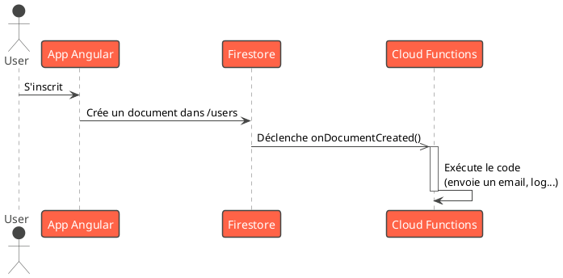

# Bonus 2 : Super-pouvoirs Backend avec Firebase (BaaS) - Pour aller plus loin

### Objectifs pédagogiques

À la fin de cette partie, vous serez capable de :

* **Comprendre** le concept de "serverless" avec les Cloud Functions.
* **Écrire** et **déployer** une Cloud Function simple qui répond à une requête HTTP.
* **Déclencher** une Cloud Function en réponse à un événement de la base de données (trigger).
* **Configurer** et **déployer** une application Angular complète sur Firebase Hosting en une seule commande.

### Introduction

Dans la partie "L'essentiel", nous avons vu comment Firebase peut gérer pour nous l'authentification et le stockage de
données. C'est déjà énorme. Mais que se passe-t-il si vous avez besoin d'une logique qui ne doit pas s'exécuter sur le
client ? Par exemple, envoyer un email de bienvenue à un nouvel utilisateur, traiter un paiement, ou effectuer un calcul
lourd que vous ne voulez pas exposer dans votre code frontend.

C'est là qu'interviennent les **Cloud Functions**. C'est votre "couteau suisse" de code backend qui s'exécute dans le
cloud, sans que vous ayez à gérer le moindre serveur. C'est le concept de **serverless**. Vous écrivez une fonction,
vous la déployez, et Firebase s'occupe de la faire tourner et de la "scaler" pour vous.

Et enfin, pour boucler la boucle, nous verrons comment **Firebase Hosting** n'est pas seulement un excellent service
pour héberger nos fichiers, mais qu'il est aussi parfaitement intégré au reste de l'écosystème, nous permettant de
déployer notre application Angular avec une facilité déconcertante.

### 1. Cloud Functions : Votre Backend Serverless

Une Cloud Function est un morceau de code (en TypeScript/Node.js pour notre usage) qui s'exécute en réponse à un *
*déclencheur (trigger)**.

Les déclencheurs les plus courants sont :

* **Requête HTTP :** La fonction s'exécute lorsque vous appelez une URL spécifique. C'est comme créer une mini-API.
* **Événement de base de données :** La fonction se déclenche lorsqu'un document est créé, mis à jour ou supprimé dans
  Firestore.
* **Événement d'authentification :** La fonction se déclenche lors de la création ou de la suppression d'un compte
  utilisateur.
* **Tâche planifiée (Cron Job) :** La fonction s'exécute à des intervalles réguliers.

#### Installation et Paramétrage

<procedure title="Configuration des Cloud Functions">
<ol>
<li>
<strong>Installer la Firebase CLI :</strong>
<p>Si ce n'est pas déjà fait, installez l'interface en ligne de commande de Firebase globalement.</p>
<p><code>npm install -g firebase-tools</code></p>
</li>
<li>
<strong>Se connecter et initialiser :</strong>
<p>Connectez-vous à votre compte Google avec <code>firebase login</code>. Ensuite, à la racine de votre projet, initialisez les fonctions :</p>
<p><code>firebase init functions</code></p>
<p>La CLI va vous poser des questions (choisissez TypeScript). Cela va créer un dossier <code>functions/</code> à la racine de votre projet. C'est un projet Node.js distinct, avec son propre <code>package.json</code>.</p>
</li>
<li>
<strong>Écrire votre première fonction :</strong>
<p>Ouvrez le fichier <code>functions/src/index.ts</code>.</p>
</li>
</ol>
</procedure>

#### Exemple : Une fonction HTTP

```typescript
// functions/src/index.ts
import {onRequest} from "firebase-functions/v2/https";
import * as logger from "firebase-functions/logger";

// Une fonction HTTP simple
export const helloWorld = onRequest((request, response) => {
    logger.info("Hello logs!", {structuredData: true});
    response.send("Hello from Firebase!");
});
```

#### Exemple : Un Trigger Firestore

Envoyons un message de bienvenue "virtuel" (un log) à chaque fois qu'un nouvel utilisateur s'inscrit et est ajouté à la
collection `users`.

```typescript
// functions/src/index.ts
import {onDocumentCreated} from "firebase-functions/v2/firestore";
import * as logger from "firebase-functions/logger";

// Se déclenche à chaque création de document dans la collection 'users'
export const sendWelcomeMessage = onDocumentCreated("users/{userId}", (event) => {
    // event.data contient les données du document créé
    const userData = event.data?.data();
    const name = userData?.name || "Nouvel utilisateur";

    logger.log(`Un message de bienvenue a été envoyé à ${name} !`);

    // Ici, on pourrait appeler une API d'emailing (SendGrid, Mailgun...)
    return null; // On indique que la fonction a terminé
});
```

Pour déployer vos fonctions :

```bash
firebase deploy --only functions
```



### 2. Firebase Hosting : Déploiement en une Commande

Nous avons déjà vu qu'on pouvait héberger nos fichiers statiques. La CLI Firebase rend ce processus extrêmement simple.

#### Configuration

À la racine de votre projet, lancez :

```bash
firebase init hosting
```

La CLI va vous poser des questions cruciales :

* **What do you want to use as your public directory?** C'est ici que vous devez indiquer le dossier de build de votre
  application Angular, par exemple : `dist/my-awesome-app`.
* **Configure as a single-page app (rewrite all urls to /index.html)?** Répondez **Yes (y)**. C'est la question qui
  résout automatiquement le problème de rafraîchissement F5 !

Cela va créer un fichier `firebase.json` à la racine de votre projet, qui ressemblera à ceci :

```json
{
  "hosting": {
    "public": "dist/my-awesome-app",
    "ignore": [
      "firebase.json",
      "**/.*",
      "**/node_modules/**"
    ],
    "rewrites": [
      {
        "source": "**",
        "destination": "/index.html"
      }
    ]
  }
}
```

#### Le Workflow de Déploiement

Le processus complet devient d'une simplicité enfantine :
<procedure title="Déployer une App Angular sur Firebase Hosting">
<ol>
<li>
<strong>Construire l'application Angular pour la production :</strong>
<p><code>ng build</code></p>
</li>
<li>
<strong>Déployer sur Firebase Hosting :</strong>
<p><code>firebase deploy --only hosting</code></p>
</li>
</ol>
<p>C'est tout ! En quelques secondes, Firebase déploie vos fichiers sur son CDN global et vous donne l'URL de votre application en ligne.</p>
</procedure>

### Exercice 10.2 : Déployer l'application sur Firebase

**Objectif :** Prendre votre application actuelle (par exemple, la Shoutbox de l'exercice précédent) et la déployer en
ligne avec Firebase Hosting.

**Instructions :**

1. Si ce n'est pas déjà fait, installez `firebase-tools` et connectez-vous (`firebase login`).
2. Assurez-vous que votre projet Firebase est bien configuré (que le fichier `.firebaserc` à la racine de votre projet
   Angular pointe vers le bon ID de projet).
3. Initialisez Firebase Hosting avec `firebase init hosting`.
    * Entrez le bon dossier public (ex: `dist/shoutbox-app`).
    * Répondez "oui" à la question sur la single-page app.
4. Lancez le build de production de votre application Angular : `ng build`.
5. Lancez le déploiement : `firebase deploy --only hosting`.
6. Cliquez sur l'URL "Hosting URL" fournie par la CLI et admirez votre application en ligne !

#### Correction exercice 10.2 {collapsible='true'}

<p>
Cet exercice est purement procédural. Il n'y a pas de code à corriger, mais un résultat à observer. Si vous avez suivi les étapes correctement, vous devriez voir la sortie suivante dans votre terminal après la commande de déploiement :
</p>

```text
=== Deploying to 'your-project-id'...

i  deploying hosting
i  hosting[your-project-id]: beginning deploy...
i  hosting[your-project-id]: found 12 files in dist/shoutbox-app
✔  hosting[your-project-id]: file upload complete
i  hosting[your-project-id]: finalizing version...
✔  hosting[your-project-id]: version finalized
i  hosting[your-project-id]: releasing new version...
✔  hosting[your-project-id]: release complete

✔  Deploy complete!

Project Console: https://console.firebase.google.com/project/your-project-id/overview
Hosting URL: https://your-project-id.web.app
```

<p>
En cliquant sur la "Hosting URL", votre application doit s'afficher et être fonctionnelle, y compris la communication en temps réel avec la base de données Firestore.
</p>


### Auto-évaluation

1. **Qu'est-ce que le "serverless" dans le contexte des Cloud Functions ?**
   a. Le code s'exécute entièrement dans le navigateur du client.
   b. On n'a plus besoin d'un backend.
   c. Le développeur écrit du code backend sans avoir à gérer, provisionner ou maintenir les serveurs sur lesquels il
   s'exécute.
   d. Les fonctions ne peuvent pas avoir d'état.

2. **Vous voulez envoyer un email de confirmation chaque fois qu'un document est ajouté à une collection `orders` dans
   Firestore. Quel type de trigger de Cloud Function est le plus approprié ?**

3. **Quelle commande de la CLI Firebase utilisez-vous pour déployer uniquement vos Cloud Functions mises à jour ?**

4. **Lors de la configuration de Firebase Hosting (`firebase init hosting`), quelle question est essentielle pour
   assurer le bon fonctionnement du routeur Angular en production ?**
   a. "What do you want to use as your public directory?"
   b. "Configure as a single-page app (rewrite all urls to /index.html)?"
   c. "Set up automatic builds and deploys with GitHub?"
   d. "File public/404.html already exists. Overwrite?"

5. **Quelle est la séquence de commandes pour mettre en ligne une nouvelle version de votre application Angular sur
   Firebase Hosting ?**
   a. `firebase deploy` puis `ng build`.
   b. `ng deploy`.
   c. `ng build` puis `firebase deploy --only hosting`.
   d. `firebase build` puis `ng deploy`.

### Conclusion

Vous avez atteint la maîtrise complète du cycle de vie d'une application, de l'idée au déploiement global. En intégrant
les **Cloud Functions**, vous avez débloqué la possibilité d'ajouter une logique backend sur mesure et scalable à vos
applications sans devenir un expert en administration système. Avec **Firebase Hosting**, vous avez découvert un moyen
incroyablement simple et puissant de mettre votre travail en ligne.

La combinaison Angular + Firebase est l'une des "stacks" les plus productives pour les développeurs web modernes, leur
permettant de construire et de lancer des applications complètes et robustes à une vitesse impressionnante. Vous
possédez désormais cette double compétence, vous ouvrant les portes de très nombreux projets.